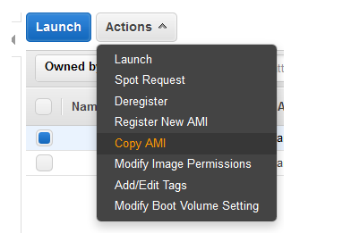
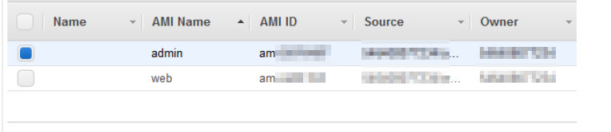

# AWS - 如何將 AMI 轉出地區 & 帳號

<!--more-->
"紀錄一下如何將 AMI 轉出到其他帳號"


# 在 ec2 頁面 → 底下 AMI 找到 Actions 點選 copy AMI

    
   

---

   
# 在Destination region 選擇要移轉的地區


   

---

   
# 在 Pemissions 底下按 edit

    
   

   

---


# 在AWS Account Number 輸入要移轉的帳號


   

---

***





---

> Author: Laurance  
> URL: https://laurance.eu.org/posts/aws-ec2-ami%E8%BD%89%E5%9C%B0%E5%8D%80%E5%B8%B3%E8%99%9F/  

