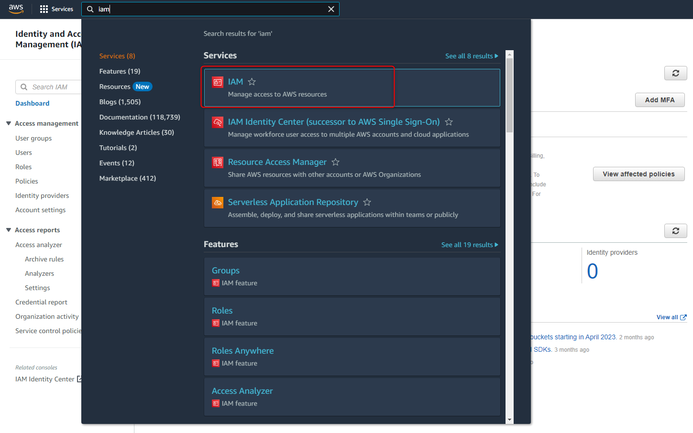
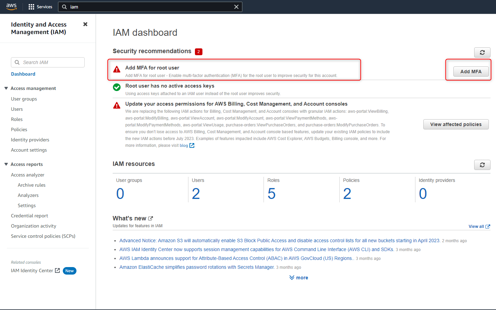
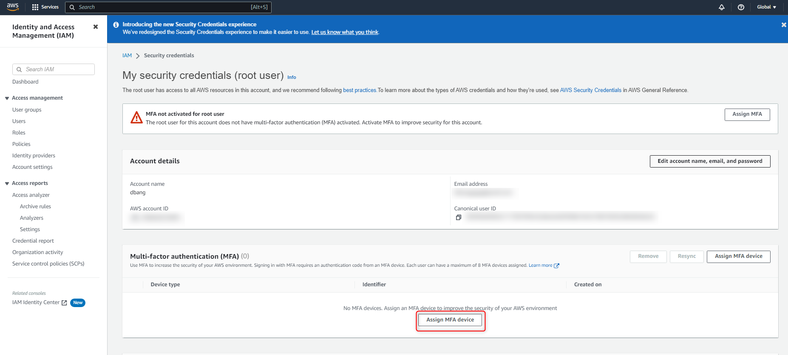
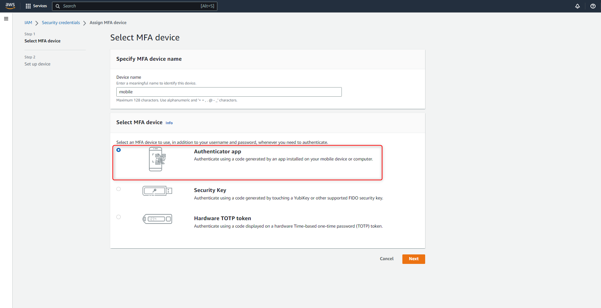
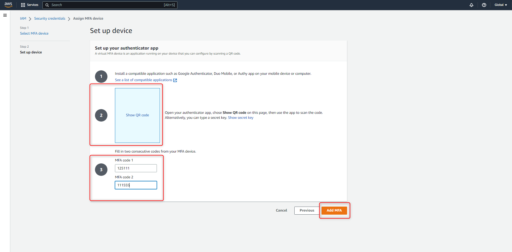
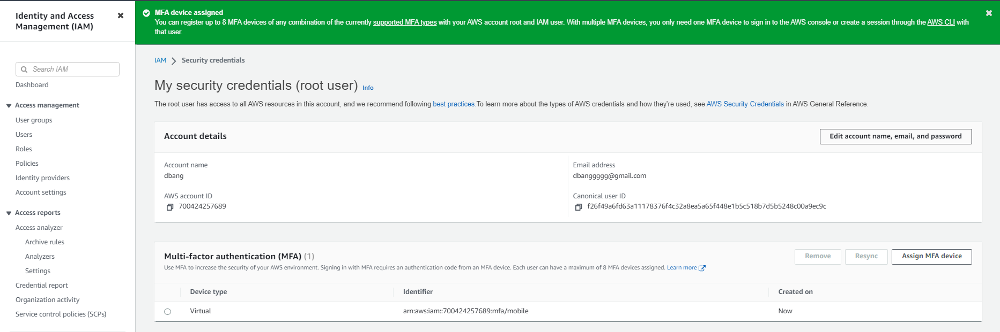

# AWS - How to enable MFA for AWS Root user

<!--more-->
"建立 MFA 二階段驗證來做 root 登入"


# 設置 AWS-MFA - 二階段認證 Authy


## 搜尋 `IAM` 服務

---

## 選擇 `Add MFA` 添加 MFA

---

## 在選單 `Multi-factor authentication (MFA)` 中新增設備 `Assign MFA device`

---

## 選擇要驗證MFA的方式 ( 這邊選擇使用APP )

---

## 點擊 `show QR code` 並使用手機APP (Authy) 掃描驗證 & 並將驗證碼依序填入 `MFA code1 , MFA code2`

---

## 添加成功

---

***





---

> Author: Laurance  
> URL: https://laurance.eu.org/posts/aws-how-to-enable-mfa-for-aws-root-user/  

