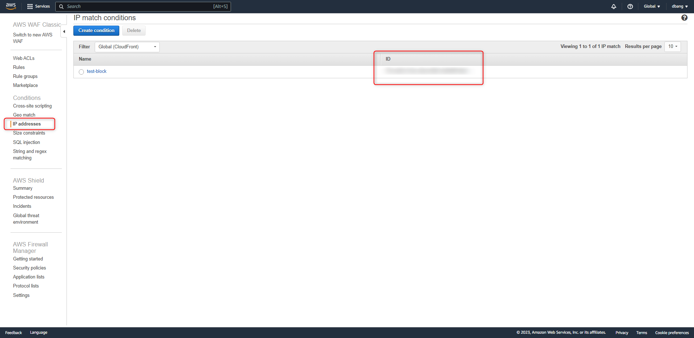

# AWS - Use update-ip-set to block based IP address for WAF


<!--more-->
"建立 ip-set 封鎖 IP ，並上傳至 WAF"

# 獲取  操作WAF  規則的  `Token` 


對 WAF 進行操作時 , 需要有一個 Token 以防止衝突的請求 


```sql
/usr/bin/aws waf get-change-token|jq -r '.ChangeToken'
```


這時會返回可操作 WAF規則的 TOKEN (可將這串亂碼存成變數 $Token)


```sql
$Token = c93e119c-607e-43b5-98e3-66d3XXXXXXX
```

# AWS 後台 WAF 規則中找到  `IP address ID` 並取得該 ID

 
 

可將這串亂碼存成變數 $addressID

 
```sql
$addressID = XXXXXXXXX791cd453-01ba-46ed-8863
```

# 將要封鎖的 IP 上傳至該 WAF 規則中 ::

```sql
/usr/bin/aws waf update-ip-set --ip-set-id  $addressID  --change-token $Token --updates Action="INSERT",IPSetDescriptor='{Type="IPV4",Value=" XX.XX.XX.XX/32"}'
```


參考: https://docs.aws.amazon.com/cli/latest/reference/waf/update-ip-set.html


***


<style>
.emojify {
	font-family: Apple Color Emoji, Segoe UI Emoji, NotoColorEmoji, Segoe UI Symbol, Android Emoji, EmojiSymbols;
	font-size: 2rem;
	vertical-align: middle;
}
@media screen and (max-width:650px) {
  .nowrap {
    display: block;
    margin: 25px 0;
  }
}
</style>



---

> Author: Laurance  
> URL: https://laurance.eu.org/posts/aws-update-ip-set-to-block-based-ip-address-for-waf/  

