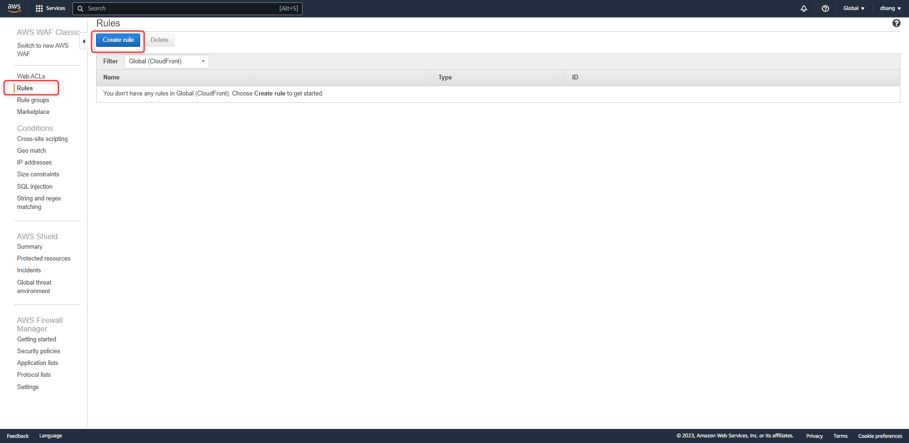
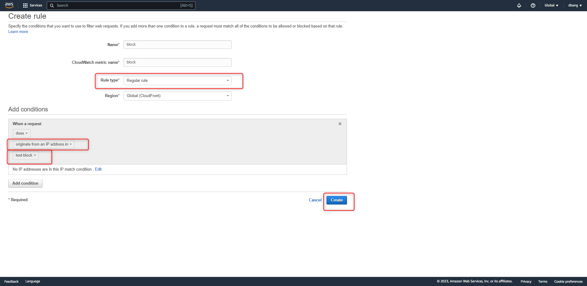
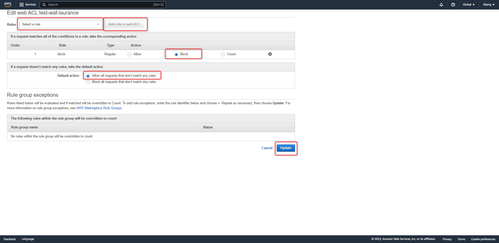
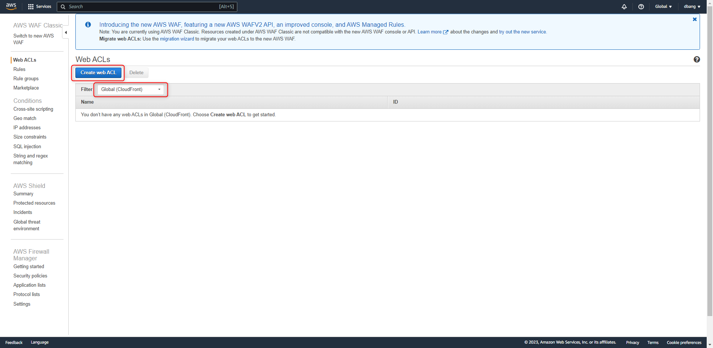
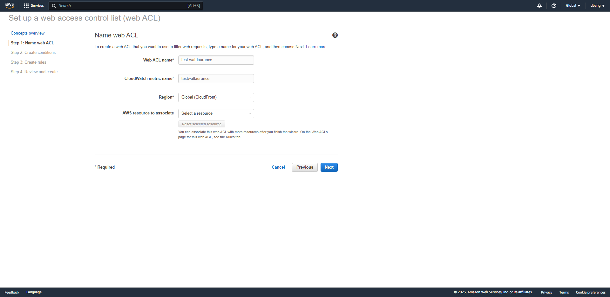
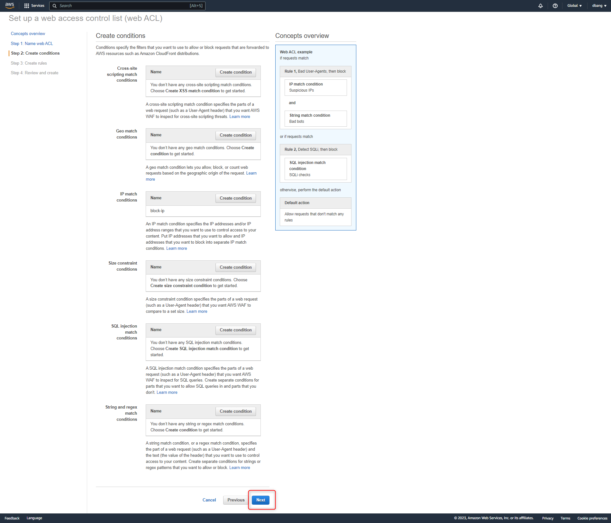
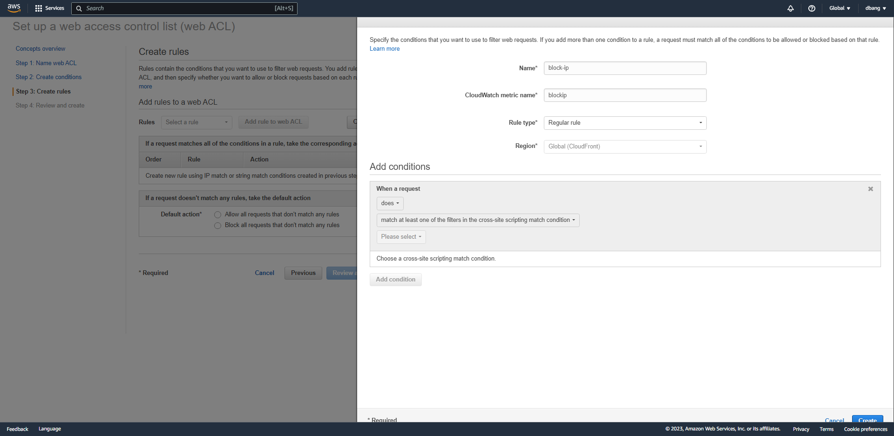

# AWS - WAF & Rules 建置

<!--more-->
"建立 AWS-WAF 封鎖 IP 的規則政策"


# 封鎖規則設置


## 建立 `IP match conditions`

---

 
 
## 輸入名稱 , 區域 , 要封鎖的 IP

---

 
  
 
## 建立 `Rules` 

---

 
 
## 輸入名稱 , 規則 , 掛進剛建立的 `IP match conditions`

---

 
 
## 編輯 `Web ACL`  將剛建立的 `Rules` 掛入

---

 
 

---


# Web ACL 建置


## 點選 `Create web ACL` 區域選 `Global CloudFront`

 
 
---

## 輸入名稱 , Cloudwatch metric 名稱 (這兩個名稱之後無法更改)

 

---

## 選擇該 WAF 政策

 

---

## 選擇該 WAF 規則

 
 

---

## 點選建立

 

---

***





---

> Author: Laurance  
> URL: https://laurance.eu.org/posts/aws-%E6%B7%BB%E5%8A%A0-rules-%E4%B8%A6%E6%8E%9B%E9%80%B2-waf-%E4%B8%AD/  

