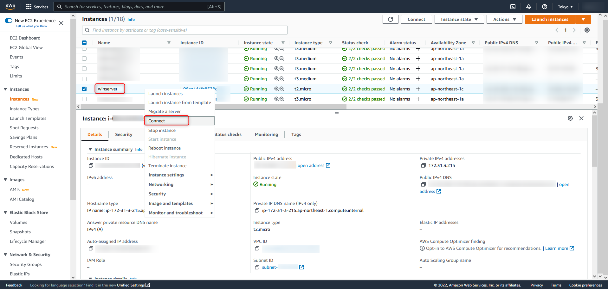
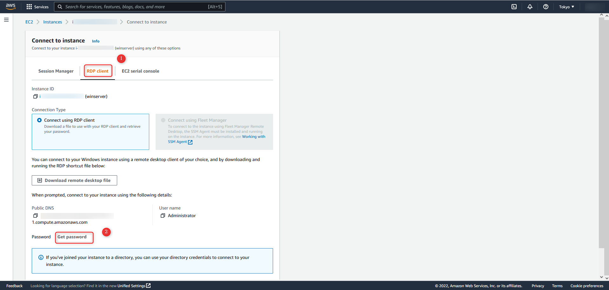
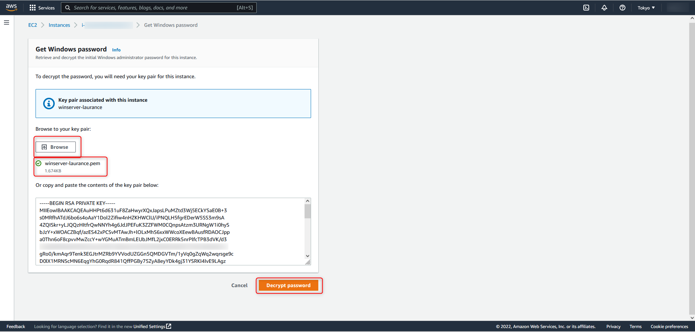
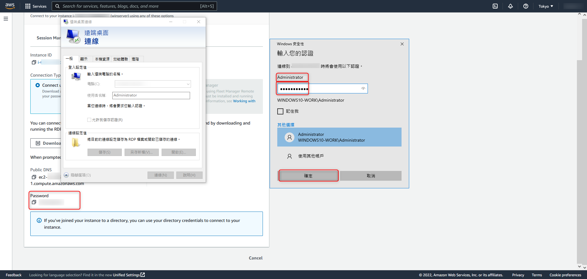

# AWS - 連線至 windows-ec2

<!--more-->
"如何使用RDP協議遠端桌面連線至 EC2-Windows"


  # 在新建立的 Instances 右鍵選擇 Connect

    
   

---

   
 # 選擇 RDP client 並點選 Get password

  
   

---

   
 # 選擇 Browse (瀏覽) 並選取製作 instance 的金鑰 (.pem) 並選擇 Decrypt Password (解密密碼)

    
   

---
  
 
 # 使用後台給的亂數密碼建立遠端桌面連線 (帳號預設都是 Administrator)

    
   

---   
   [官方文件連結](https://docs.aws.amazon.com/zh_tw/AWSEC2/latest/WindowsGuide/connecting_to_windows_instance.html)
   
   

***





---

> Author: Laurance  
> URL: https://laurance.eu.org/posts/aws-%E9%80%A3%E6%8E%A5%E8%87%B3-windows-ec2/  

