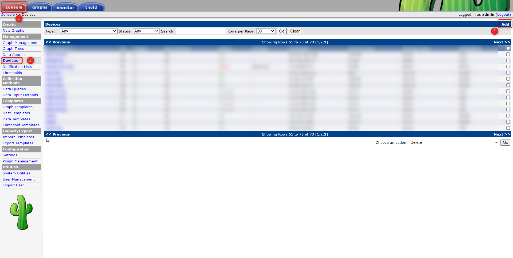
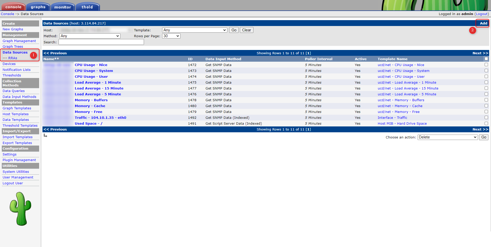
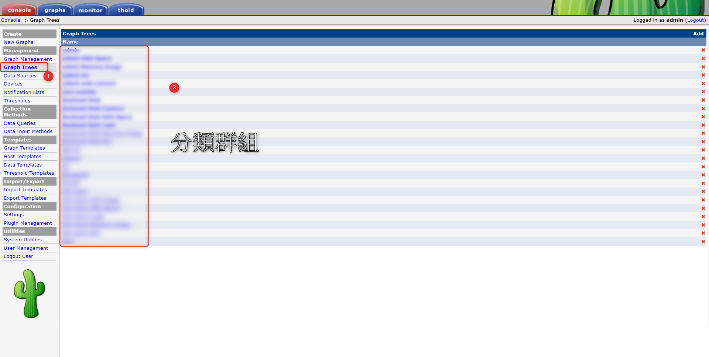

# Cacti - 新增機器監控及圖表


<!--more-->
"如何將新建的 EC2 加入 Cacti 監控"


 # 1. 新建機器上面先安裝SNMP，並確保火牆有通 UDP 161 port


```sql
yum install -y net-snmp  net-snmp-utils
```    
    
    
 # 2. Cacti 頁面新增 Device >> Add
   
   
   
   
   ---

   
  # 3. Device 填入機器的 hostname 及監控協議


   
   
   ---
   
   
  # 4. Datasource 新增要撈取的資料
   
   
   
   
   ---
   
   
  # 5. Graph Management 新增監控圖表
   
   
   
   
   ---

   
  # 6. Graph Trees 分類圖表群
   
   
   
   
   ---
   
  
***


<style>
.emojify {
	font-family: Apple Color Emoji, Segoe UI Emoji, NotoColorEmoji, Segoe UI Symbol, Android Emoji, EmojiSymbols;
	font-size: 2rem;
	vertical-align: middle;
}
@media screen and (max-width:650px) {
  .nowrap {
    display: block;
    margin: 25px 0;
  }
}
</style>



---

> Author: Laurance  
> URL: https://laurance.eu.org/posts/cacti-%E6%96%B0%E5%A2%9E%E6%A9%9F%E5%99%A8%E5%8F%8A%E5%9C%96%E8%A1%A8/  

