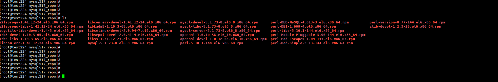

# CentOS - 如何將安裝包及其依賴包下載到本地


<!--more-->
"紀錄一下 如何將 RPM依賴包 下載到本地保存"


# 通過 yum 命令的 Downloadonly 插件下載 RPM 軟件包及其所有依賴包


## 安裝工具包

```sql
yum install yum-plugin-downloadonly yum-utils -y
```
    
## 將 *.repo 安裝到指定目錄下

```sql
yum install --downloadonly + --downloaddir=軟件包位置[可選] + 軟件包名(可加上版本號，指定版本)
    
yum install --downloadonly --downloaddir=/root/mysql517_repo/ mysql-server mysql-client mysql-devel*
```
    
 


***


<style>
.emojify {
	font-family: Apple Color Emoji, Segoe UI Emoji, NotoColorEmoji, Segoe UI Symbol, Android Emoji, EmojiSymbols;
	font-size: 2rem;
	vertical-align: middle;
}
@media screen and (max-width:650px) {
  .nowrap {
    display: block;
    margin: 25px 0;
  }
}
</style>



---

> Author: Laurance  
> URL: https://laurance.eu.org/posts/centos-%E5%A6%82%E4%BD%95%E5%B0%87%E5%AE%89%E8%A3%9D%E5%8C%85%E5%8F%8A%E5%85%B6%E4%BE%9D%E8%B3%B4%E5%8C%85%E4%B8%8B%E8%BC%89%E5%88%B0%E6%9C%AC%E5%9C%B0/  

