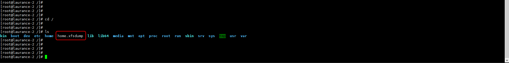
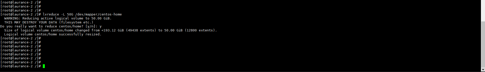
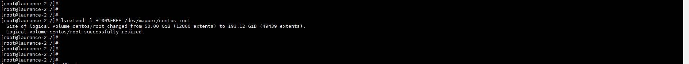
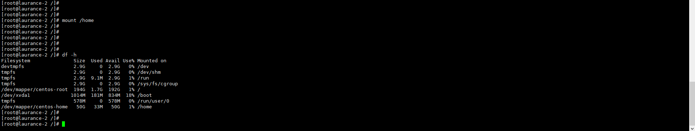
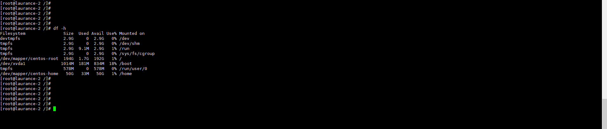

# CentOS - 根目錄磁區擴充


<!--more-->
"(將home磁區分割為50G並將其餘空間擴充到根目錄底下)"


  # 安裝xfsdump工具

```sql
yum install xfsdump -y
```



  # 備份/home磁區的掛載內容 (一路按ENTER)

```sql
xfsdump -f /home.xfsdump /home
```

   



   
  # 這時候會再跟目錄出現剛剛備份的 /home >> home.xfsdump

   



   
 # 成功備份後，將/home磁區移除掛載 (必須以root身分登入才能執行)
 
 ```sql
 umount /home
```
   
   




 # 將/home磁區大小定義為50G
   
```sql
lvreduce -L 50G /dev/mapper/centos-home
```
   
   




 # 將其餘空間擴充到根目錄底下

```sql
lvextend -l +100%FREE /dev/mapper/centos-root
```

   




# 使根目錄擴充生效
  
```sql
xfs_growfs /dev/mapper/centos-root
```
   
   




 # 格式化/home掛載對應的磁區
    
```sql
mkfs.xfs -f /dev/mapper/centos-home
```
   
   




# 重新掛載/home

```sql
mount /home
```
   
   




# 將原本備份的內容寫入/home
    
```sql
xfsrestore -f /home.xfsdump /home
```
   
   



   
# 可以看倒已將磁區容量擴充
   
   




***


<style>
.emojify {
	font-family: Apple Color Emoji, Segoe UI Emoji, NotoColorEmoji, Segoe UI Symbol, Android Emoji, EmojiSymbols;
	font-size: 2rem;
	vertical-align: middle;
}
@media screen and (max-width:650px) {
  .nowrap {
    display: block;
    margin: 25px 0;
  }
}
</style>



---

> Author: Laurance  
> URL: https://laurance.eu.org/posts/centos-%E6%A0%B9%E7%9B%AE%E9%8C%84%E7%A3%81%E5%8D%80%E6%93%B4%E5%85%85/  

