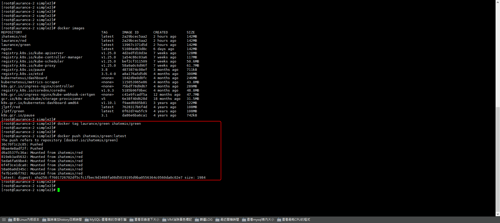

# Docker - Error-requested access to the resource is denied


<!--more-->
"上傳鏡像被拒絕 Denied ERROR: requested access to the resource is denied"



# 上傳 image 報錯
    
```sql

docker push laurance/green
    
denied: requested access to the resource is denied

```
    
   



   

# **解决方案**
   
```sql

docker tag laurance/green ihatemis/green
    
ihatemis 為 Docker hub 用戶名

```
    
   



   
# 後台查看已上傳
    
   
   
   
   
    

***


<style>
.emojify {
	font-family: Apple Color Emoji, Segoe UI Emoji, NotoColorEmoji, Segoe UI Symbol, Android Emoji, EmojiSymbols;
	font-size: 2rem;
	vertical-align: middle;
}
@media screen and (max-width:650px) {
  .nowrap {
    display: block;
    margin: 25px 0;
  }
}
</style>



---

> Author: Laurance  
> URL: https://laurance.eu.org/posts/docker-error-requested-access-to-the-resource-is-denied/  

