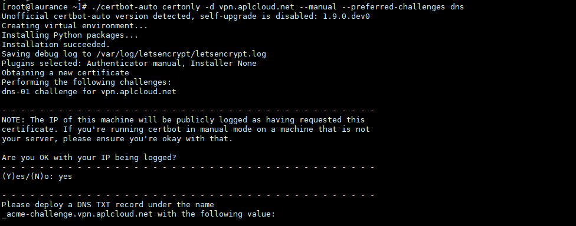
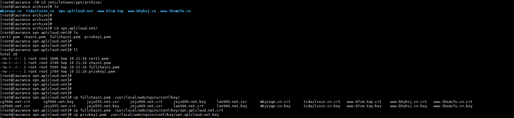
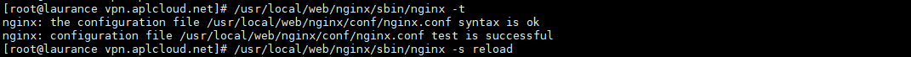
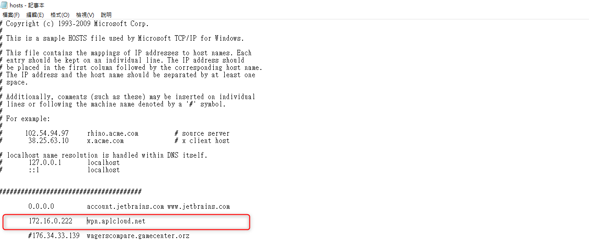
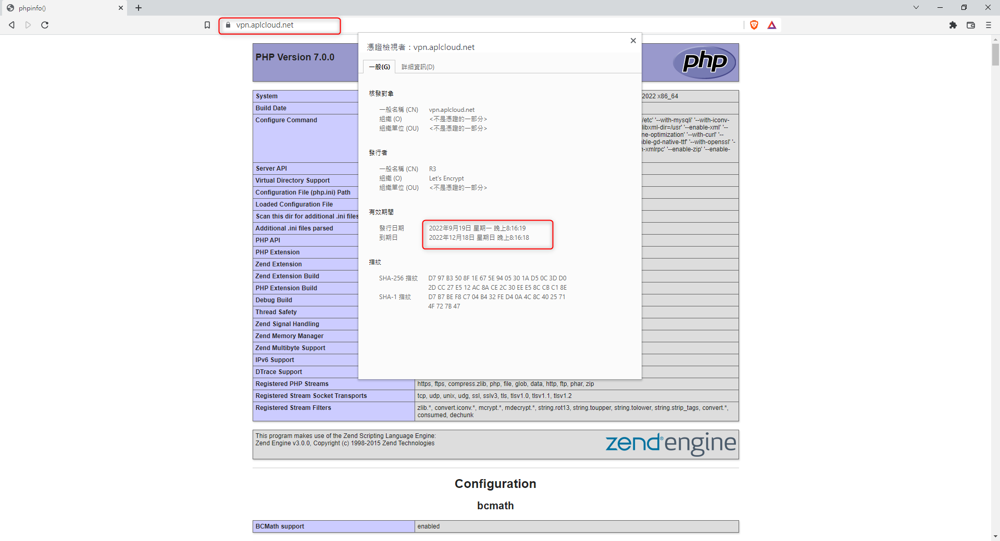
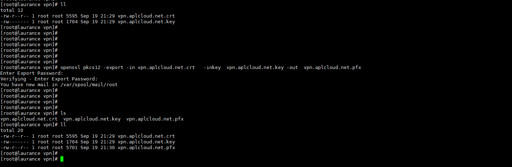
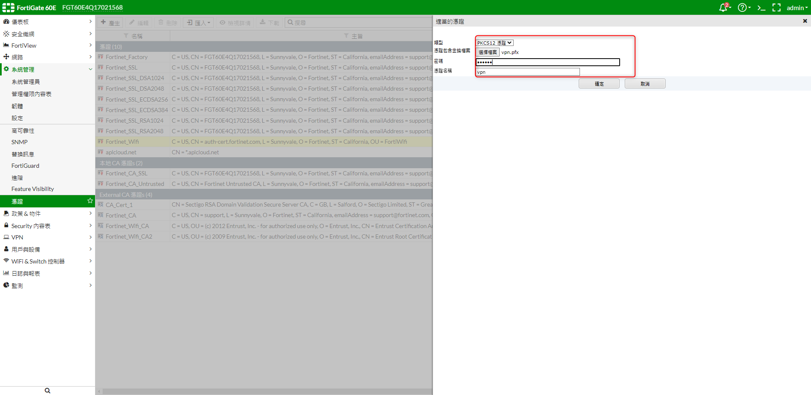
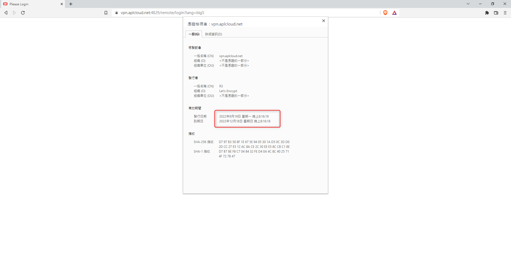

# Fortinet - FortiGate60E SSL匯入自簽3個月憑證

<!--more-->
"( SSL-VPN 匯入 PKCS12 憑證 )"



# 使用certbot-auto簽發三個月憑證,並驗證TXT


   
   

---



# 將兩隻key丟到nginx目錄測試(fullchain1.pem >> XXX.crt , privkey1.pem >> XXX.key)


   
   

---


   
# Nginx重啟reload


   
   

---


   
# 將解析綁到本機hosts

 
    
   
  
  ---
  
 
   
# 開啟剛剛設置的域名,查看憑證是否設定正確


   
   

---


   
# 使用openssl將兩隻key合併生成XXX.pfx (fortigate支援的格式) ps.會強制設定密碼


   
   

---


   
# 將剛剛製作的憑證XXX.pfx上傳至fortigate後台,並輸入剛剛設置的密碼


   
   

---


   
# Fotigate後台,SSL-VPN設定這邊的伺服器憑證選單裡就會出現剛剛設置的三個月憑證


   
   

---


   
# 驗證查看 >> 已出現剛剛製作的憑證


   
   

---

***





---

> Author: Laurance  
> URL: https://laurance.eu.org/posts/fortinet-fortigate60e-ssl%E5%8C%AF%E5%85%A53%E5%80%8B%E6%9C%88%E6%86%91%E8%AD%89/  

