# Fortinet - FortiGate 60E SSL-VPN 設置

<!--more-->
"( 實現分群連接 SSL-VPN )"



  # 1. 網路 >> 介面切 WAN1 對應外網 (設定成VPN入口) 
    
   ## (Group1: 172.16.198.50-172.16.198.100 >> ADDR1)
       
  ## (Group2: 172.16.198.101-172.16.198.150 >> ADDR2)
       
  ## 其餘port設定為LAN口 (internal:port1-7) IP/遮罩 172.16.0.55/16 關閉DHCP
       
 `默認會無法解放LAN-Port,因為被其他位置占用,解除之後就可以了`


      
   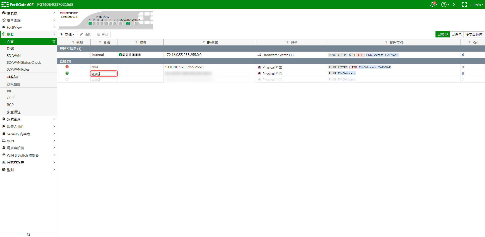


   
  # 2. 設置辦公室內部DNS


   
   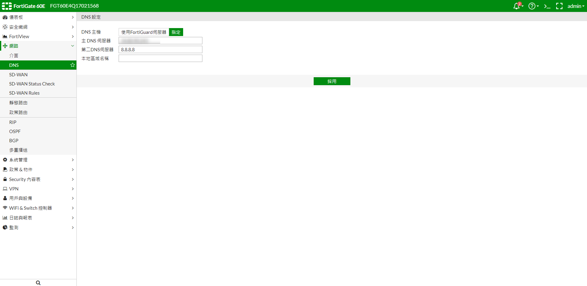


   
  # 3. 開啟進階功能開關 >> 系統管理 Feature Visibility (其餘依照環境設置)


   
   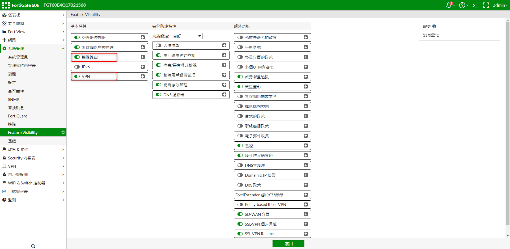

 
  
  # 4. 新增位址 >> 內部 Internal-IP


   
   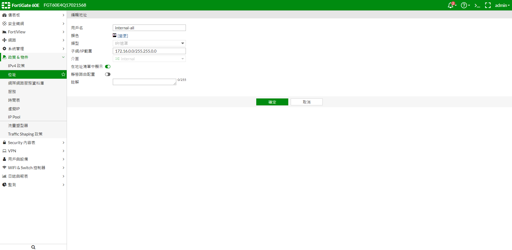
   

   
 # 5. 新增位址 >> SSLVPN_TUNNEL_ADDR1 , SSLVPN_TUNNEL_ADDR2 (做2個VPN通道)
   
   

   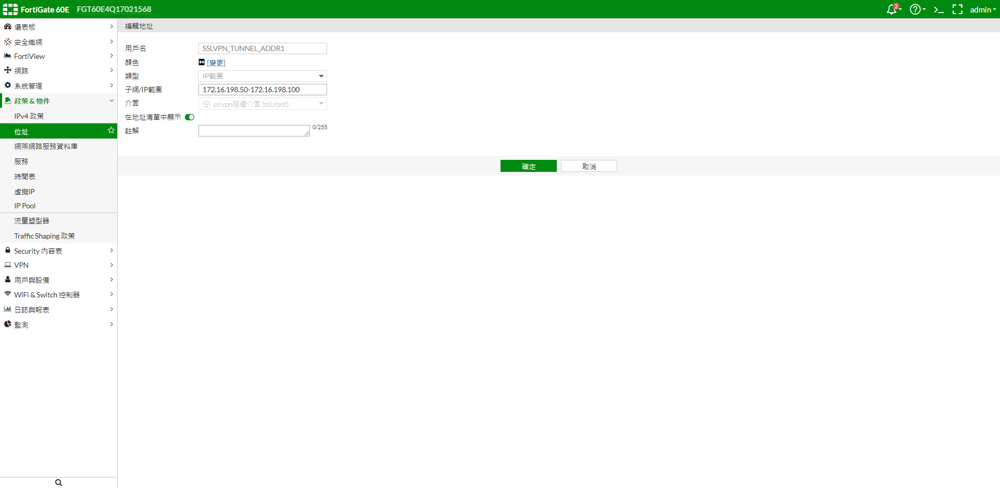
   
   
   

   
 # 6. SSL-VPN入口頁面 >> 新建 VPN-GROUP1 , VPN-GROUP2 對應 ADDR1 , ADDR2


   
   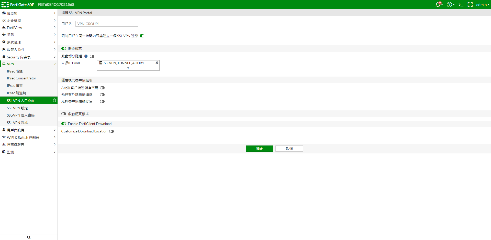
   
       


   
 # 7. 設置靜態路由 WAN1 (VPN入口)


   
   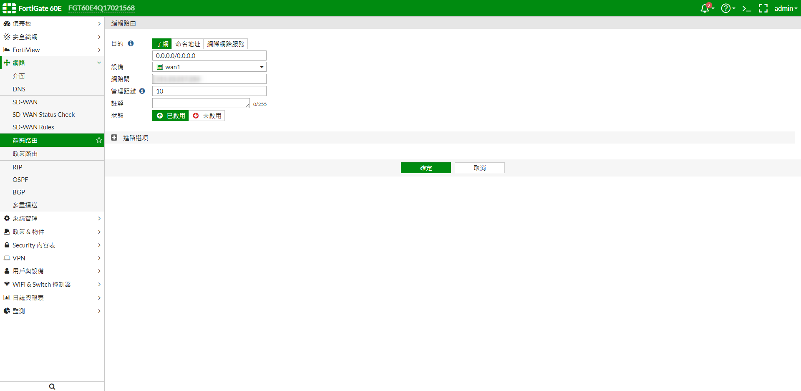
   


 # 8. 設置政策路由 (設置WAN1出口,來源分兩個 Group)
   


   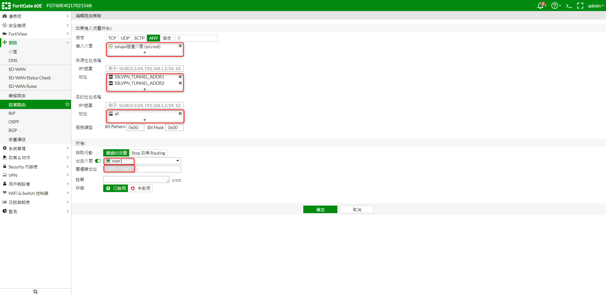
   
   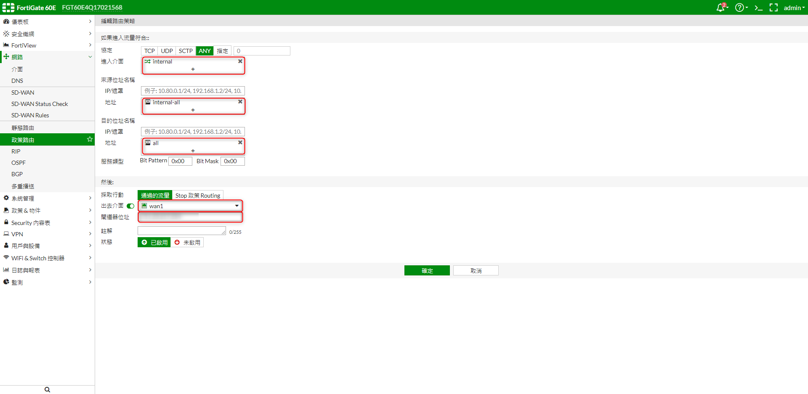
   
   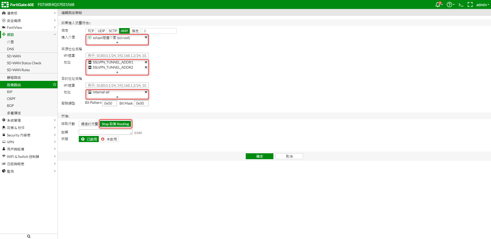
   


 # 9. IP Pool >> 新建IP池 (外部IP設置自己到自己)


   
   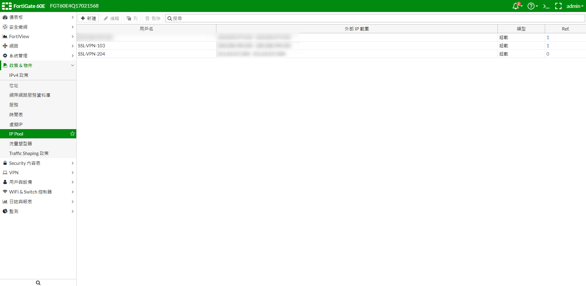

   
    
 # 10. 新增用戶群組


   
   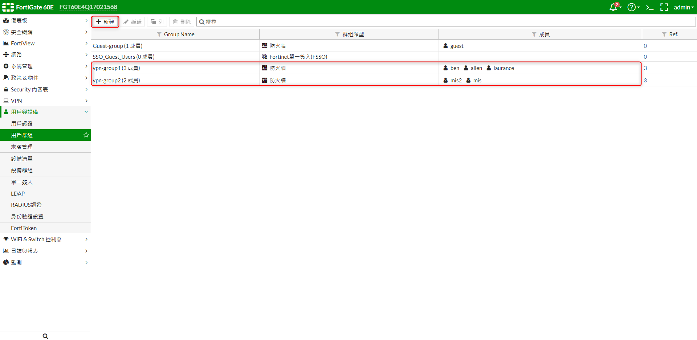


   
  # 11. SSL-VPN設定 >> 監聽走WAN1 , 4826Port , IP範圍:ADDR1,ADDR2 , 認證入口對應群組


   
   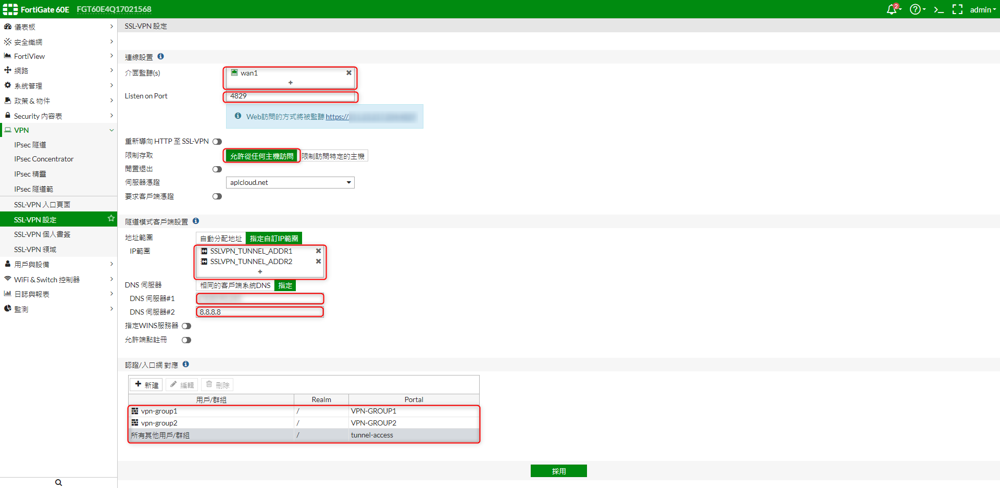
   


  # 12. 新增IPV4政策 
    
 ## (internal-wan1) (SSLVPN-LAN) (SSLVPN-WAN1)


   
   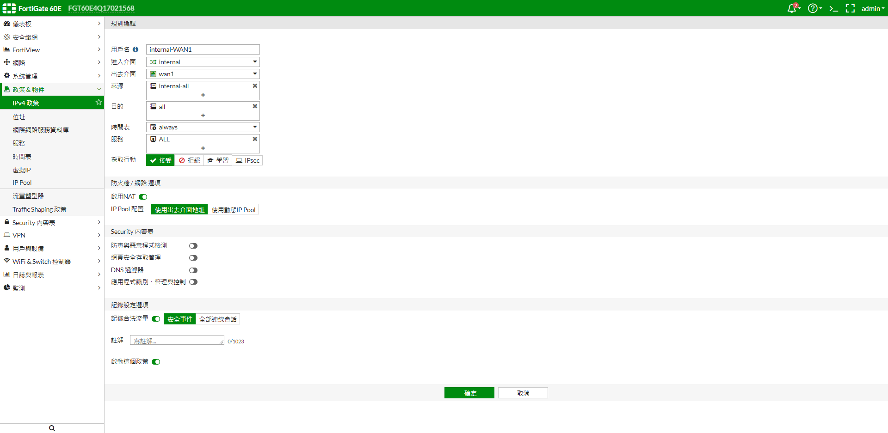
   
   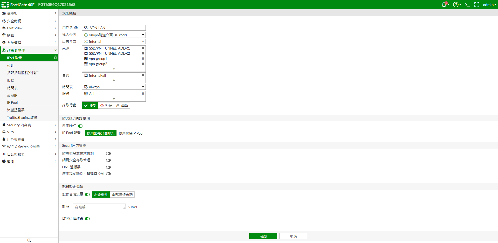
   
   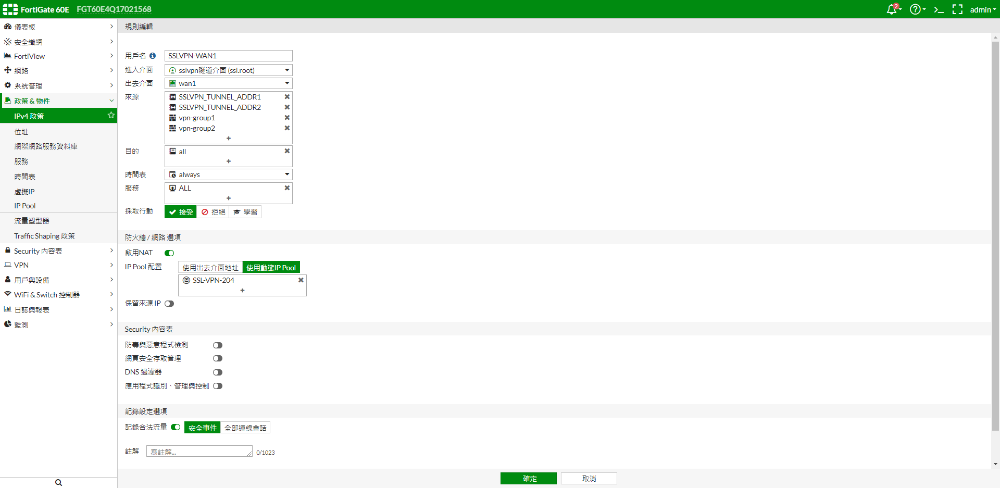
   
   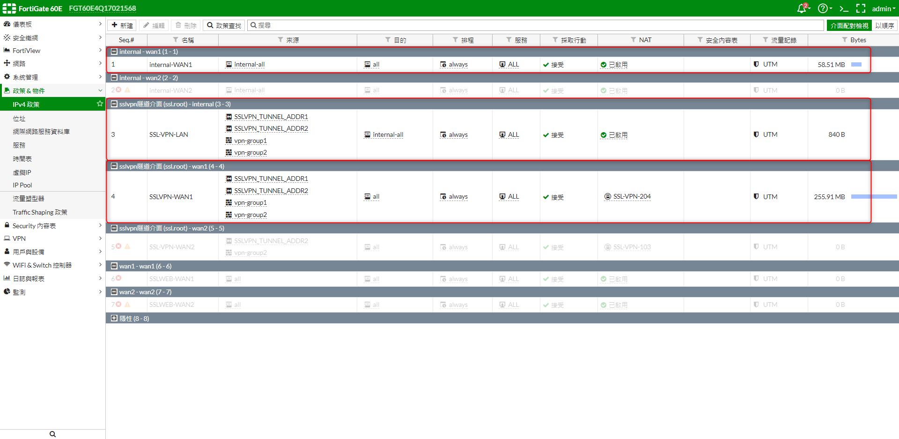

***





---

> Author: Laurance  
> URL: https://laurance.eu.org/posts/fortinet-fortigate60e-vpn%E8%A8%AD%E7%BD%AE/  

