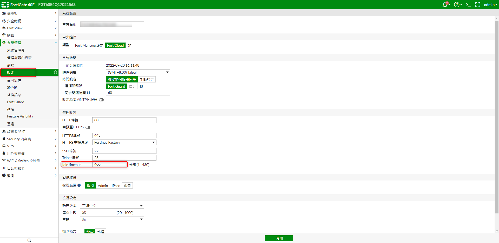

# Fortinet - FortiGate 60E 延遲自動登出設定

<!--more-->
"(解決延遲登出時間過短)"



  # 1. 修改閒置時間


   
   

***





---

> Author: Laurance  
> URL: https://laurance.eu.org/posts/fortinet-fortigate60e-%E5%BB%B6%E9%81%B2%E8%87%AA%E5%8B%95%E7%99%BB%E5%87%BA%E8%A8%AD%E5%AE%9A/  

