# GCP - ChatGPT 串接 Firebase 及 Linebot




# 建立與設定線上即時性資料庫 `Firebase Realtime database`

***

https://console.firebase.google.com/u/0/



***
***
***

## 點選 `Go to console`

***
***
***

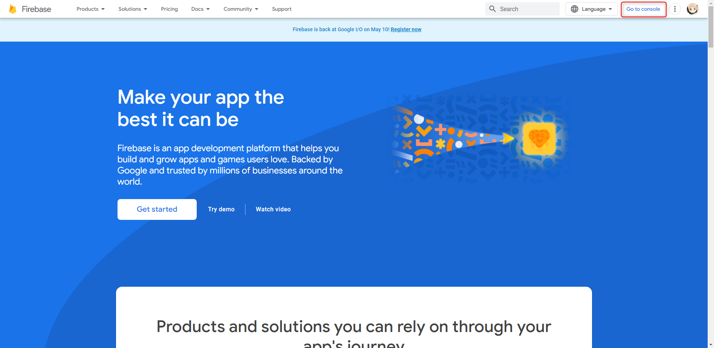

***
***
***

## 點選 `建立專案`

***
***
***

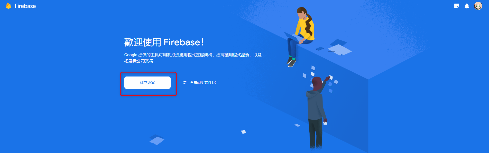

***
***
***

## 輸入 `專案名稱`及`打勾協議`

***
***
***

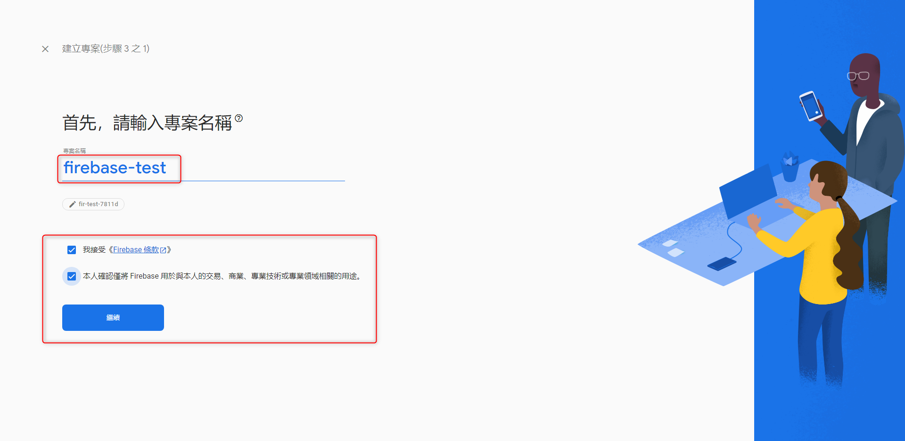

***
***
***

## 取消勾選與 `Google Analytics` 建立關聯，可以直接建立專案 

#### 建立關聯可以透過 Google Analytics  進行數據分析統計，但如果只是要單純使用資料庫，可以不必建立關聯 

***
***
***

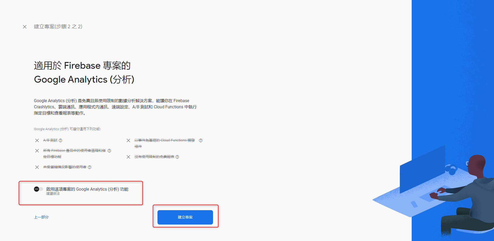

***
***
***



# 建立 Realtime Database 資料庫



***
***
***

## 專案建立完成後就會進入專案畫面，從左側選擇 `建構` > `Realtime Database`

***
***
***

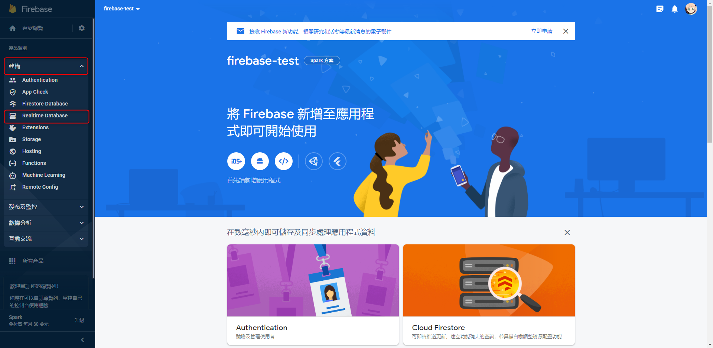

***
***
***

## 選擇後，點擊`建立資料庫`

***
***
***

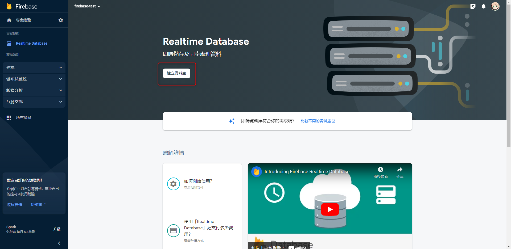

***
***
***

## 資料庫的位置選擇`美國` 繼續下一步

***
***
***

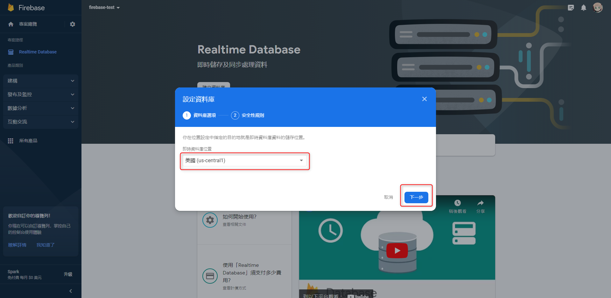

***
***
***

## 使用`鎖定模式`啟用 ( 鎖定模式表示這個資料庫禁止存取，啟用後會再修改設定使資料庫可以存取資料 )

***
***
***

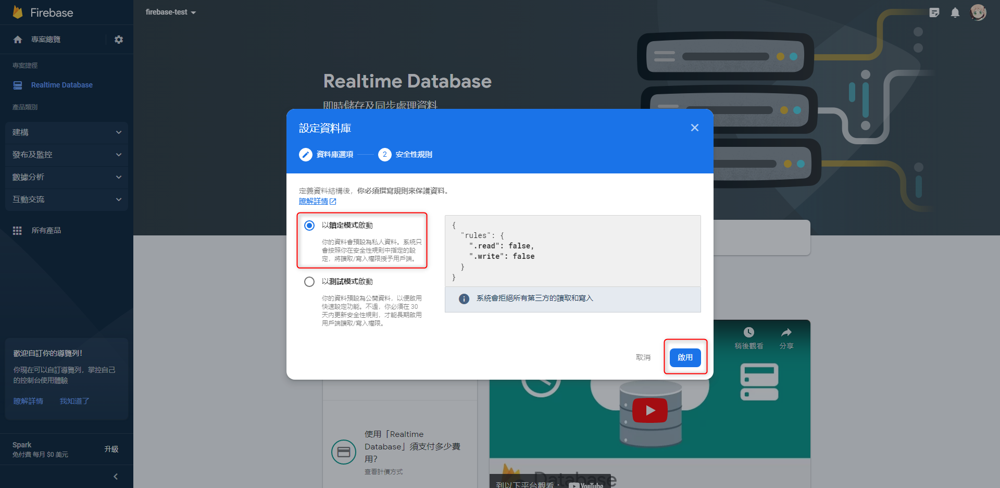

***
***
***



#  建立好的畫面



***
***
***

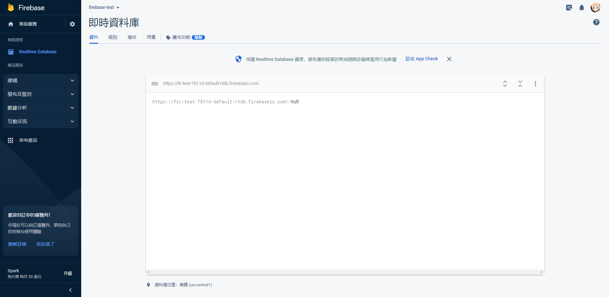

***
***
***



# 修改 Realtime Database 存取權限



***
***
***

## 進入`規則`頁籤，將規則從 `false` 修改為 `ture` 點擊`發布`，就能將資料庫改成`所有人都可以存取`的狀態

***
***
***

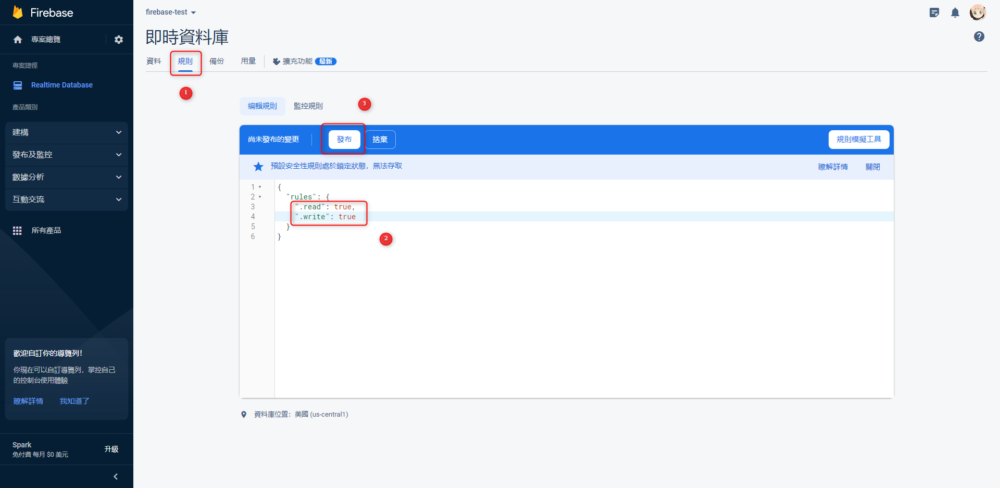
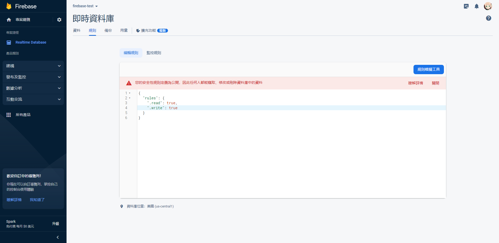

***
***
***

## 建立 `GCP-Cloud Functions` 

```sql

# requirements.txt

# Function dependencies, for example:
# package>=version
line-bot-sdk
requests
openai
git+https://github.com/ozgur/python-firebase

```

```sql

# main.py

from linebot import LineBotApi, WebhookHandler
from linebot.models import TextSendMessage, StickerSendMessage, ImageSendMessage, LocationSendMessage
import requests, json

import openai
openai.api_key = 'XXXXXXXXXXXXXXXXXXXX'

from firebase import firebase

token = 'XXXXXXXXX'
secret = 'XXXXXXXXX'

def linebot(request):
    body = request.get_data(as_text=True)
    json_data = json.loads(body)
    try:
        line_bot_api = LineBotApi(token)
        handler = WebhookHandler(secret)
        signature = request.headers['X-Line-Signature']
        handler.handle(body, signature)
        tk = json_data['events'][0]['replyToken']
        timestamp = json_data['events'][0]['timestamp']
        msg_type = json_data['events'][0]['message']['type']
        if msg_type == 'text':
            msg = json_data['events'][0]['message']['text']
            url = 'XXXXXXXXXXXXXX.firebaseio.com'
            fdb = firebase.FirebaseApplication(url, None)
                        chatgpt = fdb.get('/','chatgpt')
            
                        if chatgpt == None:
                            messages = []
                        else:
                            messages = chatgpt
            
                        if msg == '!reset':
                            reply_msg = TextSendMessage(text='對話歷史紀錄已經清空！')
                            line_bot_api.reply_message(tk,reply_msg)
                            fdb.delete('/','chatgpt')
                        else:
                            messages.append({"role":"user","content":msg})
                            response = openai.ChatCompletion.create(
                                model="gpt-3.5-turbo",
                                max_tokens=640,
                                temperature=0.5,
                                messages=messages
                            )
                            ai_msg = response.choices[0].message.content.replace('\n','')
                            messages.append({"role":"assistant","content":ai_msg})
                            reply_msg = TextSendMessage(text=ai_msg)
                            line_bot_api.reply_message(tk,reply_msg)
                            fdb.put_async('/','chatgpt',messages)
                    else:
                        reply_msg = TextSendMessage(text='你傳的不是文字訊息啦')
                        line_bot_api.reply_message(tk,reply_msg)
                except Exception as e:
                    detail = e.args[0]
                    print(detail)
                return 'OK'

```

***
***
***

## 建立好 `Function` 後 , 將 `觸發網址` 貼入 `Line Developers Webhook URL` 並點選 `Verify 驗證`

***
***
***

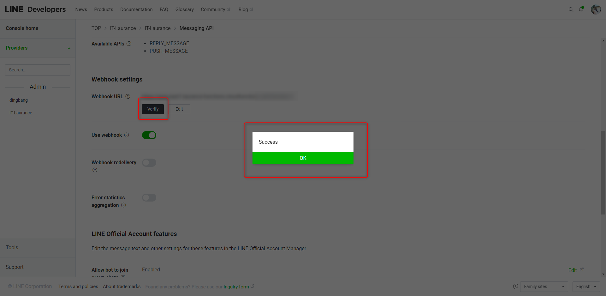

***
***
***

## 進入 `Firebase Realtime database` 也能看到歷史紀錄的資料

***
***
***

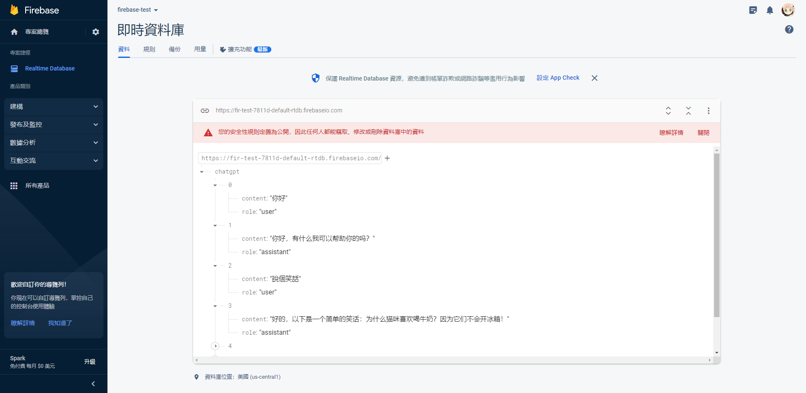


***


<style>
.emojify {
	font-family: Apple Color Emoji, Segoe UI Emoji, NotoColorEmoji, Segoe UI Symbol, Android Emoji, EmojiSymbols;
	font-size: 2rem;
	vertical-align: middle;
}
@media screen and (max-width:650px) {
  .nowrap {
    display: block;
    margin: 25px 0;
  }
}
</style>



---

> Author: Laurance  
> URL: https://laurance.eu.org/posts/gcp-chatgpt-%E4%B8%B2%E6%8E%A5-firebase%E5%8F%8Alinebot/  

