# GCP - Cloud Functions 部屬 LINE BOT + OpenAI



# LINE BOT + OpenAI 程式，讓 AI 回覆訊息



***

`讓程式判斷「Hi AI:」開頭的文字，當文字的開頭出現「Hi AI:」的字串時，就讓 OpenAI 進行回覆，否則就仍然回傳相同的字串。`

***

## {Step 1} 到 OpenAI 申請一組`帳號`及`API keys`

***
***
***

### Open AI API KEY : https://platform.openai.com/account/api-keys

***
***
***

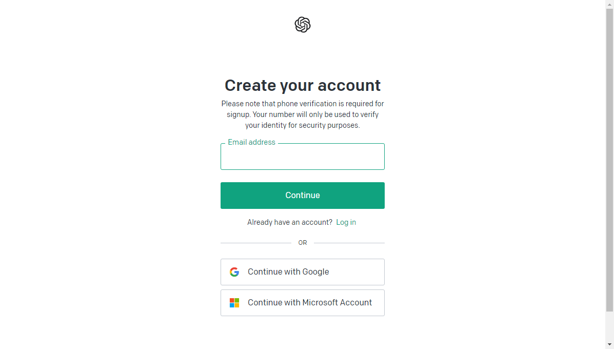

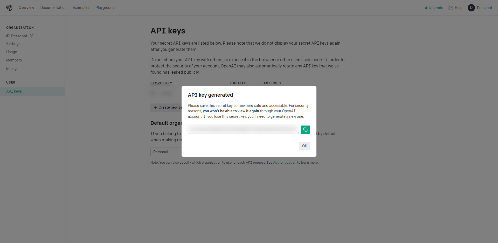

***
***
***

## {Step 2} 登入GCP選取專案 (這邊使用新專案測試)

***
***
***

### 右側選取 `API和服務` > `程式庫` 程式庫搜尋 `build api`

***
***
***

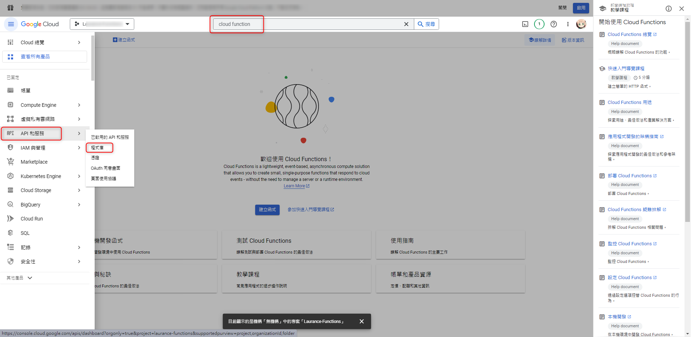 

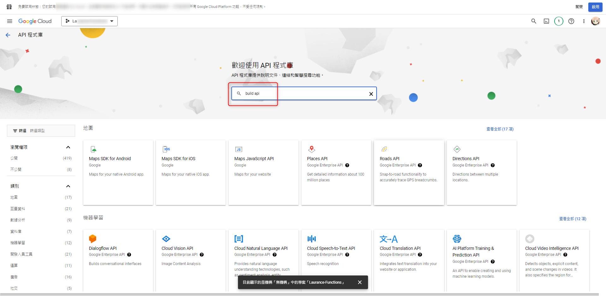

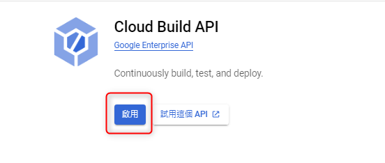

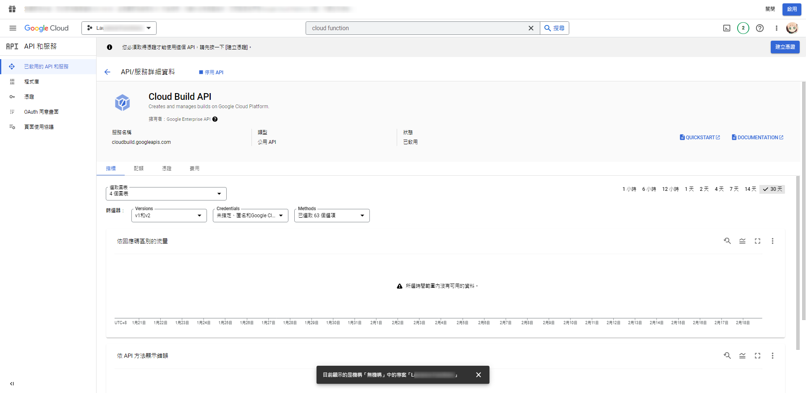

***
***
***

### 點選 `啟用API`

***
***
***

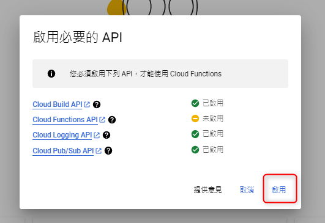

***
***
***

### 點選 `建立函式` 就能開始建立第一支 Cloud Functions 的程式

***
***
***

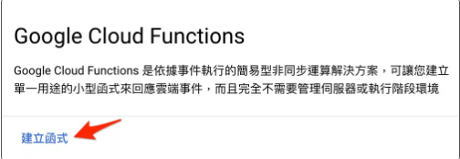

***
***
***

### 點選建立函式後，設定基本資訊，環境選擇 `第一代` `asia-east1 (台灣)`

***
***
***

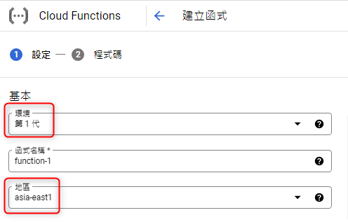

***
***
***

### 觸發條件選擇 `HTTP` 勾選 `允許未經驗證的叫用` 透過 request POST 或 GET 的方法進行叫用

***
***
***

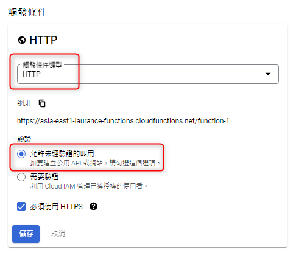

***
***
***

#### 其他保留預設值即可

***
***
***

### 編輯 `main.py` `requiements.txt` 加入 LINE BOT 和 OpenAI 函式庫

***
***
***

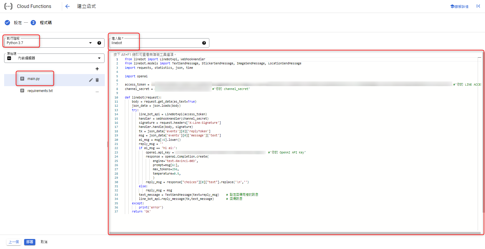

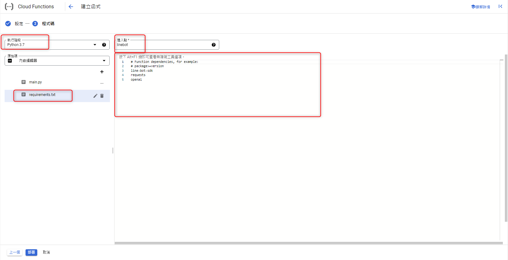

***
***
***

## {Step 3} 完成後部署程式，專案名稱前方出現綠色勾勾表示部署完成，複製觸發的網址

***
***
***

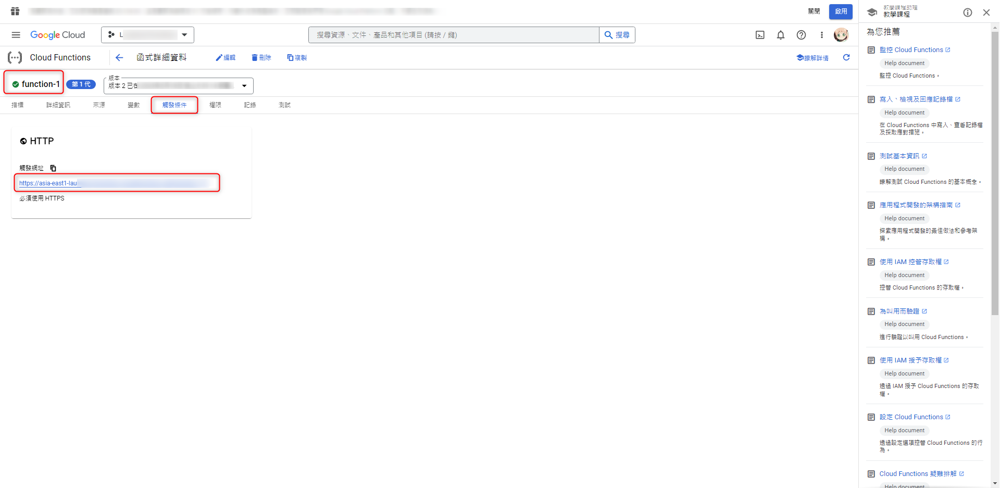

***
***
***

### 將網址填入 LINE BOT 的 Message API 裡 Webhook URL，點擊 `Edit` 貼上剛剛觸發網址 

***
***
***

### 接者按 `Verify` 驗證，出現 Success 表示 Webhook URL 已經順利串接

***
***
***

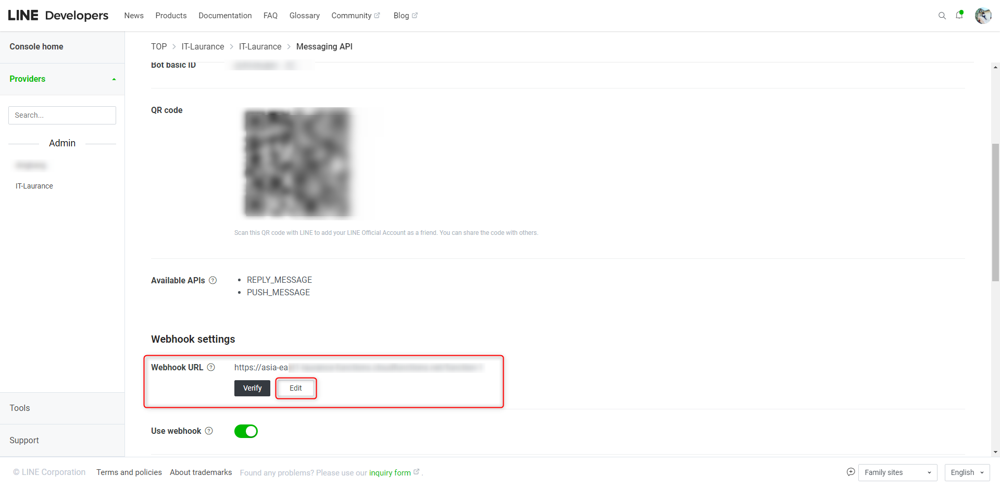

***
***
***

### 若出現 ERROR-403 則是沒有給予呼叫的權限

***
***
***

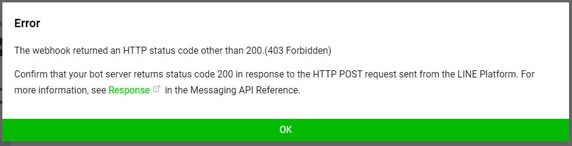

***
***
***

### 解決方法:

### 選取剛建立的 function 編輯權限 選取 `新增主體`

***
***
***

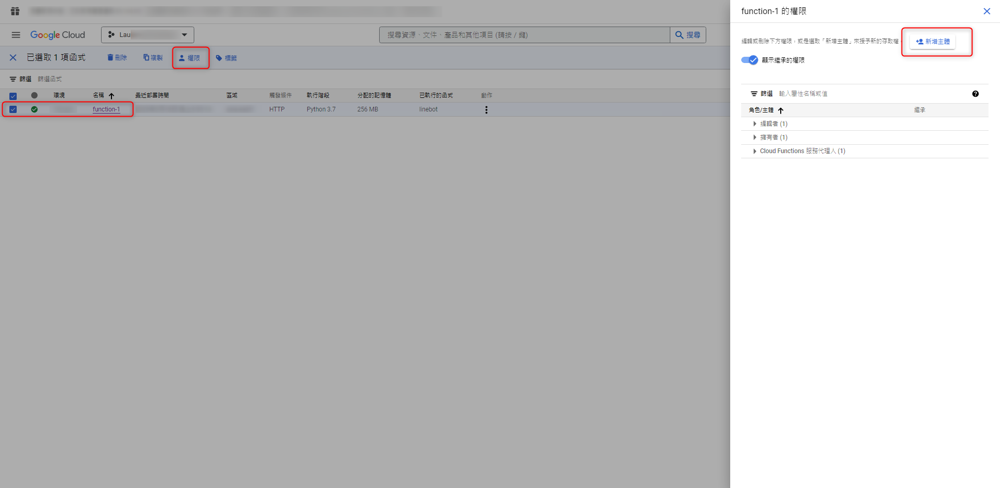

***
***
***

### 主體選擇 `allUsers` 泛指匿名使用者

### 指派角色選擇 `Cloud Functions` > `Cloud Functions 叫用者`

***
***
***

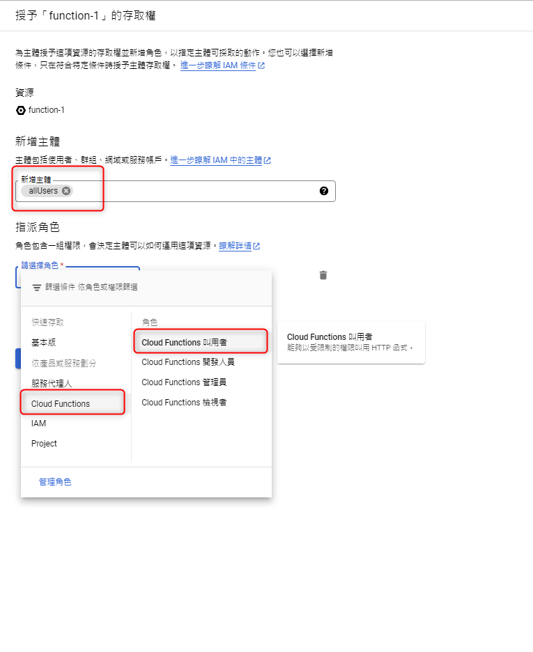

***
***
***

## {Step 4} 驗收 Line bot

***
***
***

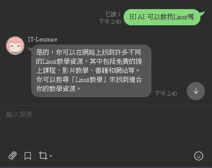

***
***
***

參考: 

https://steam.oxxostudio.tw/category/python/example/line-bot-openai-2.html

https://blog.wawajohn.net/11369.html

***





---

> Author: Laurance  
> URL: https://laurance.eu.org/posts/gcp-cloud-functions-%E9%83%A8%E5%B1%AC-line-bot-+-openai/  

