# GCP - Google Cloud Monitoring by Grafana



# Grafana 系統搭配 GCP Monitoring 資訊做監控



---

## GCP 設定

### {STEP 1} 啟用API服務 `Stackdriver Monitoring API`

***
***
***

 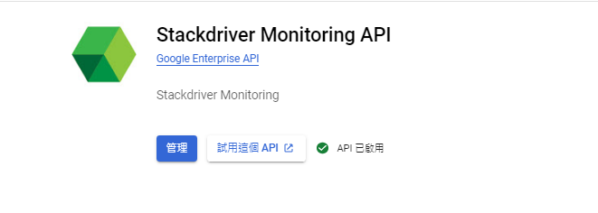

***
***
***

### {STEP 2} 啟用API服務 `Cloud Resource Manager API`

***
***
***

 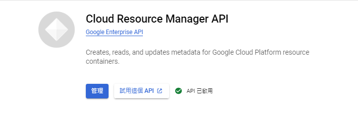

***
***
***

### {STEP 3} 點選 `API和服務` 建立服務帳號憑證

***
***
***

 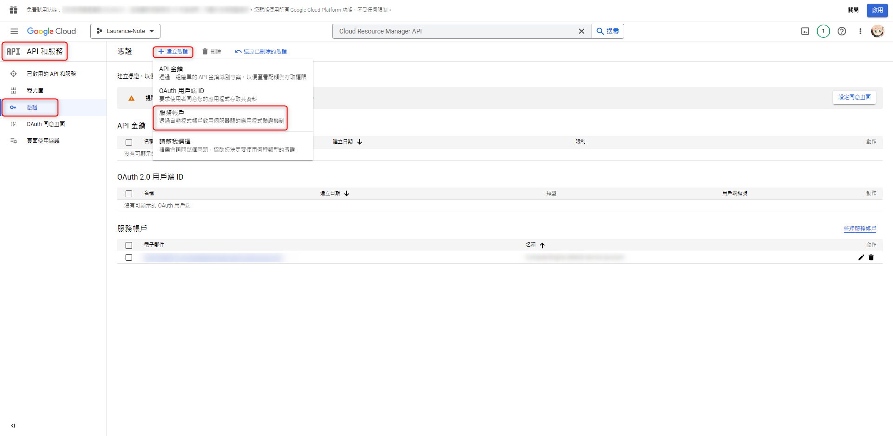

***
***
***

### {STEP 4} 設定`服務帳號名稱`及`設定該帳號權限`

***
***
***

  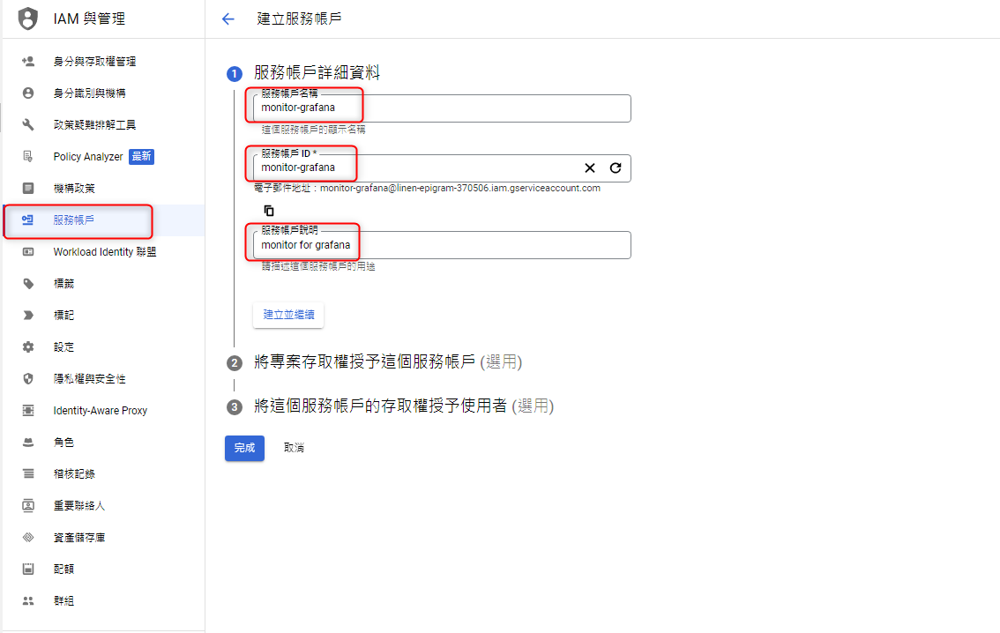
  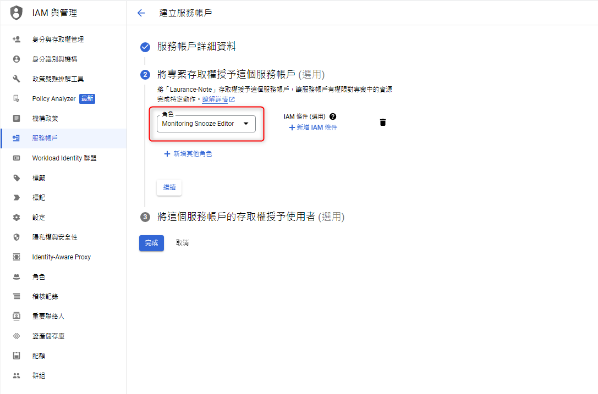

***
***
***

### {STEP 5} 設定 `授權此帳號的使用者`

***
***
***

 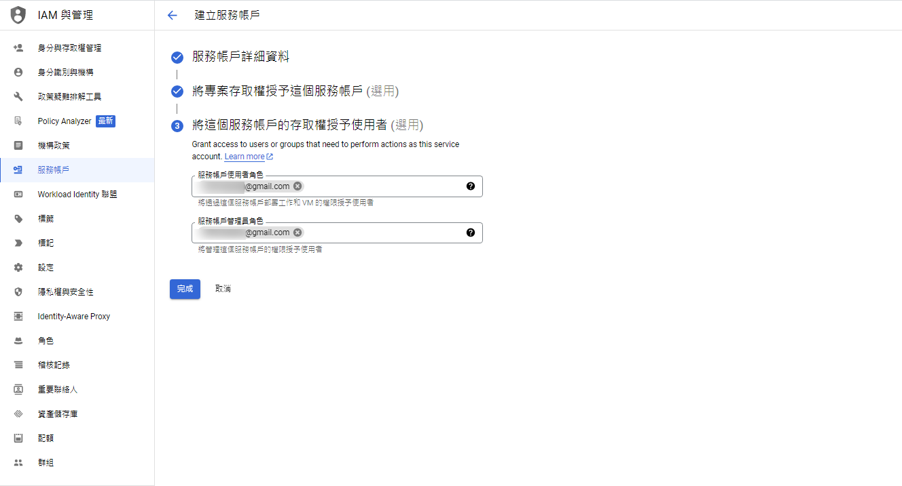

***
***
***
 
### {STEP 6} 點選剛建立的監控服務帳號 monitor-grafana 並建立 `JSON 金鑰`

***
***
***

 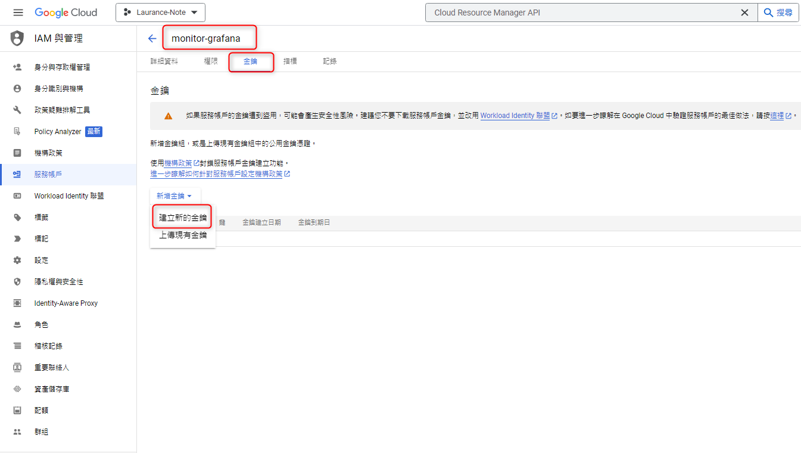
 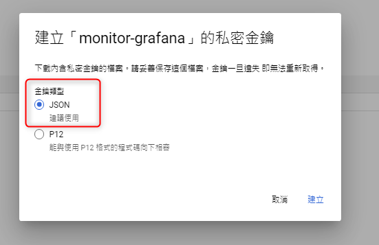

***
***
***
 
### {STEP 7} 添加監控權限 `For Monitor`

***
***
***

 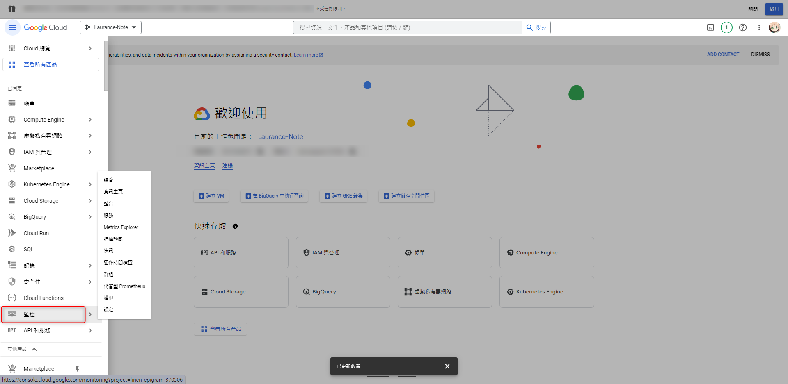

***
***
***

#### 添加 `授權使用者`

***
***
***

 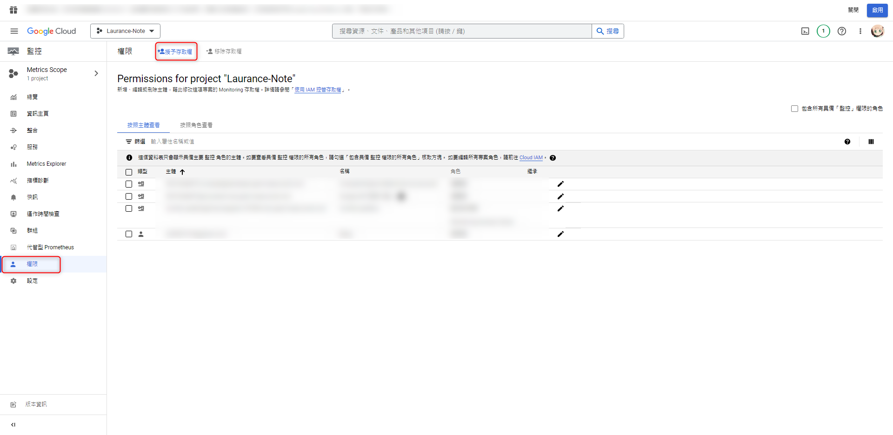

***
***
***

#### 新增主體: `剛建立的監控服務帳號 XXX.gmail`

#### 指派角色: `監控檢視者`

***
***
***

 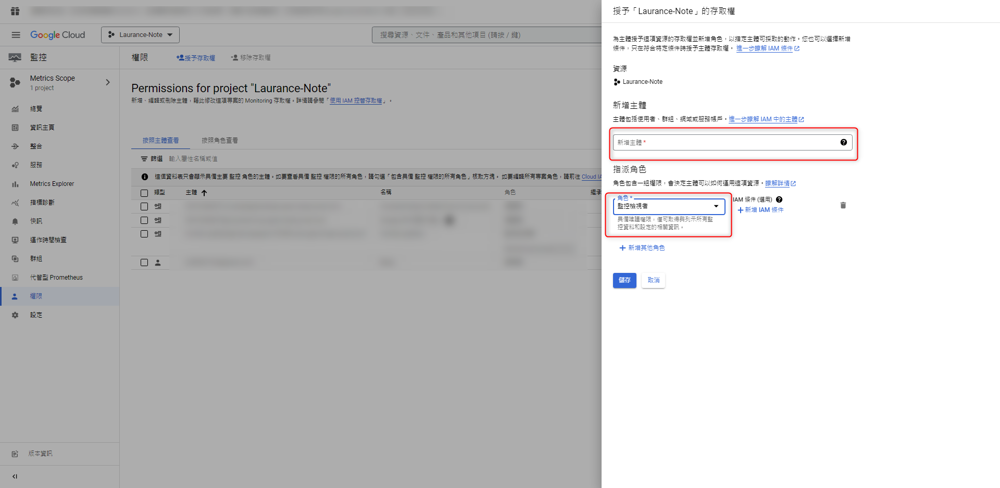

***
***
***



# Grafana



***
***
***

## {STEP 8} 新增 `Data source` 資料來源 `Google Cloud Monitoring`

***
***
***

 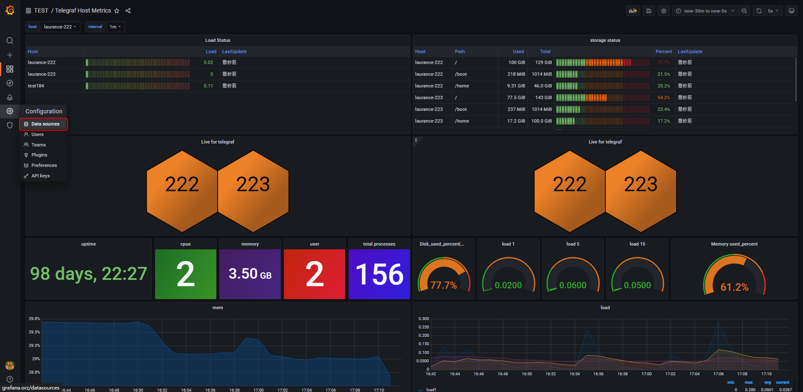
 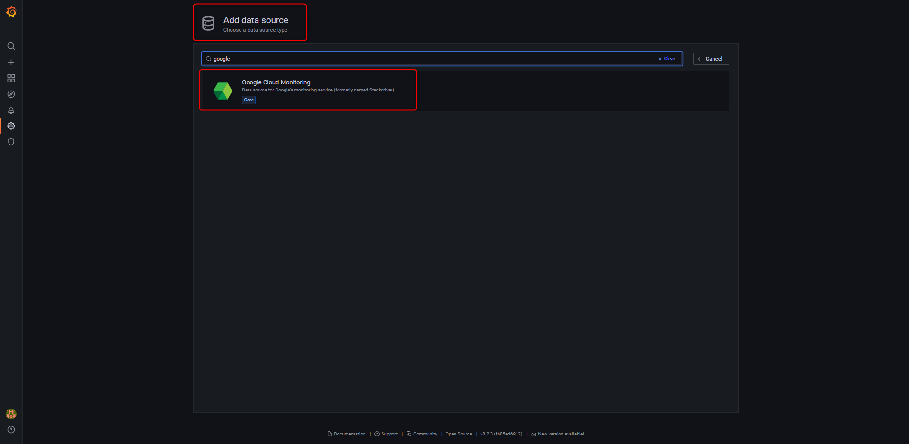

***
***
***

## {STEP 9} 將 `STEP 6` 新增的 `JSON 金鑰` 上傳 && `Save & test`

***
***
***

## 選擇 `Google JWT File`

## 點選 `Upload service account key file`

***
***
***

 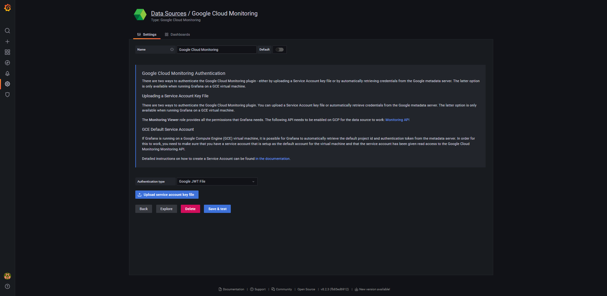
 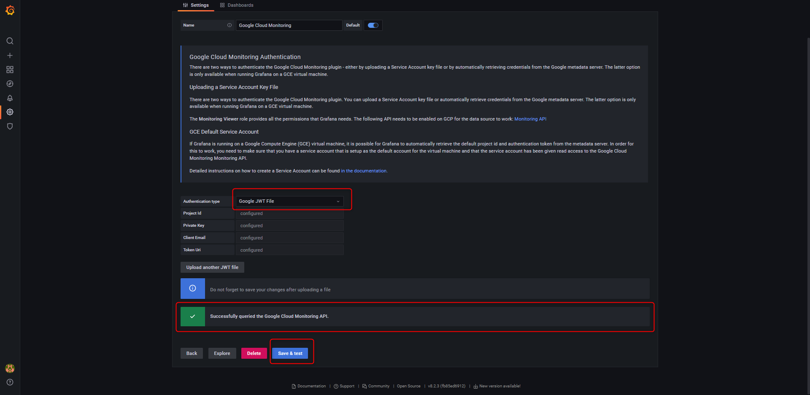

***
***
***

### {STEP 10} 成果驗收

***
***
***

 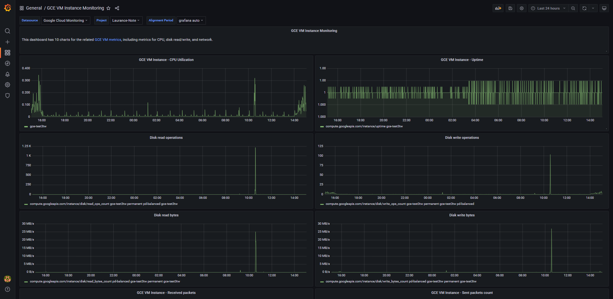

***





---

> Author: Laurance  
> URL: https://laurance.eu.org/posts/gcp-google-cloud-monitoring-by-grafana/  

