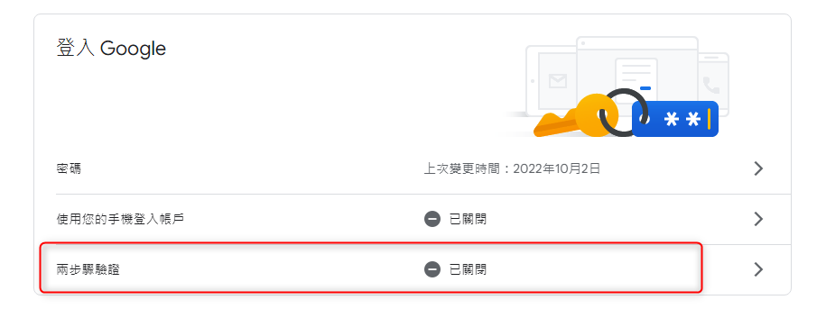
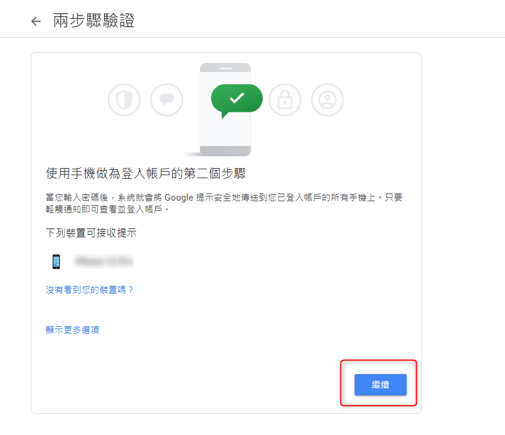
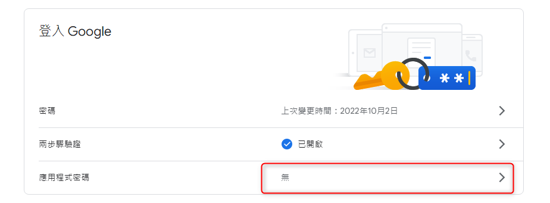
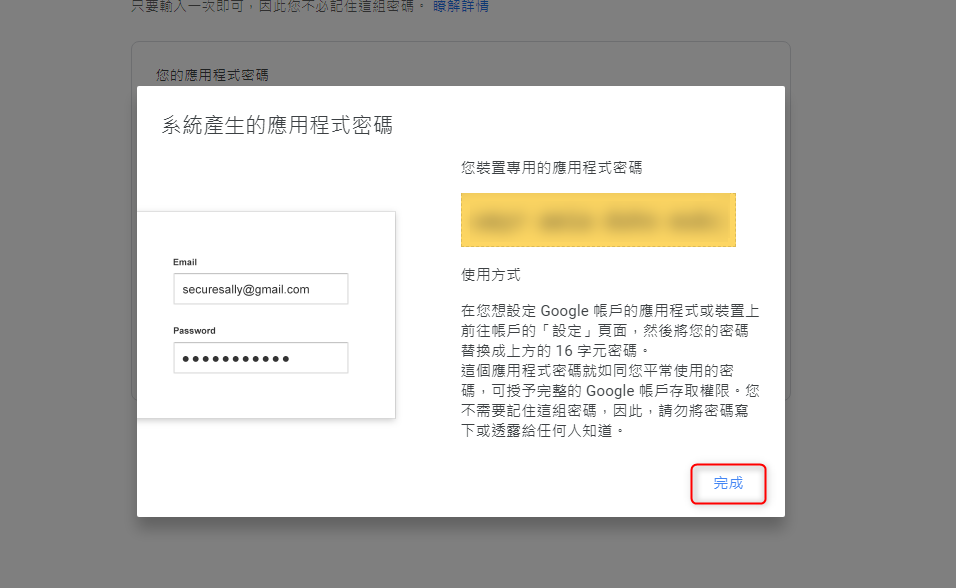

# GCP - google 啟用兩步驟驗證 再設定應用程式專用密碼

***
***
***



## 點選右上角頭像，管理你的帳戶

## 左邊 安全性 找到 "登入 Google" 並點選 "兩步驟驗證"



***
***
***

***
***
***



## 會列出有綁帳號的手機，點選繼續

## 接著輸入 "驗證碼"



***
***
***

***
***
***



# 都完成後退出到首頁，並點選 "應用程式密碼"



***
***
***

***
***
***



## 接著系統會產生一組隨機密碼

## 這組應用程式專用密碼只能登入一個地方



***
***
***

   

***





---

> Author: Laurance  
> URL: https://laurance.eu.org/posts/gcp-google-%E5%95%9F%E7%94%A8%E5%85%A9%E6%AD%A5%E9%A9%9F%E9%A9%97%E8%AD%89/  

