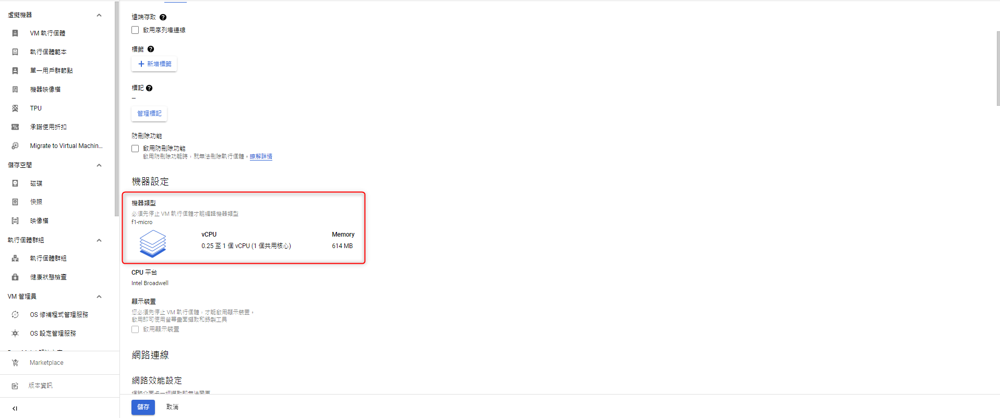
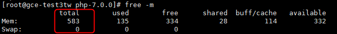
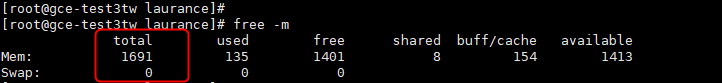

# GCP - GCE 內存過小導致無法編譯 PHP 解決方法


***
***
***



# 編譯PHP時,秀 ERROR: virtual memory exhausted: Cannot allocate memory



***
***
***

## 因為用的是免費方案,內存小的可憐,故先調大再縮小

## GCP後台查看機器內存只有 614M

***
***
***

   

***
***
***
   
## 機器上看也是 583M

***
***
***

   

***
***
***
   
## 先將機器關機 (要關機才能調)

```sql

init 0    # Linux 關機語法

```

***
***
***
    
## 到GCP後台調成 g1-small

***
***
***

   

***
***
***
   
## 開機後就能看到已調成 1.6G

***
***
***

   
   
   
***


<style>
.emojify {
	font-family: Apple Color Emoji, Segoe UI Emoji, NotoColorEmoji, Segoe UI Symbol, Android Emoji, EmojiSymbols;
	font-size: 2rem;
	vertical-align: middle;
}
@media screen and (max-width:650px) {
  .nowrap {
    display: block;
    margin: 25px 0;
  }
}
</style>



---

> Author: Laurance  
> URL: https://laurance.eu.org/posts/gcp-%E5%85%A7%E5%AD%98%E9%81%8E%E5%B0%8F%E5%B0%8E%E8%87%B4%E7%84%A1%E6%B3%95%E7%B7%A8%E8%AD%AFphp/  

