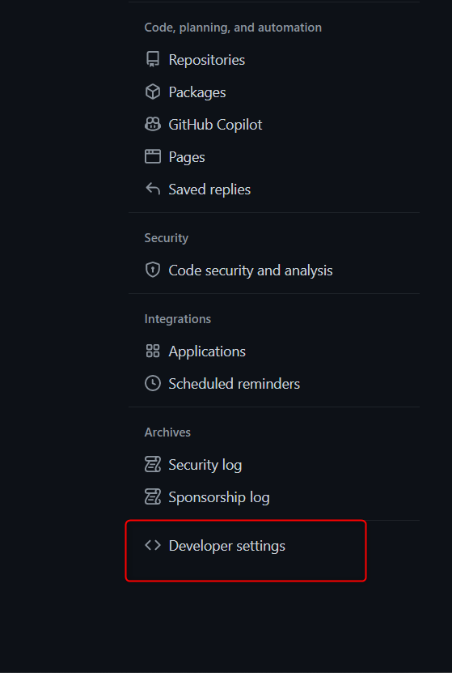
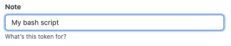
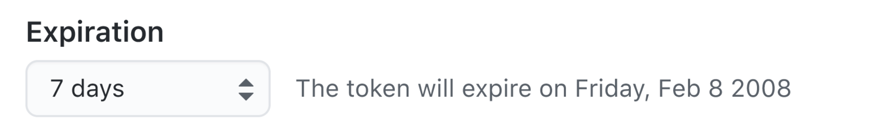

# Git - 建立訪問 Token

<!--nore-->
"密碼登入顯示 ERROR : Authentication failed"

***
***
***

## 點擊右上角 setting

***
***
***
    
   

***
***
***
   
## 左側欄 點擊 Developer settings

***
***
***
    
   

***
***
***
   
## 左側欄 點擊 Personal access tokens

***
***
***
    
   

***
***
***

## 生成新 Tokens

***
***
***
    
   

***
***
***
   
## 新增 Token Name

***
***
***
    
   

***
***
***
   
## 選擇過期時間

***
***
***
    
   

***
***
***
   
## 選擇鑰給予 Token 的權限

***
***
***
    
   

***
***
***
   
## 生成 Tokens

***
***
***
    
   
   

***





---

> Author: Laurance  
> URL: https://laurance.eu.org/posts/git-%E5%BB%BA%E7%AB%8B%E8%A8%AA%E5%95%8Ftoken/  

