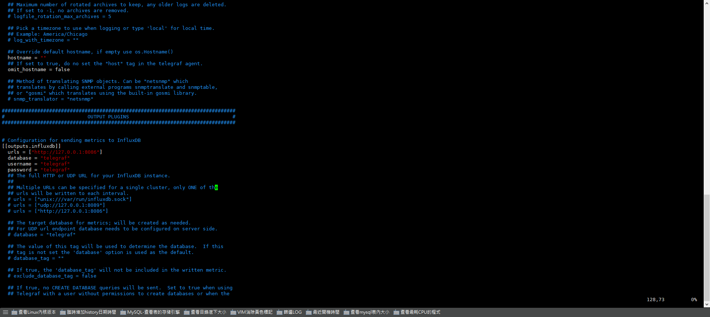
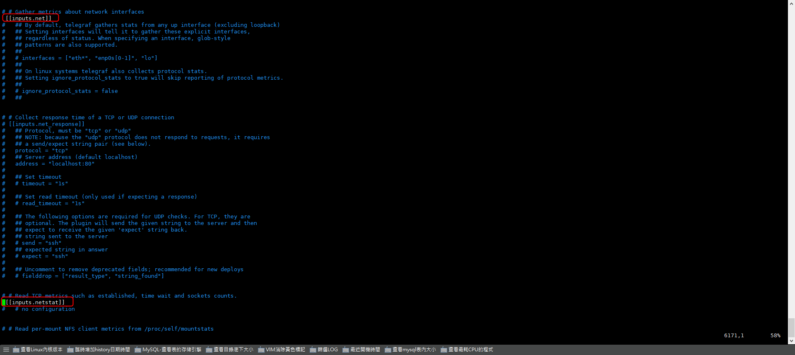
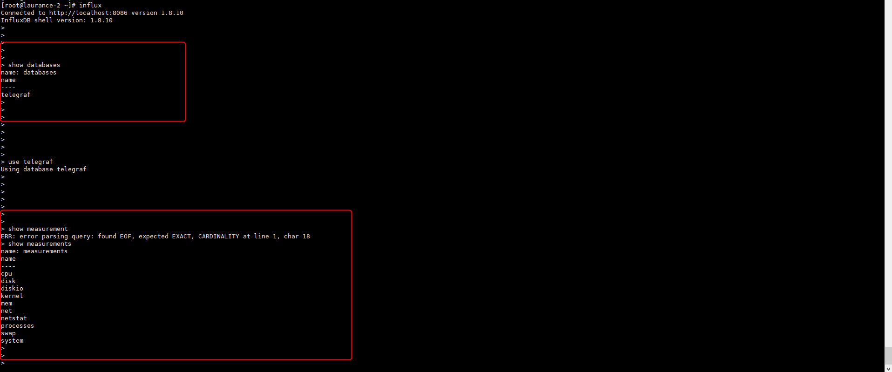
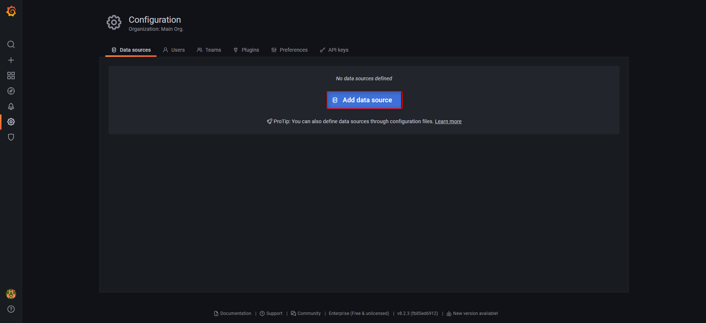
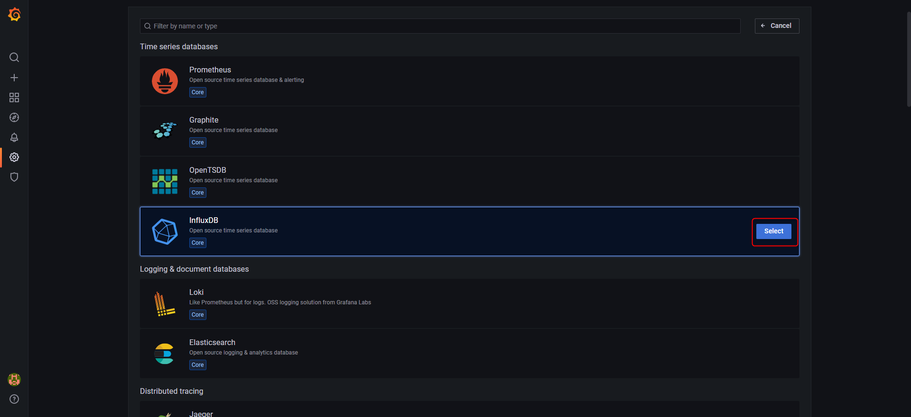
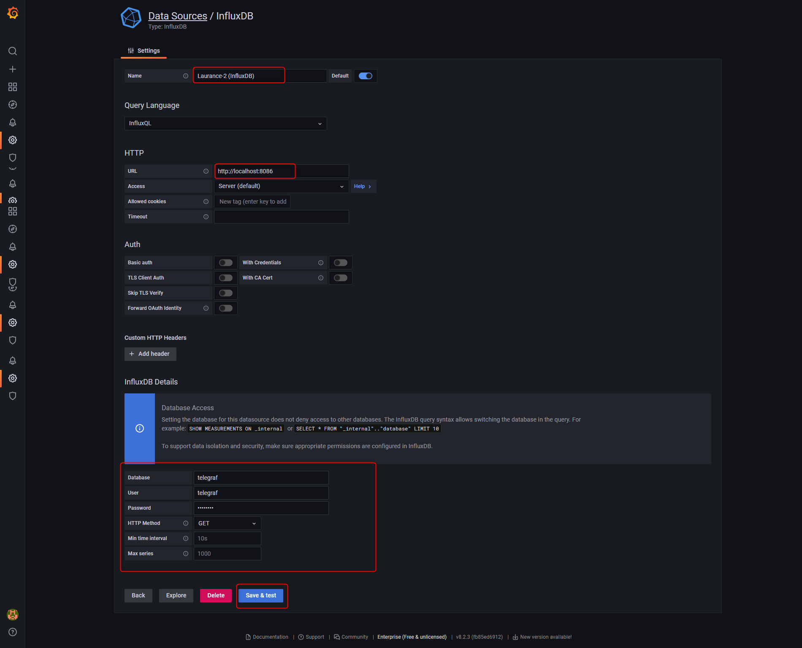
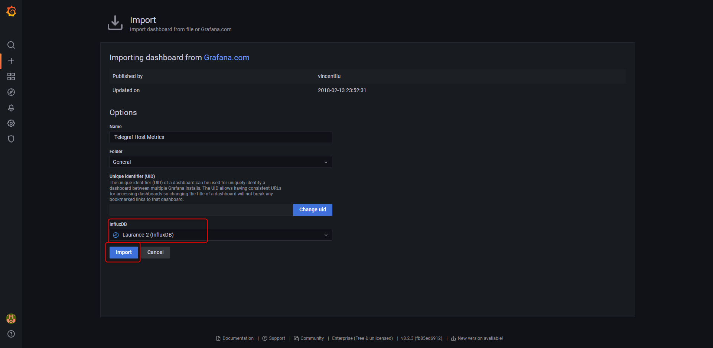
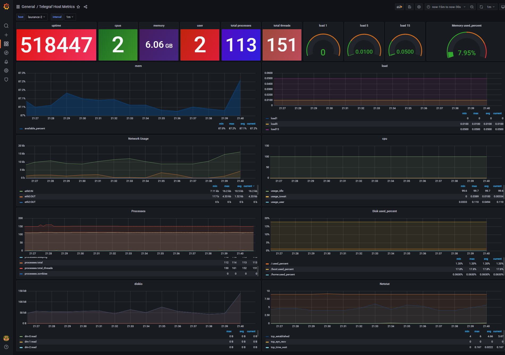

# Grafana - 構建 Linux 效能監控


***
***

<!--more-->
使用 grafana + influxdb + telegraf 建立監控

***
***

**Grafana 安裝**
=====

   [Grafana 官方載點](https://grafana.com/grafana/download)


   
以下用 `yum` 方式安裝 `Grafanae-8.2.3-1`


    
```sql
wget https://dl.grafana.com/enterprise/release/grafana-enterprise-8.2.3-1.x86_64.rpm
    
yum localinstall grafana-enterprise-8.2.3-1.x86_64.rpm
    
systemctl start grafana-server
    
systemctl status grafana-server
```

***
***

**InfluxDB 、 Telegraf 安裝**
=====
    
[InfluxDB 官方載點](https://portal.influxdata.com/downloads/)
   

   
以下用 `yum` 方式安裝 `InfluxDB v1.8.0` `Telegraf v1.24.1`



```sql
cat <<EOF | tee /etc/yum.repos.d/influxdata.repo
[influxdata]
name = InfluxData Repository - Stable
baseurl = https://repos.influxdata.com/stable/\$basearch/main
enabled = 1
gpgcheck = 1
gpgkey = https://repos.influxdata.com/influxdata-archive_compat.key
EOF

yum install influxdb telegraf
```

***
***
    
### Step.1 修改 `Telegraf 的設定檔`並啟動:   
   
`將 output-influxdb 打開並指向 database-telegraf , 打開 network 參數 , 新增使用者`

***
***
   

   


***
***
   
#### 啟動服務 telegraf
     
```sql
service telegraf start
```

***
***

#### Step.2 啟動服務 InfluxDB
    
```sql
service influxdb start
```
  


***
***
  
### Step.3 進入 `InfluxDB` 介面建立 `telegraf 使用者` , 並`給予權限`
   
```sql
influx

create user telegraf with password 'telegraf'
grant all on telegraf to telegraf
```

***
***

### Step.4 啟動服務 grafana
   
```sql
systemctl start grafana-server
```

***
***
    
### Step.5 開啟後台 http://localhost:3000 並建立資料來源 datasource
  
  

  
  
  
  
  

***
***
  
### Step.6 匯入 Grafana 官方模板
  
  
  
  
  
  

***
***
  
### Step.7 驗證: 打開本機 3000port    ex: http://172.16.0.222:3000
  
  

***
***
    
***


<style>
.emojify {
	font-family: Apple Color Emoji, Segoe UI Emoji, NotoColorEmoji, Segoe UI Symbol, Android Emoji, EmojiSymbols;
	font-size: 2rem;
	vertical-align: middle;
}
@media screen and (max-width:650px) {
  .nowrap {
    display: block;
    margin: 25px 0;
  }
}
</style>



---

> Author: Laurance  
> URL: https://laurance.eu.org/posts/grafana-+-influxdb-+-telegraf-%E6%A7%8B%E5%BB%BAlinux%E6%95%88%E8%83%BD%E7%9B%A3%E6%8E%A7/  

