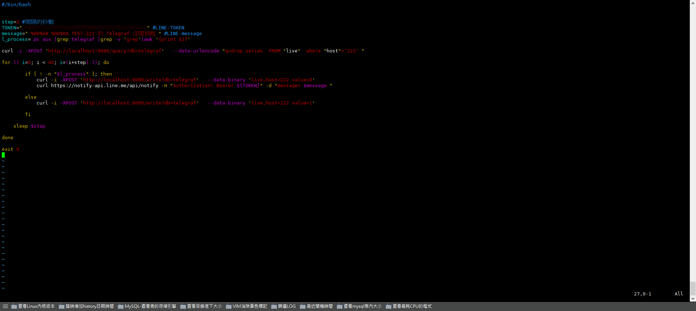
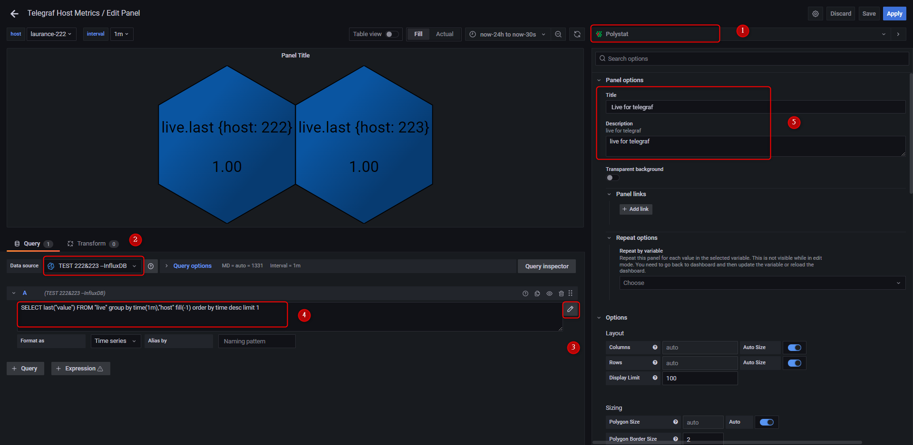
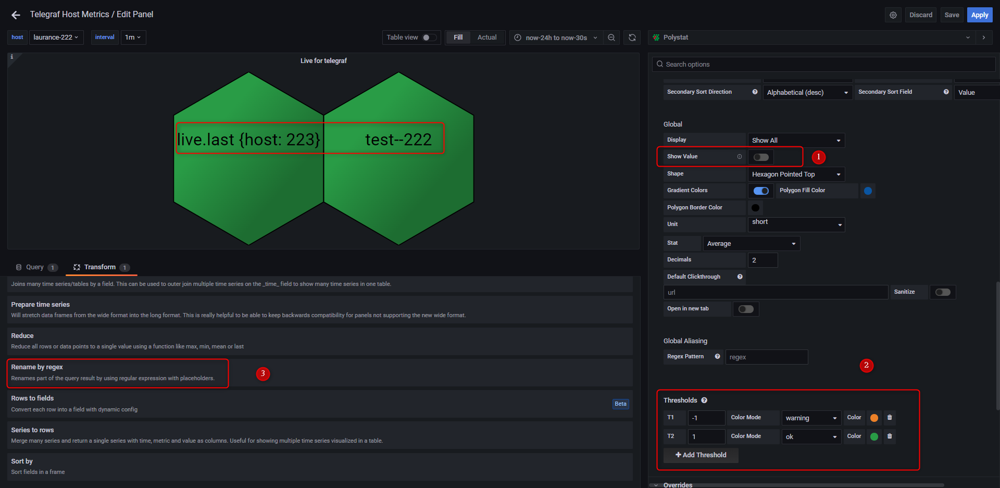
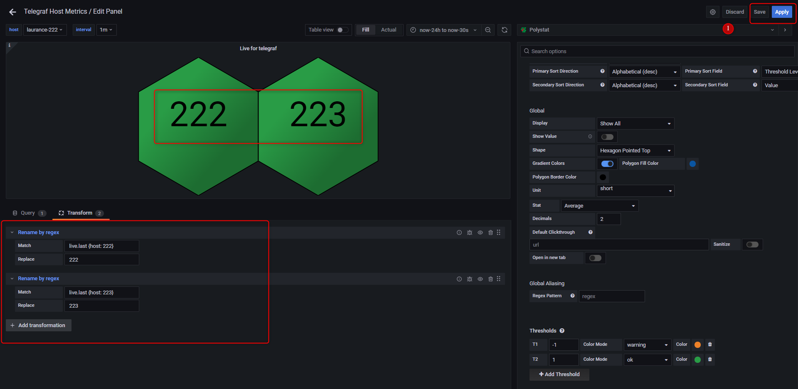

# Grafana - Polystat panel使用


<!--more-->
"( 建立 agent 監控並使用 Line-Notify 提醒 )"


## 安裝Grafana套件
    
```sql
grafana-cli plugins install grafana-polystat-panel
```    

## 服務重啟
   
```sql
service grafana-server restart
``` 
 
## 查看 telegraf 的 PID
   
```sql
ps aux |grep telegraf |grep -v 'grep'|awk '{print $2}'
```    

## 建立監控並寫入 InfluDB 的 Shell，並給予權限
   
```sql
vim live.sh && chmod 755 live.sh
```

***
***
***
   
   

***
***
***
   
## 建立排程 ( SHELL:每2秒執行一次 )
   
```sql
crontab -e
    
* * * * * sh /home/grafana/crontab-live.sh
```

***
***
***

##  Grafana 後台-建立新 panel 並設置

***
***
***
   
   
   
   

***
***
***
   
## 最後記得要 SAVE，不然得重頭在來

***
***
***
   
   
   
   
   
   
   
***


<style>
.emojify {
	font-family: Apple Color Emoji, Segoe UI Emoji, NotoColorEmoji, Segoe UI Symbol, Android Emoji, EmojiSymbols;
	font-size: 2rem;
	vertical-align: middle;
}
@media screen and (max-width:650px) {
  .nowrap {
    display: block;
    margin: 25px 0;
  }
}
</style>



---

> Author: Laurance  
> URL: https://laurance.eu.org/posts/grafana-polystat-panel%E4%BD%BF%E7%94%A8/  

