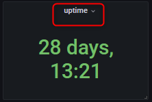
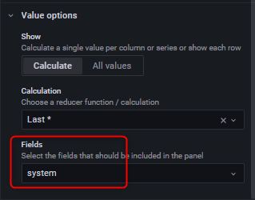
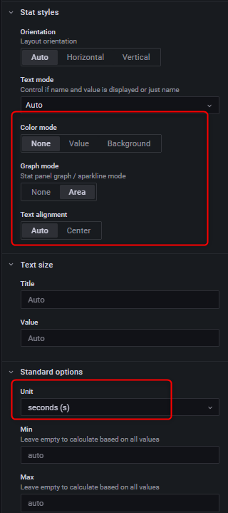

# Grafana - 使用 uptime 查詢系統運行時間


# 建立 `panel for uptime`



## 點選 `uptime` 的 `panel` 選擇 `edit`



***
***
***

 

***
***
***



## 旁邊細節設定可參照 :



***
***
***

 
 
 

***
***
***

# InfluxDB查詢語法:

```sql
select last(uptime_format) as value from system
    
SELECT last("uptime_format") AS "value" FROM "system" WHERE "host" =~ /$server$/ AND $timeFilter GROUP BY time($interval)
```


***


<style>
.emojify {
	font-family: Apple Color Emoji, Segoe UI Emoji, NotoColorEmoji, Segoe UI Symbol, Android Emoji, EmojiSymbols;
	font-size: 2rem;
	vertical-align: middle;
}
@media screen and (max-width:650px) {
  .nowrap {
    display: block;
    margin: 25px 0;
  }
}
</style>



---

> Author: Laurance  
> URL: https://laurance.eu.org/posts/grafana-%E4%BD%BF%E7%94%A8uptime%E6%9F%A5%E8%A9%A2%E7%B3%BB%E7%B5%B1%E9%81%8B%E8%A1%8C%E6%99%82%E9%96%93/  

