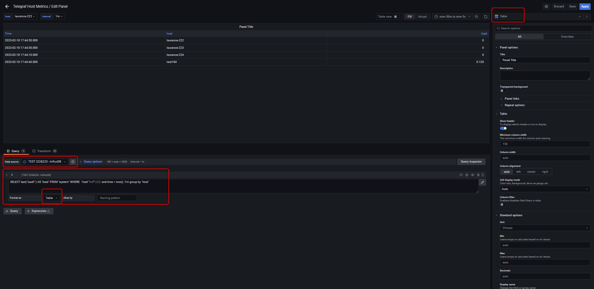
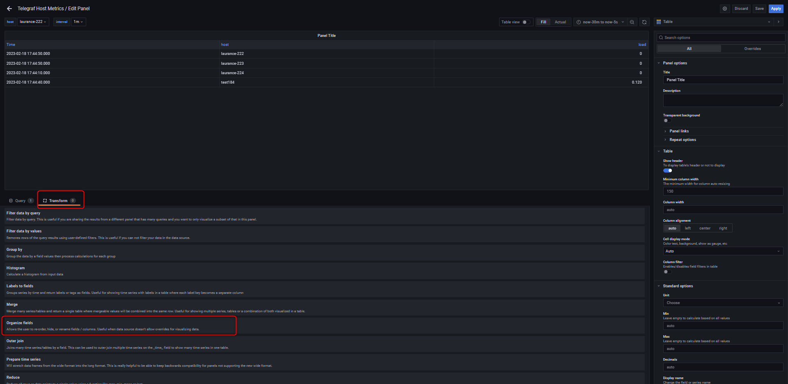
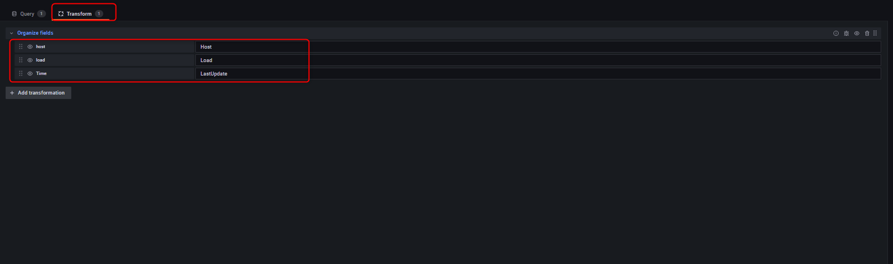
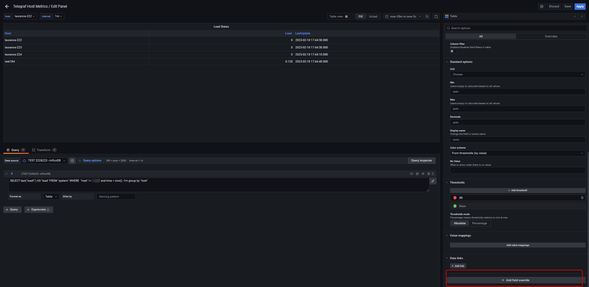
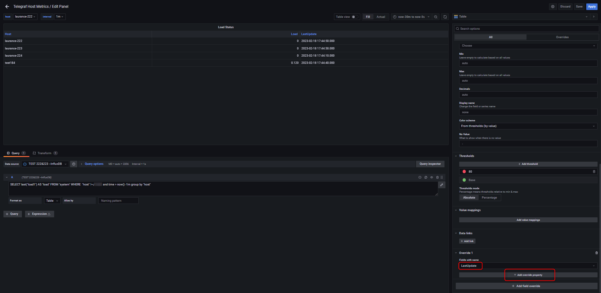
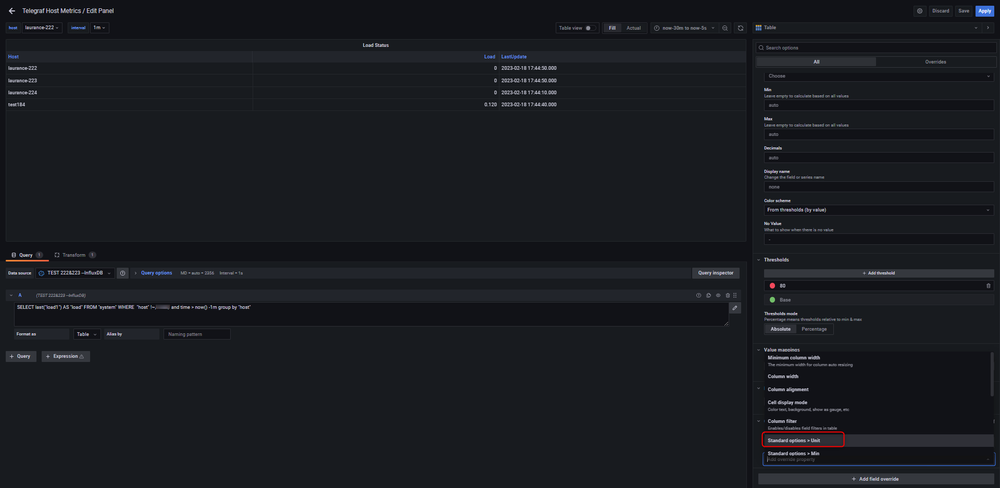
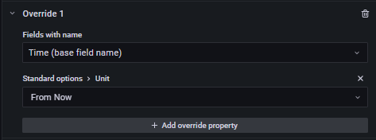
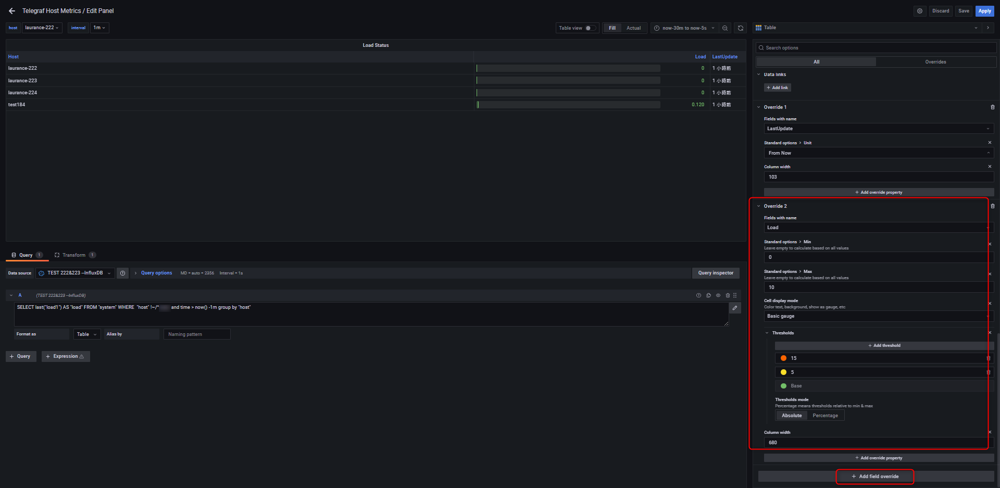

# Grafana - 建立 panel for loading

***
***

**Add an panel for monitor loading**
=====

***
***

### {step1} 右上角 `+` > Add an empty panel

***
***

### {step2} 依需求填寫 `Data source` `Query` `Visualization`

***
***


    
Data source = InfluxDB





Query = SELECT last("load1") AS "load" FROM "system" WHERE  "host" !~/^$interval$/ and time > now() -1m group by "host"




   
Visualization = Table



***
***
    

***
***

### {step3} 選擇 `Transform` 建立 `Organize fields` && 增加 `host` `load` `time`

***
***

***
***

### {step4} 右側條件選單拉到最底選擇 

***
***



`Add filed override` > `Fields with name` > `LastUpdate` > `+ Add override property`



***
***

***
***



`Standard options > Unit` > `Date&time` > `From Now`



***
***

***
***



#### Override 1



***
***

***
***



#### Override 2



***
***

***
***



#### Override 3



***
***

***
***



#### Final



***
***

***
***

***





---

> Author: Laurance  
> URL: https://laurance.eu.org/posts/grafana-%E5%BB%BA%E7%AB%8B-panel-for-loading/  

