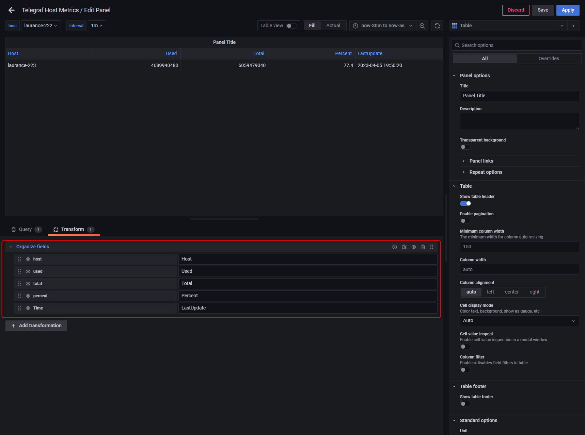
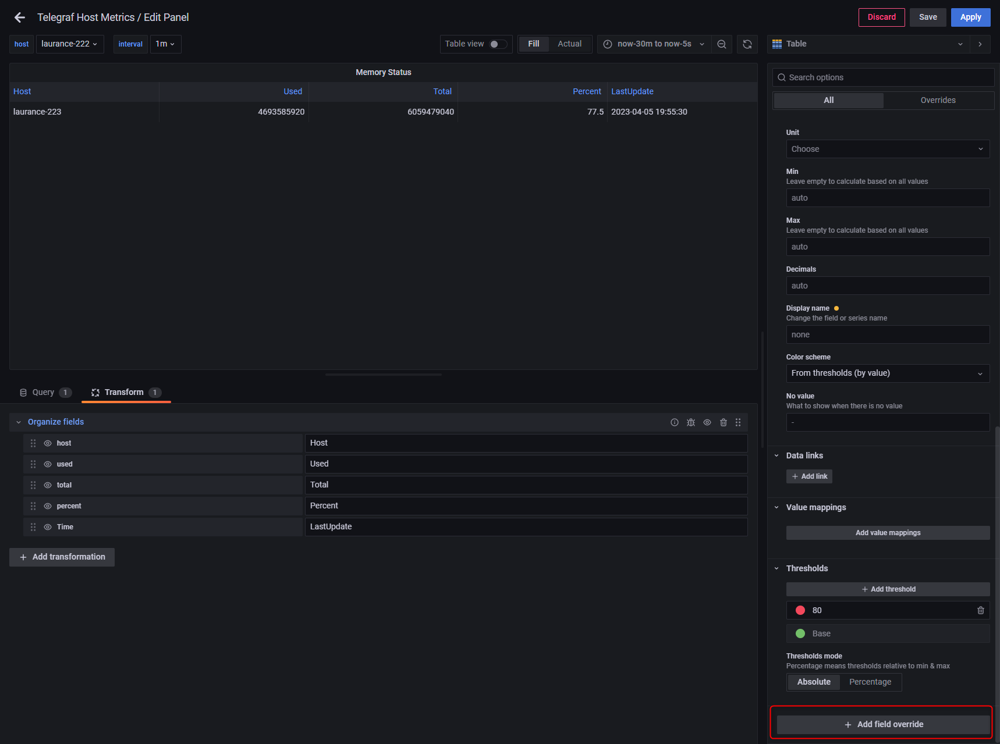
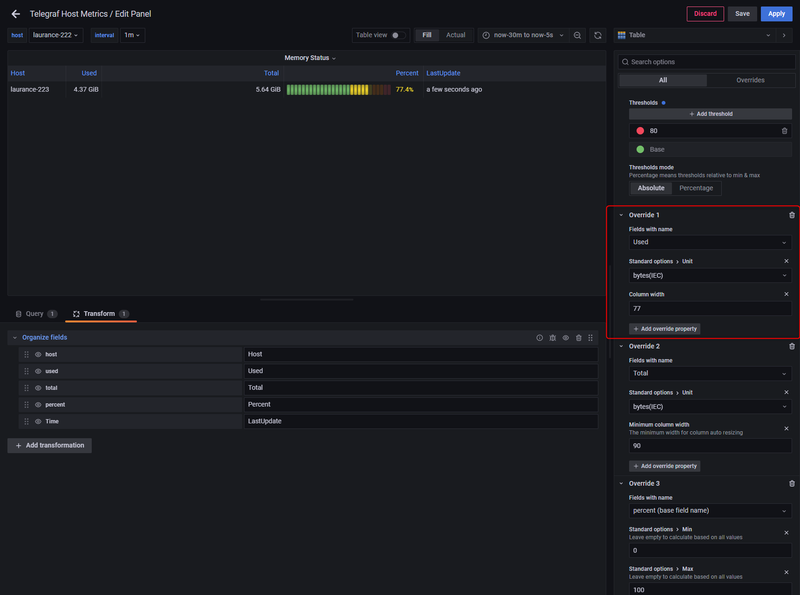
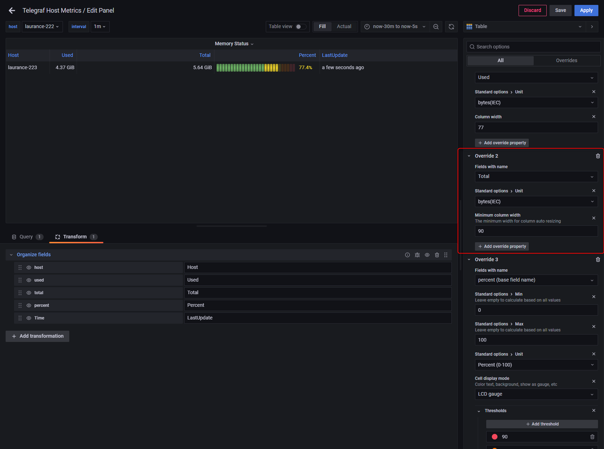
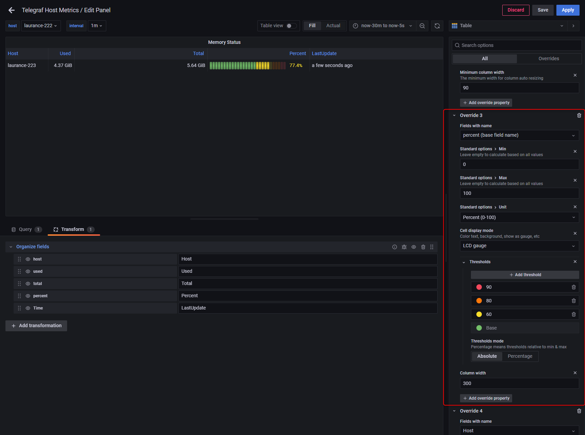
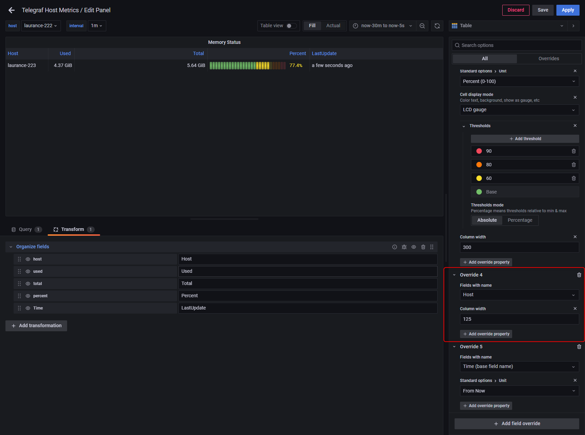
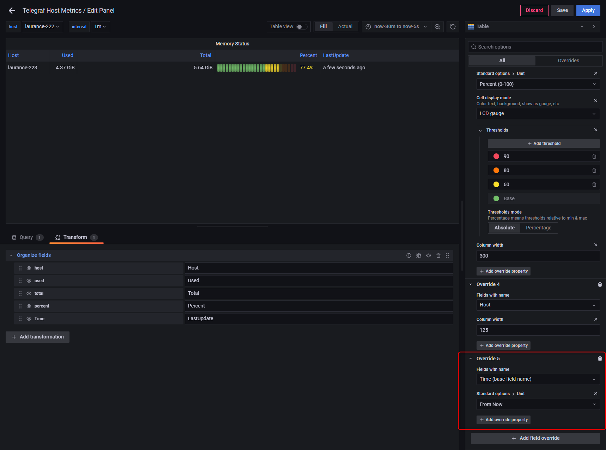

# Grafana - 建立 panel for memory

***
***

**Add an panel for monitor memory**
=====

***
***

### {step1} 右上角 `+` > Add an empty panel

***
***

### {step2} 依需求填寫 `Data source` `Query` `Visualization`

***
***



Data source = InfluxDB

Query = 

SELECT last("used_percent") AS "percent", "used" AS "used", "total" AS "total" FROM "mem" WHERE  "host" !~/^$interval$/ and time > now() -1m group by "host"

Visualization = Table



***
***

### {step3} 依需求新增 `Transform`

***
***



Transform = Organize fields

host = Host

used = Used

total = Total

percent = Percent

Time = LastUpdate
    


***
***

***
***

### {step4} 右側條件選單拉到最底選擇 `Add filed override`

***
***



#### Override 1 & Override 2



***
***

***
***



#### Override 3 & Override 4 & Override 5 



***
***

***
***

***





---

> Author: Laurance  
> URL: https://laurance.eu.org/posts/grafana-%E5%BB%BA%E7%AB%8B-panel-for-memory/  

