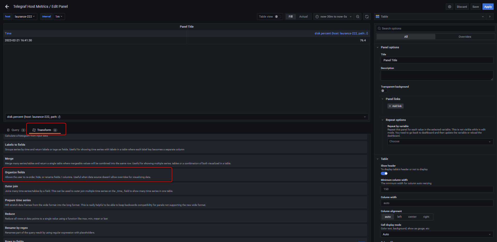
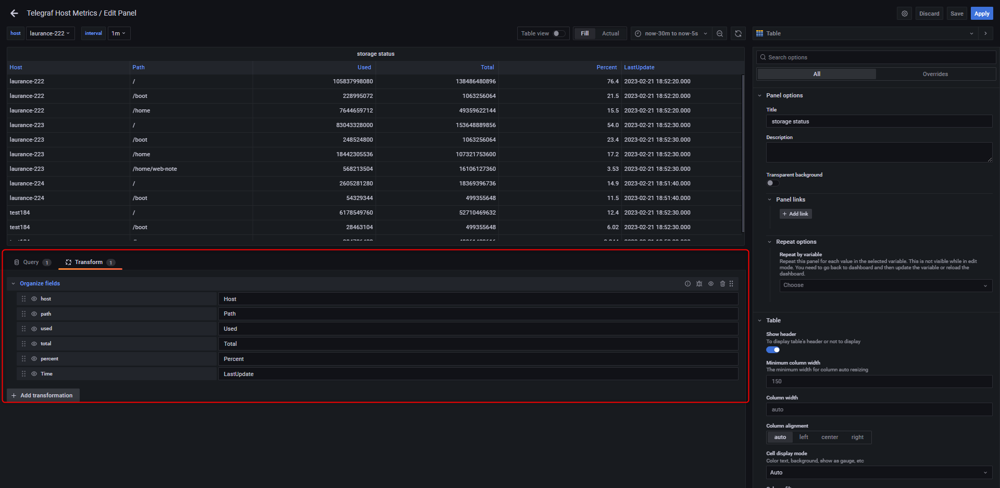
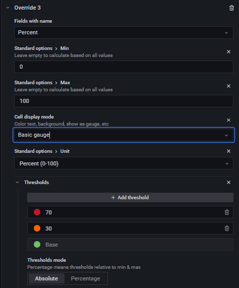
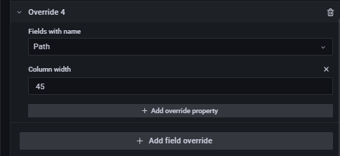
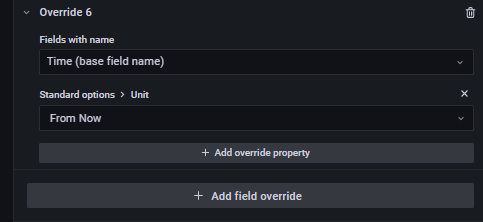
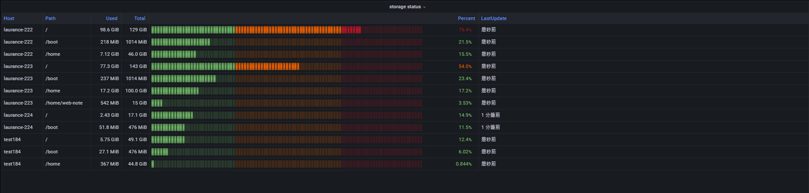

# Grafana - 建立 panel for storage

***
***

**Add an panel for monitor storage**
=====

***
***

### {step1} 右上角 `+` > Add an empty panel

***
***

### {step2} 依需求填寫 `Data source` `Query` `Visualization`



Data source = InfluxDB
    
Query = 

SELECT last("used_percent") AS "percent", "used" AS "used", "total" AS "total" FROM "disk" WHERE  "host" !~ /^$interval$/ and time > now() -1m group by "host", "path"
    
Format as = Table
    
Visualization = Table



***
***
    

***
***

### {step3} 選擇 `Transform` 建立 `Organize fields` && 依需求填寫 `host`,`path`,`used`,`total`,`percent`,`lastupdate`

***
***

***
***

### {step4} 右側條件選單拉到最底選擇 `Add filed override`

***
***



#### Override 1 & Override 2



***
***

***
***



#### Override 3 & Override 4



***
***

***
***



#### Override 5 & Override 6



***
***

***
***



#### FINAL



***
***

***
***

***





---

> Author: Laurance  
> URL: https://laurance.eu.org/posts/grafana-%E5%BB%BA%E7%AB%8B-panel-for-storage/  

