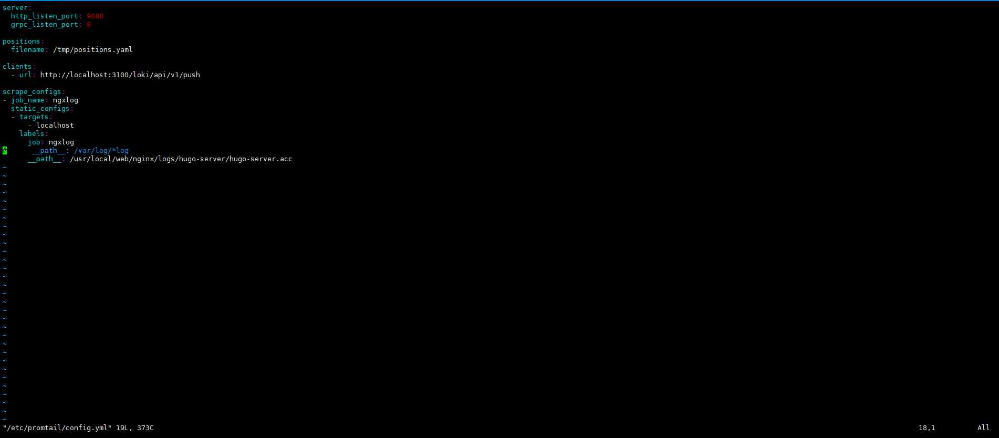
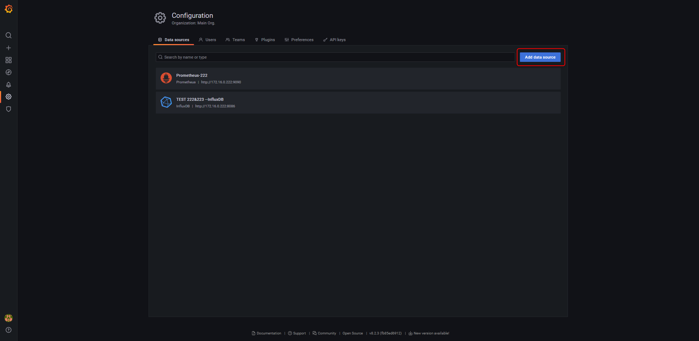
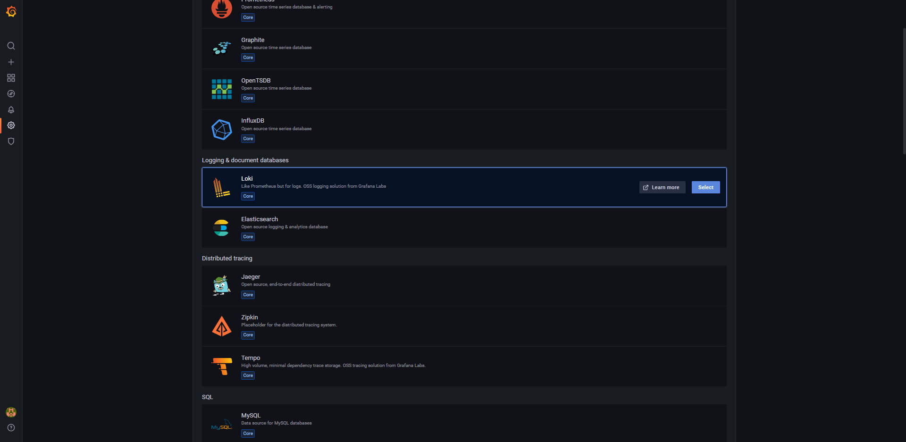
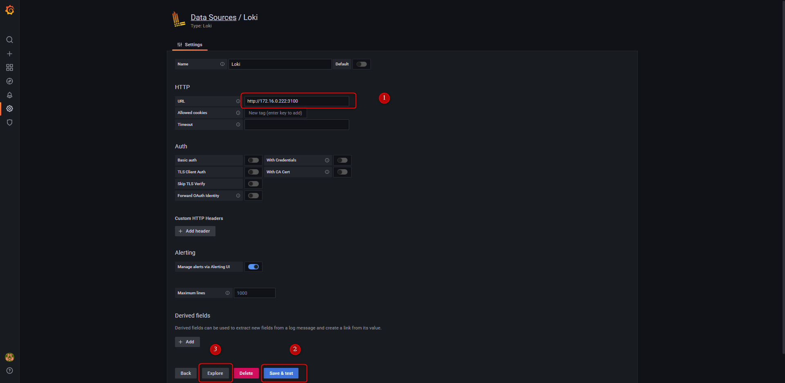
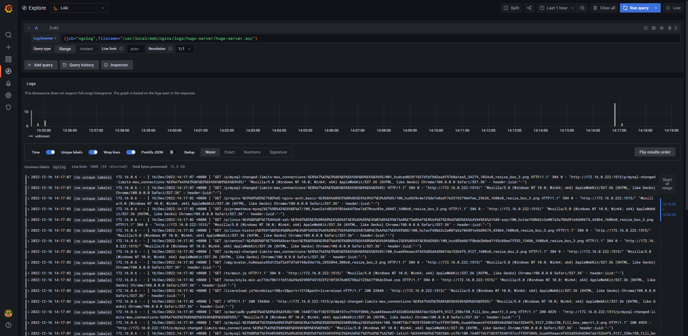

# Grafana - 搭建紀錄 Loki、Promtail、Grafana 輕量級日誌系統


***
***

**Grafana 安裝**
=====

[Grafana 官方載點](https://grafana.com/grafana/download)

### 安裝完啟動 grafana

`用途:用於視覺化和分析 Log`

```sql
wget https://dl.grafana.com/enterprise/release/grafana-enterprise-9.3.2-1.x86_64.rpm
    
yum localinstall grafana-enterprise-9.3.2-1.x86_64.rpm
    
systemctl start grafana-server && systemctl status grafana-server
```

***
***

**Promtail 、 Loki 安裝**
=====
    
[Promtail & Loki 官方載點](https://grafana.com/docs/loki/latest/installation/local/)

### Promtail 安裝

`用途:收集 Log 及添加標籤並發送給 Loki`

```sql
wget https://github.com/grafana/loki/releases/download/v2.7.1/promtail-2.7.1.x86_64.rpm
    
yum localinstall promtail-2.7.1.x86_64.rpm
```

***
***

### Loki 安裝 

`用途:負責儲存 Log 和處理查詢`
    
```sql
wget https://github.com/grafana/loki/releases/download/v2.7.1/loki-2.7.1.x86_64.rpm
        
yum localinstall loki-2.7.1.x86_64.rpm
```

***
***
    
#### Promtail & Loki 設定檔配置: 
   
```sql
vim /etc/loki/config.yml
```
   
   
   
```sql
vim /etc/promtail/config.yml
```
   
   

### 啟動服務 Promtail & Loki
   
```sql
systemctl start loki && systemctl start promtail
```

***
***
    
### 訪問 Grafana
   
#### 建立 Datasorce for loki
   
   

***
***

#### 選擇 LOKI - Database
   
   

***
***
   
#### 填寫資料來源 之後按 save && explore
   
   

***
***
   
#### 填寫 Log browser job & filename 即可
   
   

***
***
   
#### 驗證:
   
```sql
curl http://172.16.0.222:3100/metrics
```

***
***
   
   
**Loki 整體架構**
====
   

   
***
***
   
    


   
   
***


<style>
.emojify {
	font-family: Apple Color Emoji, Segoe UI Emoji, NotoColorEmoji, Segoe UI Symbol, Android Emoji, EmojiSymbols;
	font-size: 2rem;
	vertical-align: middle;
}
@media screen and (max-width:650px) {
  .nowrap {
    display: block;
    margin: 25px 0;
  }
}
</style>



---

> Author: Laurance  
> URL: https://laurance.eu.org/posts/grafana-%E6%90%AD%E5%BB%BAlokipromtailgrafana%E8%BC%95%E9%87%8F%E7%B4%9A%E6%97%A5%E8%AA%8C%E7%B3%BB%E7%B5%B1/  

