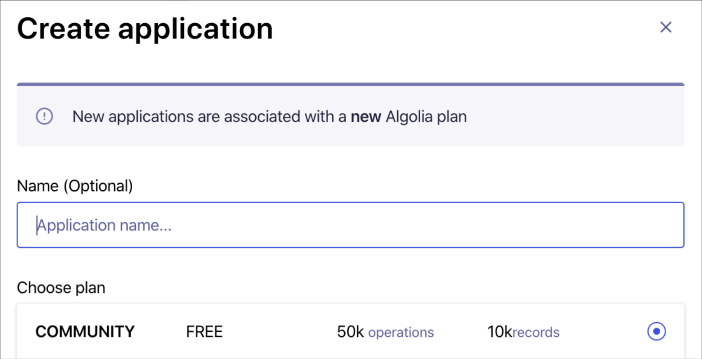
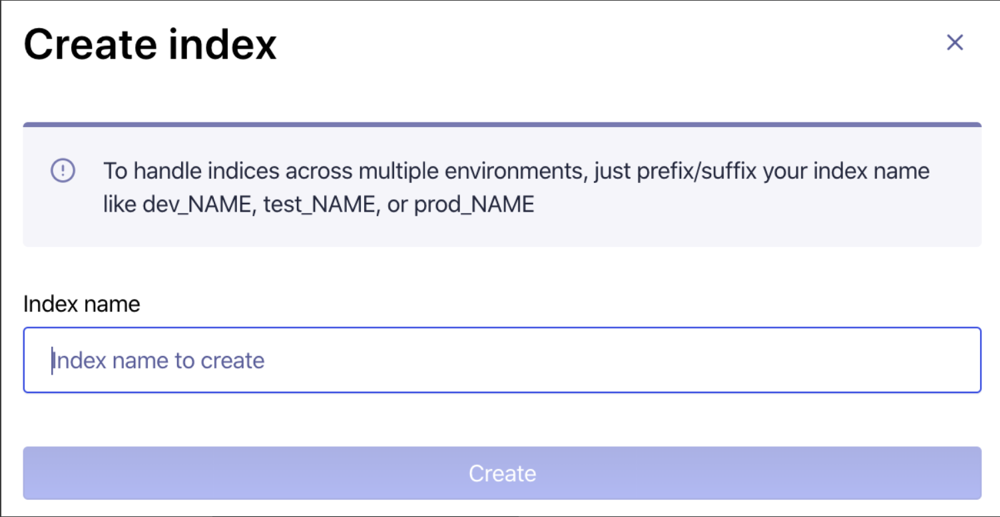
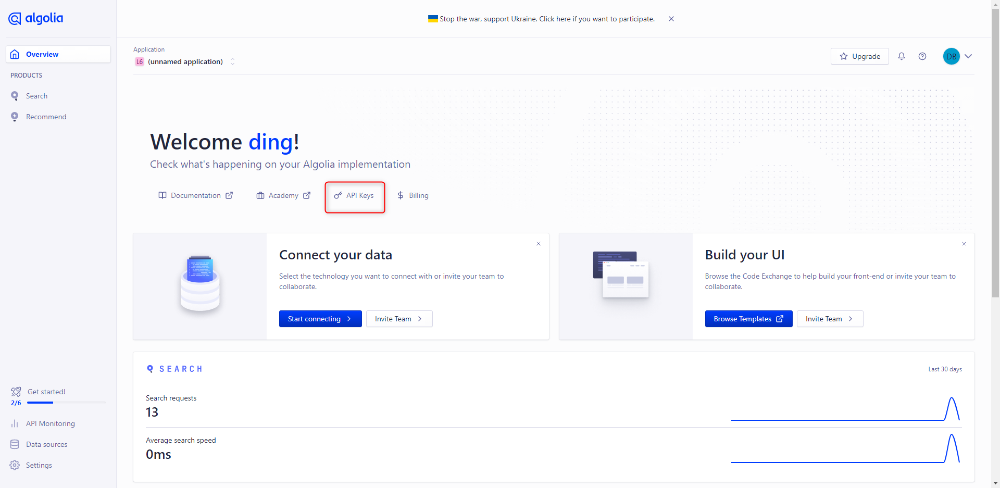
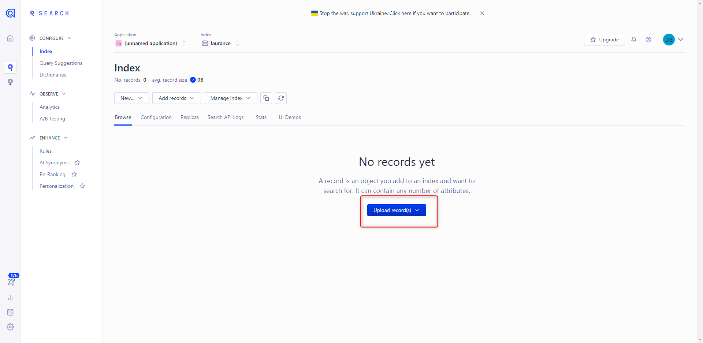
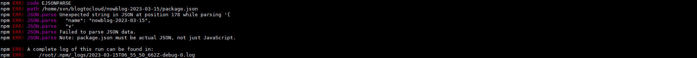
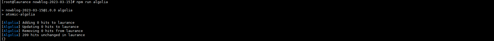

# HUGO - 添加 Algolia 搜索支持


***
***

**新增搜索模塊 `Algolia` 配置在 hugo 上,實現本地搜索**
=====

[Algolia官方網址](https://www.algolia.com/)

***
***

### {Step 1} 新建 application 及 index




***
***

### {Step 2} 紀錄 Keys 等等會用到 ( `Application ID`, `Search-Only API Key`, `Admin API Key` )



***
***

### {Step 3} 修改 `config.yaml` 主要生成 `Algolia 索引`

```sql
outputFormats:
    Algolia:
        baseName: algolia
        isPlainText: true
        mediaType: application/json
        notAlternative: true

outputs:
    home: ["HTML", "RSS", "Algolia"]

params.algolia:
    appId: "Application ID"
    indexName: "Index name"
    searchOnlyKey: "Admin API Key"
```

***
***

### {Step 4} 在目錄下 `layouts/_default` 新建 `list.algolia.json` 文件

```sql
{{/* 生成Algolia搜索索引文件 */}}
{{- $.Scratch.Add "index" slice -}}
{{/* content/posts或content/post目錄下的博文才生成索引 */}}
{{- range where (where .Site.Pages "Type" "in" (slice "posts" "post")) "IsPage" true -}}
  {{- if and (not .Draft) (not .Params.private) -}}
    {{- $.Scratch.Add "index" (dict "objectID" .File.UniqueID "url" .Permalink "content" (.Summary | plainify) "tags" .Params.Tags "lvl0" .Title "lvl1" .Params.Categories "lvl2" "摘要") -}}
  {{- end -}}
{{- end -}}
{{- $.Scratch.Get "index" | jsonify -}}
```

***
***

### {Step 5} 目錄下執行 `hugo` 命令後,在 `public/` 下會生成 `algolia.json`

***
***

### {Step 6} 將上述生成的 `algolia.json` 上傳至 `Algolia`



***
***

### {Step 7} 安裝 `Atomic-Algolia` (目的: 自動上傳)

#### 在根目錄下語法

`註：這裡需要用到 npm 套件工具，所以需要安裝 node js`

    npm init  (這裡直接一直 ENTER)

    npm install atomic-algolia --save
    

#### 修改根目錄下的 `Package.Json`

```sql
"scripts": {
    "test": "echo \"Error: no test specified\" && exit 1",
    "algolia": "atomic-algolia"
  },
```

`到根目錄下的 package.json 內，在 scripts 下添加`

`Json 格式記得要加逗號,不然會跳 ERROR`

 

#### 建立 .ENV 檔

```sql
ALGOLIA_APP_ID=你的Application ID
        
ALGOLIA_INDEX_NAME=你的索引名字  
        
ALGOLIA_INDEX_FILE=public/algolia.json
        
ALGOLIA_ADMIN_KEY=你的Admin API Key
```

***
***
    
#### 上傳索引文件

    可以在 local 端執行 `npm run algolia` 這行指令查看效果
    
 


參考: https://edward852.github.io/post/hugo%E6%B7%BB%E5%8A%A0algolia%E6%90%9C%E7%B4%A2%E6%94%AF%E6%8C%81/#%E7%94%9F%E6%88%90%E7%B4%A2%E5%BC%95%E6%96%87%E4%BB%B6

***


<style>
.emojify {
	font-family: Apple Color Emoji, Segoe UI Emoji, NotoColorEmoji, Segoe UI Symbol, Android Emoji, EmojiSymbols;
	font-size: 2rem;
	vertical-align: middle;
}
@media screen and (max-width:650px) {
  .nowrap {
    display: block;
    margin: 25px 0;
  }
}
</style>



---

> Author: Laurance  
> URL: https://laurance.eu.org/posts/hugo%E6%B7%BB%E5%8A%A0algolia%E6%90%9C%E7%B4%A2%E6%94%AF%E6%8C%81/  

