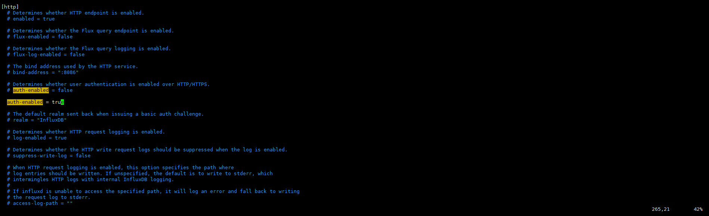

# InfluxDB - 如何建立使用者密碼及相關權限


**InfluxDB 預設是沒有密碼的,使用 `influx` 進入介面操作即可**
------

```sql
[root@laurance ~]# influx
    
Connected to http://localhost:8086 version 1.8.10
    
InfluxDB shell version: 1.8.10
```

***
***

**建立使用者及密碼**
------

```sql
CREATE USER telegraf WITH PASSWORD 'telegraf'

CREATE USER <username> WITH PASSWORD '<password>'
```

***
***

**給予讀的權限**
-----

```sql
GRANT READ ON telegraf TO laurance

GRANT [READ,WRITE,ALL] ON <database_name> TO <username>
```

***
***

**查看使用者**
-----

```sql
SHOW USERS
```

***
***

**查看權限**
-----

```sql
SHOW GRANTS FOR laurance
```

***
***

**拔除 `root` 權限**
-----

```sql
REVOKE ALL PRIVILEGES FROM telegraf
```

***
***

**給予 `root` 權限**
-----

```sql
GRANT ALL PRIVILEGES TO laurance
```

***
***

**重新設置密碼**
-----

```sql
SET PASSWORD FOR laurance = 'influxdb4ever'
```

***
***

**刪除使用者**
-----

```sql
DROP USER laurance
```

***
***

#### 登入

##### 將密碼驗證打開 `ps 一定要有 ''ROOT'  才能登入`

##### 編輯設定檔 `vim /etc/influxdb/influxdb.conf`

##### 將 `[http] 模快下的 [auth-enabled] 改為 true`

 

***
***
 
##### 改完設定重啟 DB

```sql
systemctl restart influxdb
```

***
***

##### 帶密碼登入

```sql
influx -username laurance -password influxdb4ever
```

***
***

##### 進入介面 使用密碼登入

```sql
[root@laurance ~]# influx
    
Connected to http://localhost:8086 version 1.8.10
    
InfluxDB shell version: 1.8.10
    
> auth
    
username: laurance
    
password: 
``` 

***
***

***


<style>
.emojify {
	font-family: Apple Color Emoji, Segoe UI Emoji, NotoColorEmoji, Segoe UI Symbol, Android Emoji, EmojiSymbols;
	font-size: 2rem;
	vertical-align: middle;
}
@media screen and (max-width:650px) {
  .nowrap {
    display: block;
    margin: 25px 0;
  }
}
</style>



---

> Author: Laurance  
> URL: https://laurance.eu.org/posts/influxdb-%E5%BB%BA%E7%AB%8B%E4%BD%BF%E7%94%A8%E8%80%85%E5%AF%86%E7%A2%BC/  

