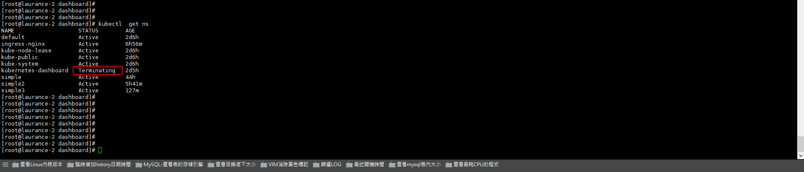
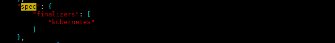
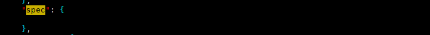
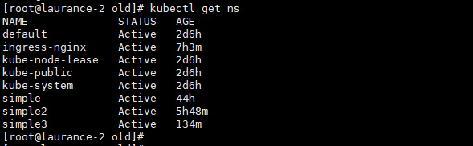

# Kubernetes - ERROR-unable to create new content is being terminated


<!--more-->
"Namespace-kubernetes-dashboard 一直卡在 termnating，所以導致無法有效刪除."

***
***

**查看 namespace**

```sql
kubectl get ns
```
    
   

***
***
   
**查看 kubernetes-dashboard 的 namespace**

```sql
kubectl get ns kubernetes-dashboard  -o json > kubernetes-dashboard.json
```

***
***
    
**編輯 kubernetes-dashboard.json 檔**

```sql
vim kubernetes-dashboard.json
```

***
***
    
**刪除前**

   

***
***
   
**刪除後**

   

***
***
   
**重新掛起 Proxy**

```sql
kubectl proxy --address='0.0.0.0' &
```

***
***
    
**curl刪除**

```sql
curl -k -H "Content-Type:application/json" -X PUT --data-binary @kubernetes-dashboard.json http://127.0.0.1:8001/api/v1/namespaces/kubernetes-dashboard/finalize
```

***
***
    
**kubernetes-dashboard 已刪除**

   

***
***

***


<style>
.emojify {
	font-family: Apple Color Emoji, Segoe UI Emoji, NotoColorEmoji, Segoe UI Symbol, Android Emoji, EmojiSymbols;
	font-size: 2rem;
	vertical-align: middle;
}
@media screen and (max-width:650px) {
  .nowrap {
    display: block;
    margin: 25px 0;
  }
}
</style>



---

> Author: Laurance  
> URL: https://laurance.eu.org/posts/kubernetes-error-unable-to-create-new-content-is-being-terminated/  

