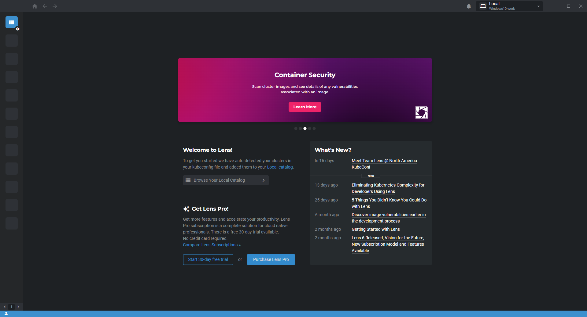
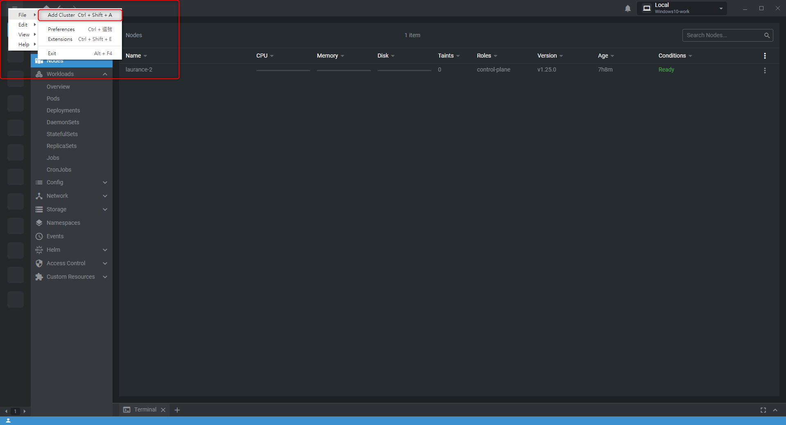
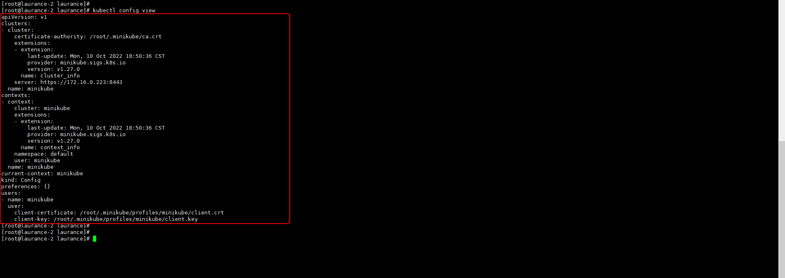
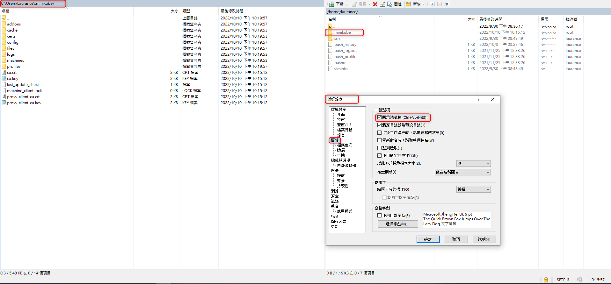
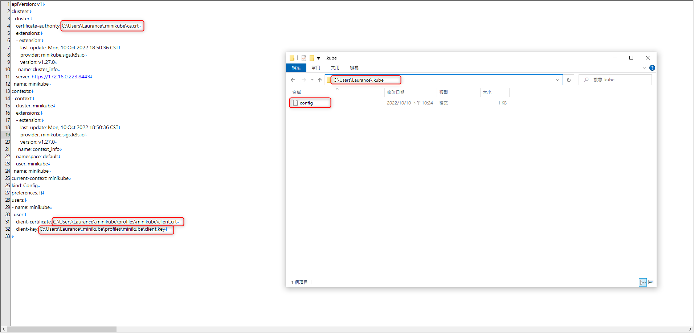
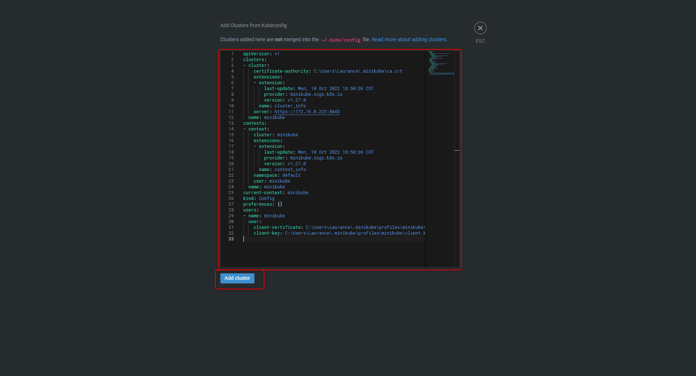
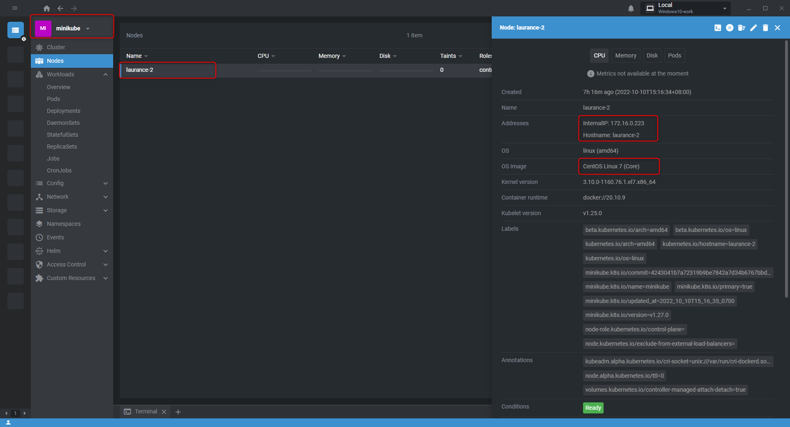

# Kubernetes - Lens 使用指南 : 透過 IDE 管理 minikube


**安装 LENS on Windows x64**

**[LENS 官方載點](https://k8slens.dev/)**

   

***
***
   
**右上三條線點選 File >> Add Cluster 新增集群**

   

***
***
   
**回到測試機上查看 minikube 設定檔**

```sql
kubectl config view 
```
    
   

***
***
   
**將測試機裡的 .minikube 隱藏檔資料夾 winscp 取出放到對應位置**

```sql
PWD: /root/.minikube
```

     

***
***
   
**將測試機裡的 .kube 隱藏檔資料夾 winscp 取出放到對應位置，並修改路徑**   

```sql
PWD: /root/.kube
```
    
   

***
***
         
**將 .kube 下的 config 內容貼至 LENS >> File >> Add Cluster 新增集群**

   

***
***
   
**雙擊連接即可**

   
   
***
***
   


***


<style>
.emojify {
	font-family: Apple Color Emoji, Segoe UI Emoji, NotoColorEmoji, Segoe UI Symbol, Android Emoji, EmojiSymbols;
	font-size: 2rem;
	vertical-align: middle;
}
@media screen and (max-width:650px) {
  .nowrap {
    display: block;
    margin: 25px 0;
  }
}
</style>



---

> Author: Laurance  
> URL: https://laurance.eu.org/posts/kubernetes-lens-%E4%BD%BF%E7%94%A8%E6%8C%87%E5%8D%97%E9%80%9A%E9%81%8E-ide-%E7%AE%A1%E7%90%86-minikube/  

