# LINE - BOT 串接 Dialogflow 操作紀錄

***
***
    
**GCP 後台搜尋服務 Dialogflow**

***
***
    
   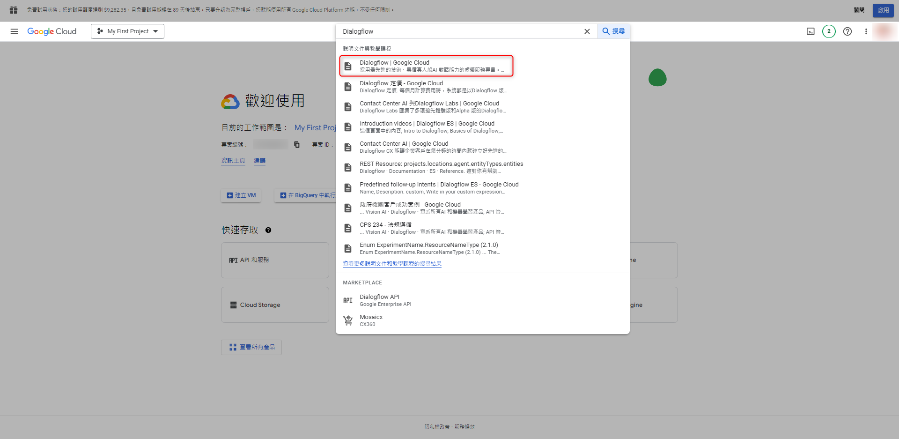

***
***
   
**選取 Dialogflow 控制台**

***
***
    
   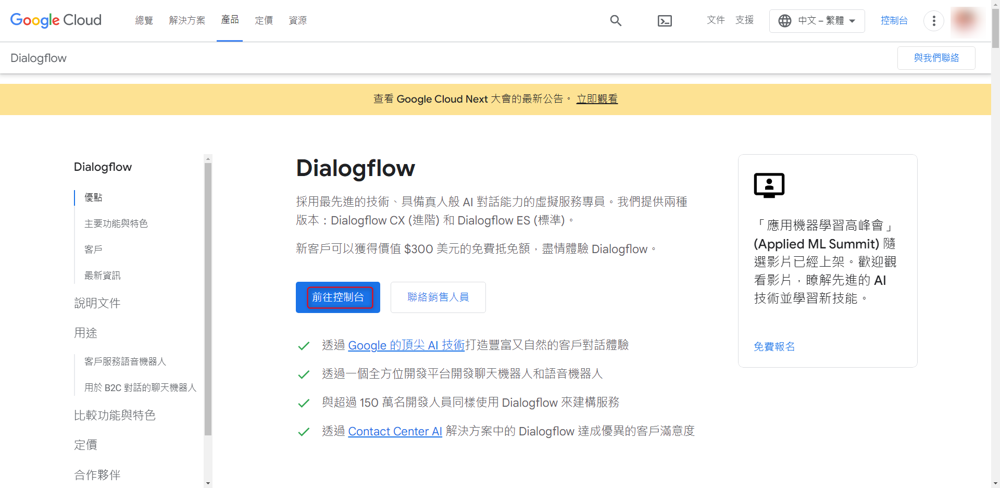

***
***
   
**這邊選擇舊專案 (原本沒有的話點新增)**

***
***
    
   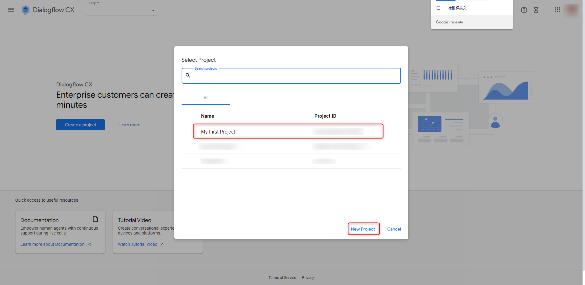
   
   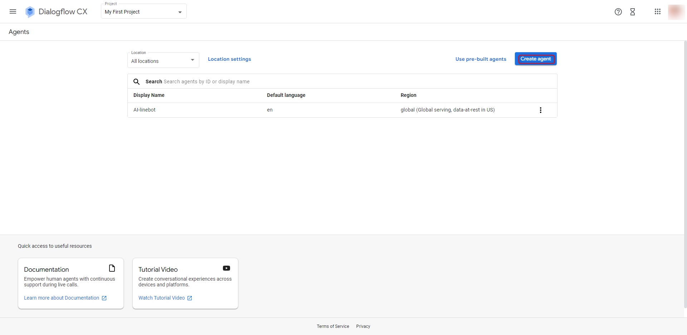

***
***
   
**新增 agent (因為當初建專案時,選擇的是免費地區,所以這邊才只能選 global)**

***
***
    
   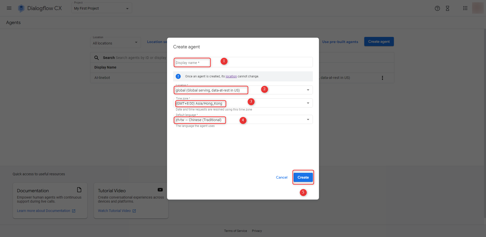

***
***
   
**選擇 Manage , 點擊需要串接 Webhook 的 Intent** 
    
**進入後在最下方勾選「Enable webhook call for this intent」，表示該 Intent 會透過 Webhook 處理後再進行回覆**

***
***
    
   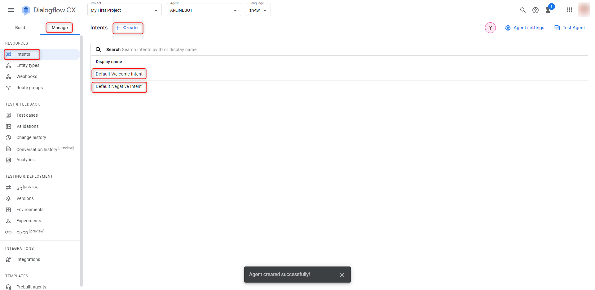

***
***
   
**選擇 Intergrations 與 LINE 串接**

***
***
    
   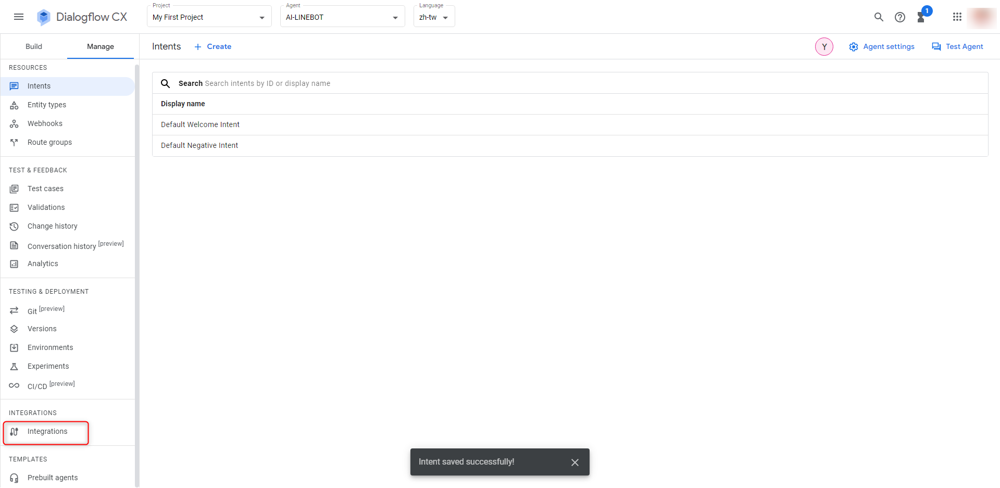
   
   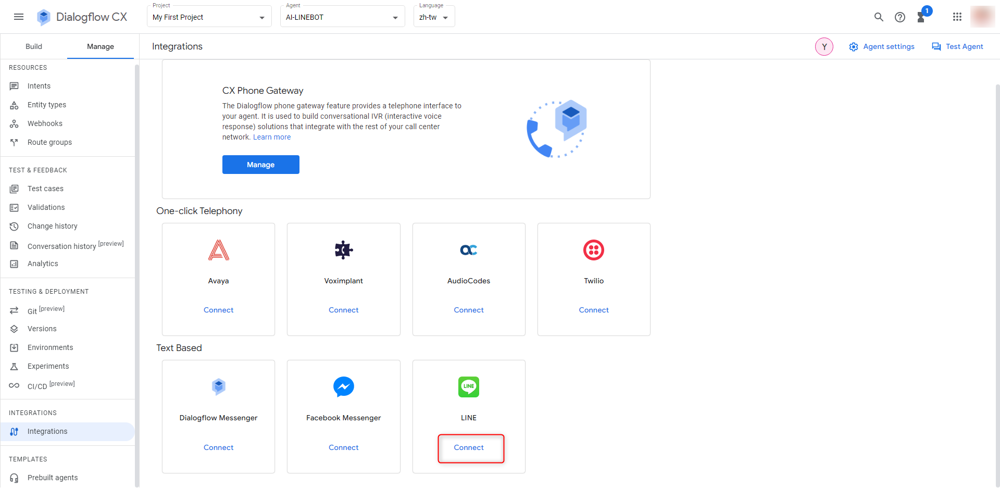

***
***
   
**將 LINE 的 ID 及 TOKEN 依序填入 Configuration**

***
***
    
   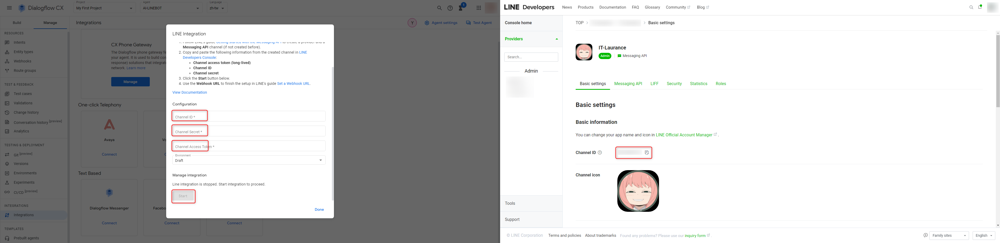
   
   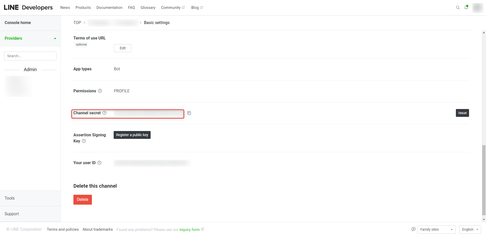
   
   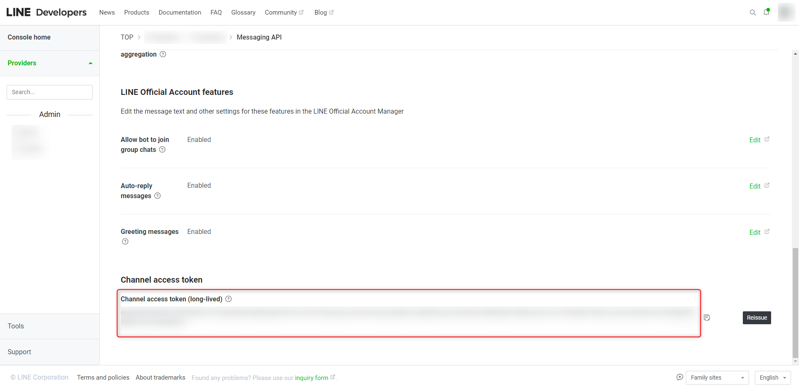

***
***
   
**最後將 Webhook URL 複製到 LINE 後台上的 Webhook settings** 

***
***
   
   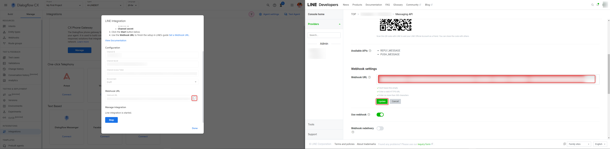
   
   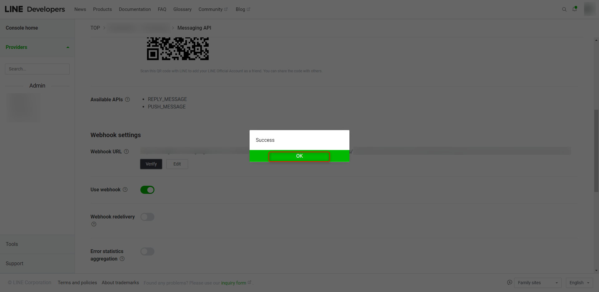

***
***
   
**串接流程圖**
=====

***
***
   
   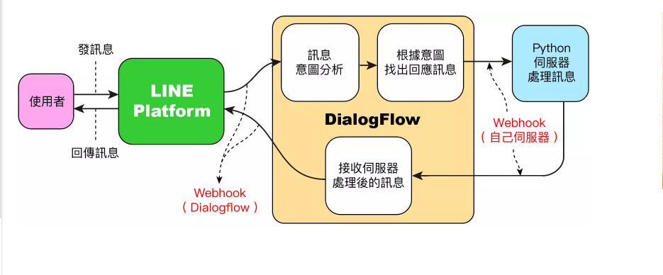

***
***
    

***





---

> Author: Laurance  
> URL: https://laurance.eu.org/posts/line-bot-%E4%B8%B2%E6%8E%A5-dialogflow/  

