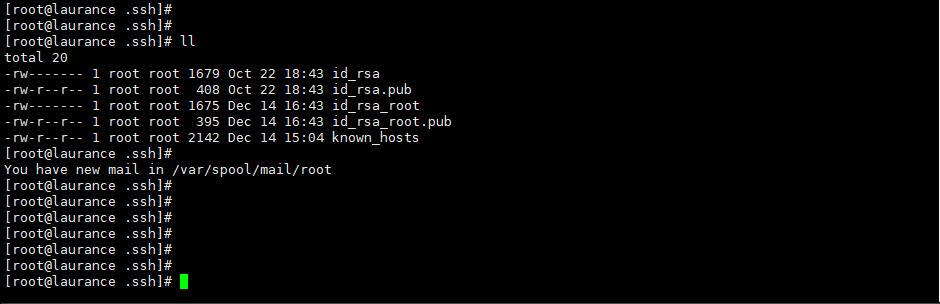

# Linux - 實現免密碼複製遠端檔案 (scp)


***
***



### 測試環境 : 

#### ( 來源 ) A 機

#### ( 目的 ) B 機



***
***

### A 機設置 : 

#### 在家目錄新增 `公鑰` 及 `私鑰`

```sql
ssh-keygen -t dsa
```

`新增完後, 在 .ssh/ 目錄裡，會多出 id_rsa 和 id_rsa.pub 這兩個檔案`

***
***
   


***
***

#### 將 `A 機  id_dsa.pub`  的內容複製到 `B 機家目錄下` 並命名為 `authorized_keys`  限制讀寫權限
   
```sql
cat id_rsa.pub > authorized_keys
    
chmod 600 authorized_keys
```

***
***


    
PS. 若是有多個  id_rsa.pub 需要設定 (注意!!! 需要在第一步選擇路徑)
   
```sql
ssh-keygen -t rsa
```
    
第一步需填寫路徑 其餘 ENTER 即可
    
```sql
Enter file in which to save the key (/root/.ssh/id_rsa): /root/.ssh/id_rsa_root
```



***
***
    


***
***
    

   

***


<style>
.emojify {
	font-family: Apple Color Emoji, Segoe UI Emoji, NotoColorEmoji, Segoe UI Symbol, Android Emoji, EmojiSymbols;
	font-size: 2rem;
	vertical-align: middle;
}
@media screen and (max-width:650px) {
  .nowrap {
    display: block;
    margin: 25px 0;
  }
}
</style>



---

> Author: Hugo Authors  
> URL: https://laurance.eu.org/posts/linux-%E4%BD%BF%E7%94%A8-ssh-%E9%85%8D%E5%90%88%E6%86%91%E8%AD%89%E4%BE%86%E9%81%A0%E7%AB%AF%E8%A4%87%E8%A3%BD%E6%AA%94%E6%A1%88-scp/  

