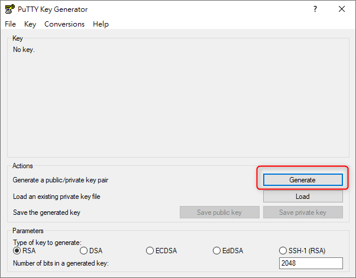
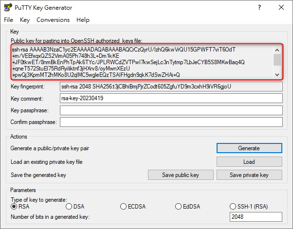
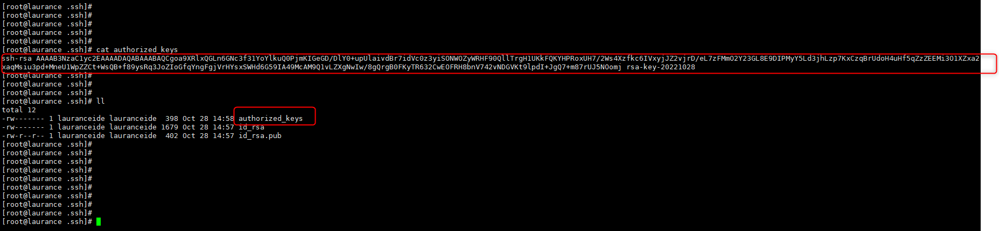

# Linux - 使用 PuTTYgen 產生 SSH 連線公鑰與私鑰


<!--more-->
用於 IDE 編輯器的帳號 (程式連)

***
***

### Linux 機器裡新增 ` 使用者 ide 帳號 `

```sql

useradd lauranceide
    
su - lauranceide
    
ssh-keygen

```
    
` ssh-keygen 一路按 `Enter` 即可`

***
***

### (Windows 介面) 打開 putty-keygen.exe 並按下 Generate 

***
***



***
***

#### 將產生的 key 貼入剛剛創建 ide 帳號家目錄中 .ssh 的目錄裡 , 並命名為 authorized_keys

***
***

#### 使用 putty-keygen.exe 製作 authorized_keys內容 , 按下 Generate (滑鼠在進度調上游移會快一點)

***
***



***
***

#### 跑完後 複製上面的內容貼進帳號的 `.ssh/authorized_keys` 再給權限 600

```sql
chmod 600 .ssh/authorized_keys
```

***
***



***
***
    
#### 按下 `save pubilc key` 儲存檔案  `lauranceide.pub`

#### 按下 `save private key` 儲存檔案  `lauranceide.ppk`

***
***


    
#### 將 `lauranceide.ppk` 轉檔成 `lauranceide.pem`

##### ` 先 import_key lauranceide.ppk 後在 Export_key lauranceide.pem`


    
##### (root) 登入 Linux 將帳號登入的權限改為 nologin
    
```sql
vim  /etc/passwd 	
```

##### 將 `/bin/bash` 改為 `/sbin/nologin`

```sql
lauranceide:x:1006:1009::/home/lauranceide: /sbin/nologin
```


***


<style>
.emojify {
	font-family: Apple Color Emoji, Segoe UI Emoji, NotoColorEmoji, Segoe UI Symbol, Android Emoji, EmojiSymbols;
	font-size: 2rem;
	vertical-align: middle;
}
@media screen and (max-width:650px) {
  .nowrap {
    display: block;
    margin: 25px 0;
  }
}
</style>



---

> Author: Laurance  
> URL: https://laurance.eu.org/posts/linux-%E4%BD%BF%E7%94%A8putty-keygen%E7%94%A2%E7%94%9Fssh-key/  

