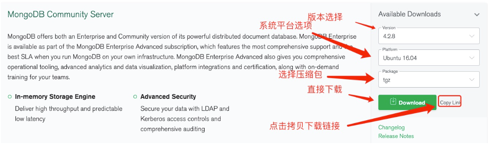

# MongoDB - 安裝教學


***
***
    
[MongoDB官網下載地址](https://www.mongodb.com/download-center#community)

***
***
    


***
***
   


***
***

```sql

yum install libcurl openssl
    
wget https://fastdl.mongodb.org/linux/mongodb-linux-x86_64-4.0.28.tgz
    
tar zxvf mongodb-linux-x86_64-4.0.28.tgz  -C /usr/local/
    
mv /usr/local/mongodb-linux-x86_64-4.0.28/ mongodb/
    
cd /usr/local/mongodb/
    
mkdir data log conf
    
cd data/ && mkdir db/
    
cd /usr/local/mongodb/conf && touch mongodb.conf

```

***
***
     
```sql
vim mongodb.conf
```
  
```sql

dbpath=/usr/local/mongodb/data/db  
    
logpath=/usr/local/mongodb/log/mongodb.log 
    
port=27017
    
fork=true
    
bind_ip=0.0.0.0

```

***
***

**啟動服務**
-----

```sql
./bin/mongod --config ./conf/mongodb.conf
```

***
***

**關閉服務**
-----

```sql
./bin/mongod --config ./conf/mongodb.conf --shutdown
```

***
***
     
**建立 mongoDB 連線**
-----

```sql
./mongo
```

***
***
     


***


<style>
.emojify {
	font-family: Apple Color Emoji, Segoe UI Emoji, NotoColorEmoji, Segoe UI Symbol, Android Emoji, EmojiSymbols;
	font-size: 2rem;
	vertical-align: middle;
}
@media screen and (max-width:650px) {
  .nowrap {
    display: block;
    margin: 25px 0;
  }
}
</style>



---

> Author: Laurance  
> URL: https://laurance.eu.org/posts/mongod-mongodb%E5%AE%89%E8%A3%9D%E6%95%99%E5%AD%B8/  

