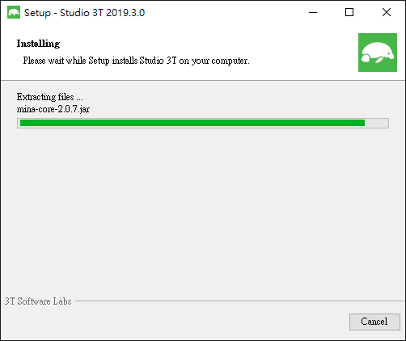
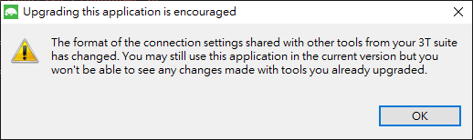
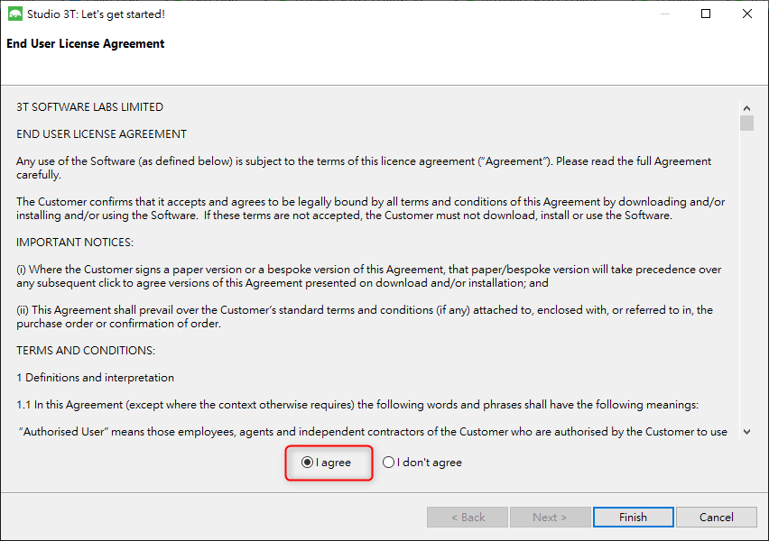
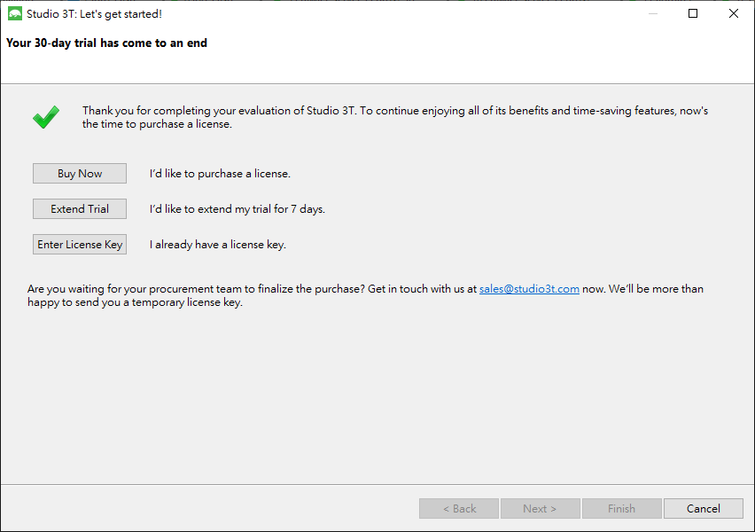
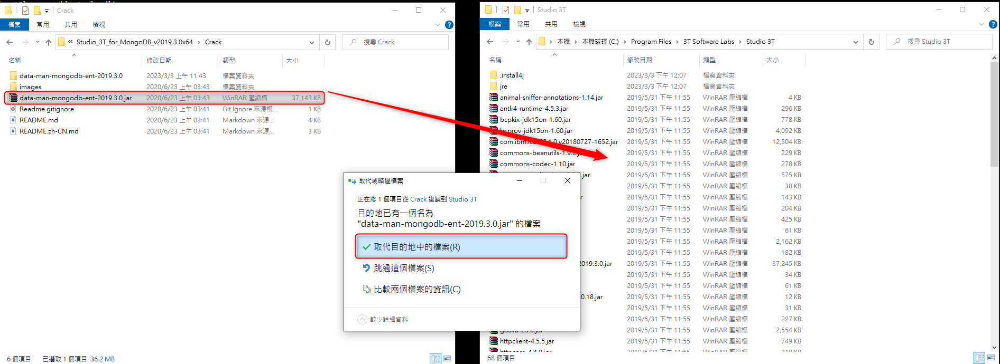
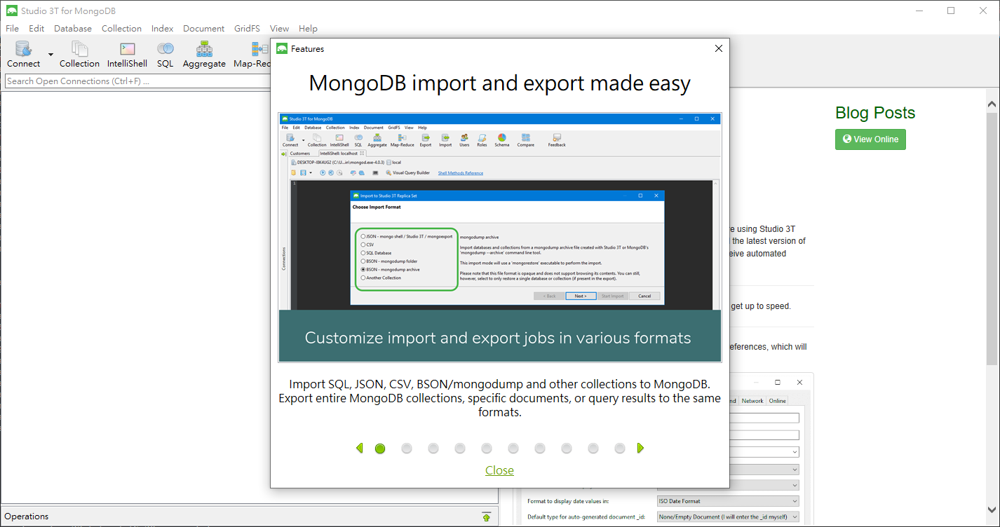

# MongoDB -Studio 3T for MongoDB 2019 019.3.0

***
***

**{Step 1} 安裝 `Studio 3T for 2019.3.0` exe執行檔**
-----

`ps. 記住安裝包路徑  ex: C:\Program Files\3T Software Labs\Studio 3T`

***
***

***
***

**{Step 2} 安裝完成後前面會跳 `建議要更新` , 不用理他按 `OK`**
-----

***
***

***
***

**{Step 3} 點選 `I agree` 即可**
-----

***
***

***
***

**{Step 4} 此時會跳出需要驗證的環節**
-----

***
***

***
***

**{Step 5} 將 `Crack 底下的 data-man-mongodb-XXX` 移至安裝包路徑**
-----

***
***

***
***

**{Step 6} 再次打開已跳過驗證環節**
-----

***
***

***
***

[studio 3T for 2019 019.3.0](https://pesktop.com/en/windows/studio-3t-for-mongodb-2019)

***





---

> Author: Laurance  
> URL: https://laurance.eu.org/posts/mongod-studio-3t-for-mongodb-2019-019.3.0/  

