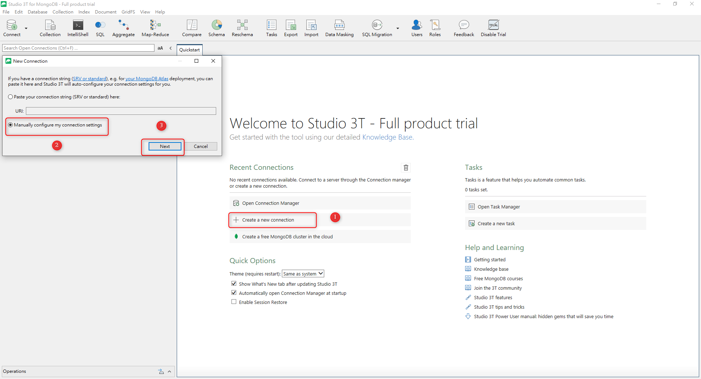
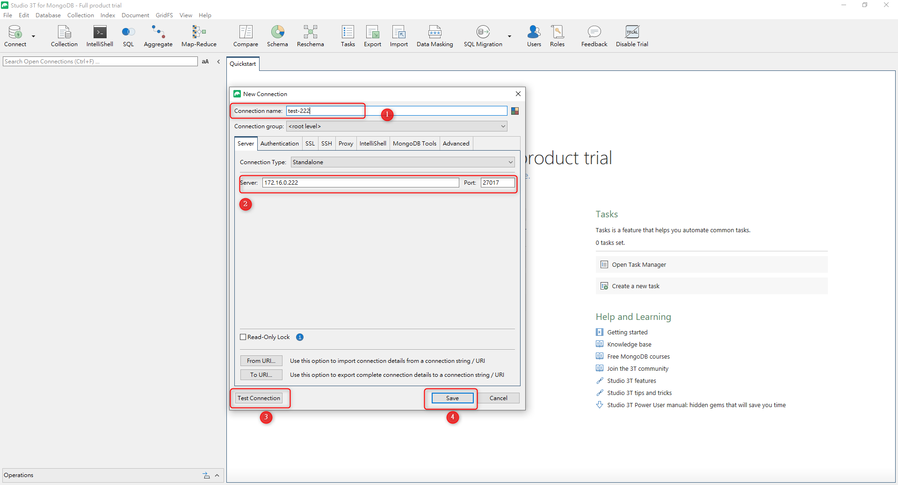

# MongoDB - 如何使用 studio 3T 遠端建立連線

***
***

**新建立連線**
-----

***
***
    

***
***
   
**打上 host , port 儲存**
-----

***
***
    

***
***
    

[studio 3T for windows](https://studio3t.com/download/)

***





---

> Author: Laurance  
> URL: https://laurance.eu.org/posts/mongod-%E5%A6%82%E4%BD%95%E4%BD%BF%E7%94%A8studio-3t-%E9%81%A0%E7%AB%AF%E5%BB%BA%E7%AB%8B%E9%80%A3%E7%B7%9A/  

