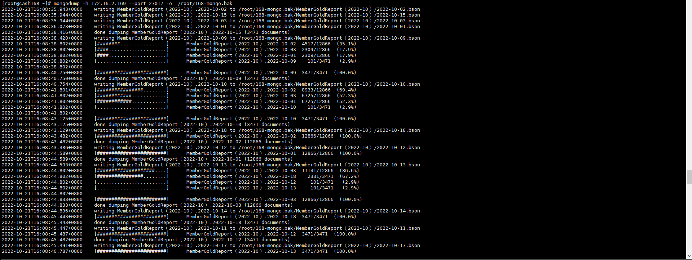
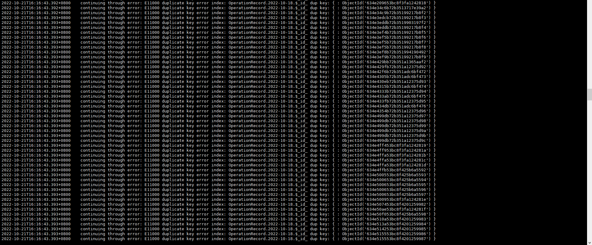

# MongoDB - 如何備份與還原


***
***

**先建立要備份的資料庫 (否則會備份失敗)**
-----
   
```sql
mkdir /root/168-mongo.bak
```

***
***
    
**透過以下命令進行單個資料庫備份 (參數 -d 資料庫)**
-----   
    
```sql
mongodump -h 172.16.2.169 --port 27017 -d my-mongo -o ./root/168-mongo.bak
```

***
***
    
**透過以下命令進行全部資料庫備份**
-----   
    
```sql
mongodump -h 172.16.2.169 --port 27017 -o ./root/168-mongo.bak
```

***
***
    
**透過以下命令進行本機備份 (解決Authentication failed.)**
-----   
    
```sql
mongodump -o mongodb-dump/
```

***
***
    


***
***
   
**透過以下命令還原剛剛備份的資料庫**
-----
   
```sql
mongorestore -h 127.0.0.1 --port 27017 /root/168-mongo.bak
```

***
***
           
**會報錯 ERROR - E11000 duplicate key error 重複密鑰錯誤集合**
-----

***
***
   


***
***
   
**(加入參數 --drop my-backup)  注意!!! 任何不在備份中的文件都將永久丟失！**
-----
   
```sql
mongorestore -h 127.0.0.1 --port 27017 /root/168-mongo.bak --drop
```
    
***
***


***


<style>
.emojify {
	font-family: Apple Color Emoji, Segoe UI Emoji, NotoColorEmoji, Segoe UI Symbol, Android Emoji, EmojiSymbols;
	font-size: 2rem;
	vertical-align: middle;
}
@media screen and (max-width:650px) {
  .nowrap {
    display: block;
    margin: 25px 0;
  }
}
</style>



---

> Author: Laurance  
> URL: https://laurance.eu.org/posts/mongod-%E5%A6%82%E4%BD%95%E5%82%99%E4%BB%BD%E8%88%87%E9%82%84%E5%8E%9F-mongodb/  

