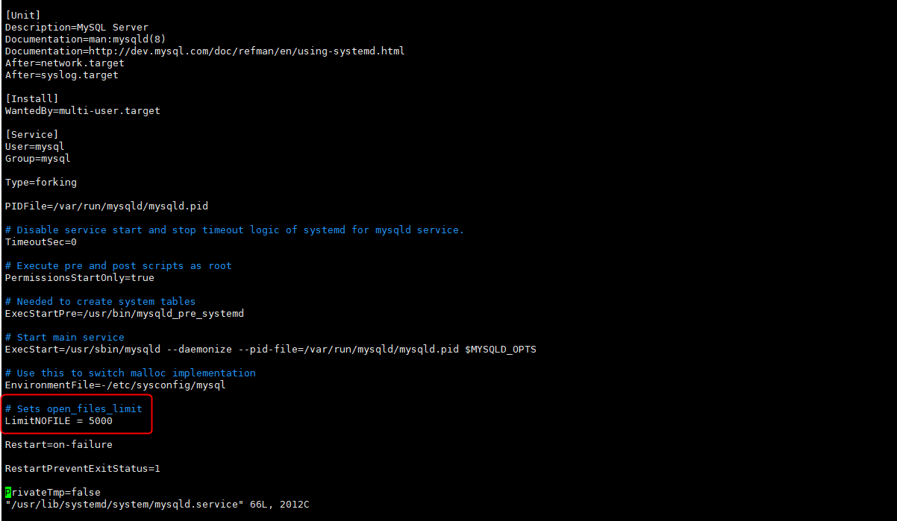

# MySQL - 報錯 Changed limits max_connections ( error 214 ) 解决方法


<!--more-->
error 214 ---- Buffered warning: Changed limits: max_connections

***
***

**修改系統 Kernel 的變數**
-----

```sql
vim /etc/sysctl.conf
```
    
```sql
net.ipv4.tcp_syncookies = 1

net.ipv4.tcp_tw_reuse = 1

net.ipv4.tcp_tw_recycle = 1
  
net.ipv4.tcp_fin_timeout = 30
```

***
***
    
***修改系統資源限制配置文件***
-----

```sql
vim /etc/security/limits.conf 
```

```sql
* soft nproc 65535

* hard nproc 65535

* soft nofile 65535

* hard nofile 65535  
```

***
***
    
***將mysql默認資源限制拉高 (默認為5000)***
-----

```sql
vim /usr/lib/systemd/system/mysqld.service
    
LimitNOFILE=65535
```    

***
***
 


***
***

***


<style>
.emojify {
	font-family: Apple Color Emoji, Segoe UI Emoji, NotoColorEmoji, Segoe UI Symbol, Android Emoji, EmojiSymbols;
	font-size: 2rem;
	vertical-align: middle;
}
@media screen and (max-width:650px) {
  .nowrap {
    display: block;
    margin: 25px 0;
  }
}
</style>



---

> Author: Laurance  
> URL: https://laurance.eu.org/posts/mysql-changed-limits-max_connections-%E8%A7%A3%E5%86%B3%E6%96%B9%E6%B3%95/  

