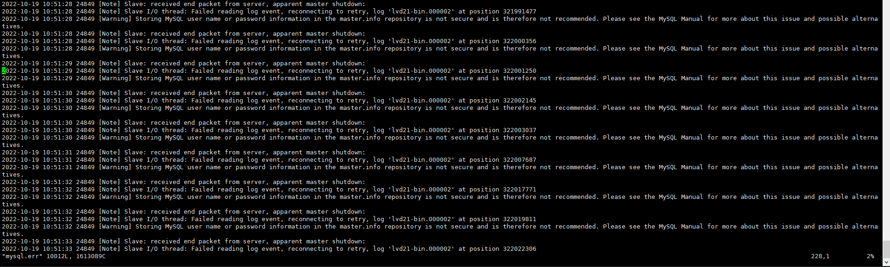

# MySQL - 報錯 Slave received end packet from server apparent master shutdown


***
***

**MySQL 一臺從庫的錯誤日誌，大量報下面的錯誤資訊**
=====

***
***
    


***
***
   
**先檢查一下 `Server ID` 有沒有重複**
-----

```sql
show global variables like 'server%id%';
```

***
***
        
**若 ServerID 沒重複的話那肯定就是 DB 的 UUID 重複了**
-----

***
***
    
**{ 解決方式 }:**
-----

***
***
   
**到 MySQL 目錄將 `auto.cnf` 砍掉重新生成即可**
-----

```sql
cd /var/lib/mysql

rm -f auto.cnf

mysqld_multi stop 3

mysqld_multi start 3
```

***
***


***


<style>
.emojify {
	font-family: Apple Color Emoji, Segoe UI Emoji, NotoColorEmoji, Segoe UI Symbol, Android Emoji, EmojiSymbols;
	font-size: 2rem;
	vertical-align: middle;
}
@media screen and (max-width:650px) {
  .nowrap {
    display: block;
    margin: 25px 0;
  }
}
</style>



---

> Author: Laurance  
> URL: https://laurance.eu.org/posts/mysql-%E5%A0%B1%E9%8C%AFslave-received-end-packet-from-server-apparent-master-shutdown/  

