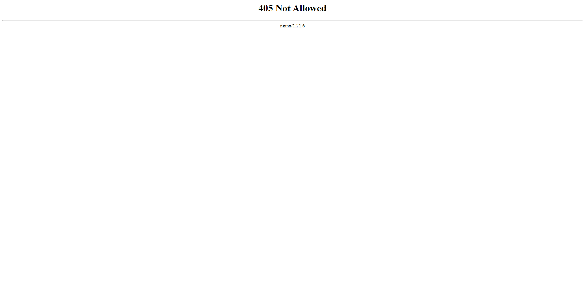

# Nginx - 405 Not Allowed 解決方法


<!--more-->
跨域存取錯誤 405 Not Allowed

***
***



***
***

**解決方法**

***

**允許靜態頁使用 POST 方法**

```sql
  # To allow POST on static pages

  error_page  405     =200 $uri ;
```


***


<style>
.emojify {
	font-family: Apple Color Emoji, Segoe UI Emoji, NotoColorEmoji, Segoe UI Symbol, Android Emoji, EmojiSymbols;
	font-size: 2rem;
	vertical-align: middle;
}
@media screen and (max-width:650px) {
  .nowrap {
    display: block;
    margin: 25px 0;
  }
}
</style>



---

> Author: Laurance  
> URL: https://laurance.eu.org/posts/nginx-405-not-allowed/  

