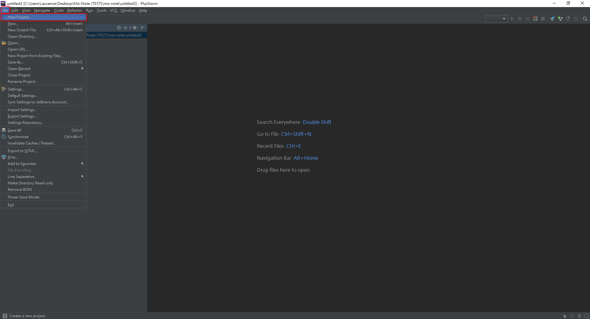
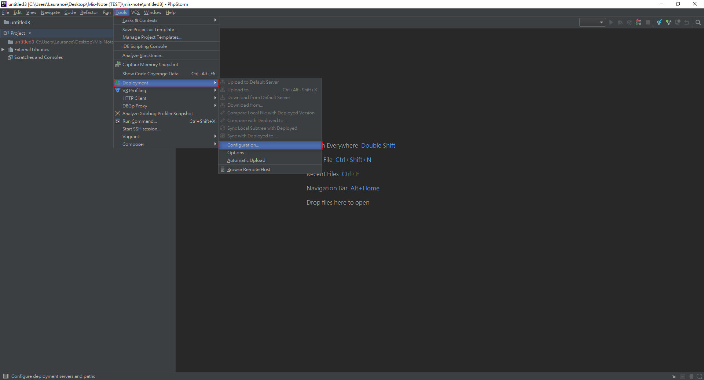
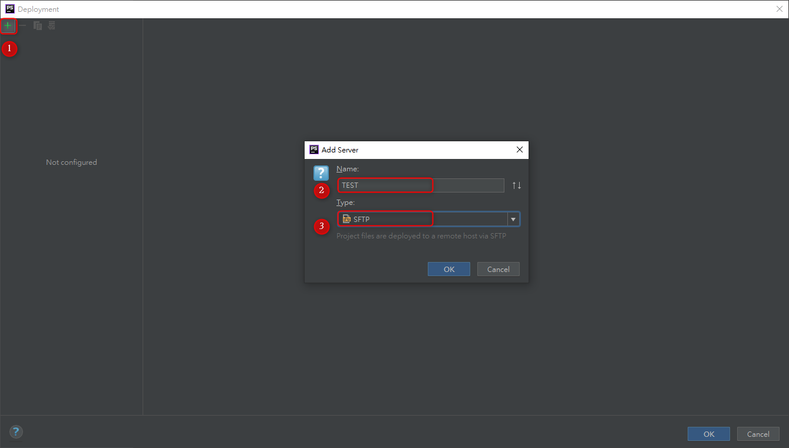
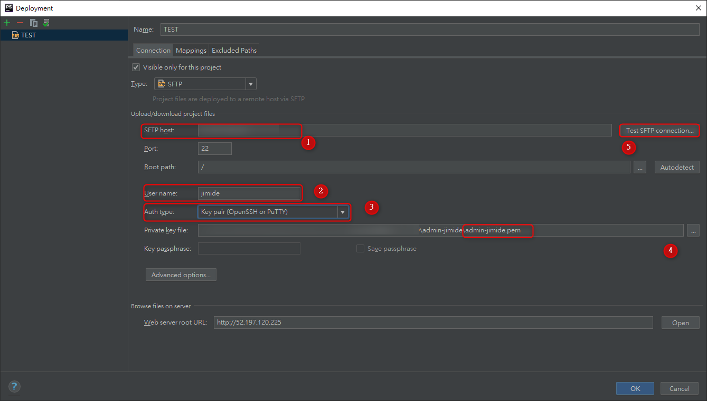

# phpstorm - 使用 putty-key pem 連接方式


***
***

**新增一個 `New Project`**

***
***

    
   

***
***
   
**選擇 `Create` >> `Open in new window` >> `OK`**

***
***
    
   

***
***
   
**打開遠端部署 `Development` 設定介面**

***
***
    
   

***
***
   
**按下 `+` >> `Name` >> `Type: SFTP`**

***
***
    
   

***
***
   
**測試登入 選擇 `Test SFTP connection` 即可**
    
```sql
SFTP host: IP

Port : 22
            
Root path: /
 
User name: jimide
            
Auth type: OpenSSH or Putty
            
Private key file: admin-jimide.pem
```

***
***
    
   

***
***
   
   

***
***

***


<style>
.emojify {
	font-family: Apple Color Emoji, Segoe UI Emoji, NotoColorEmoji, Segoe UI Symbol, Android Emoji, EmojiSymbols;
	font-size: 2rem;
	vertical-align: middle;
}
@media screen and (max-width:650px) {
  .nowrap {
    display: block;
    margin: 25px 0;
  }
}
</style>



---

> Author: Laurance  
> URL: https://laurance.eu.org/posts/phpstorm-idekey-%E9%80%A3%E6%8E%A5%E6%96%B9%E5%BC%8F/  

