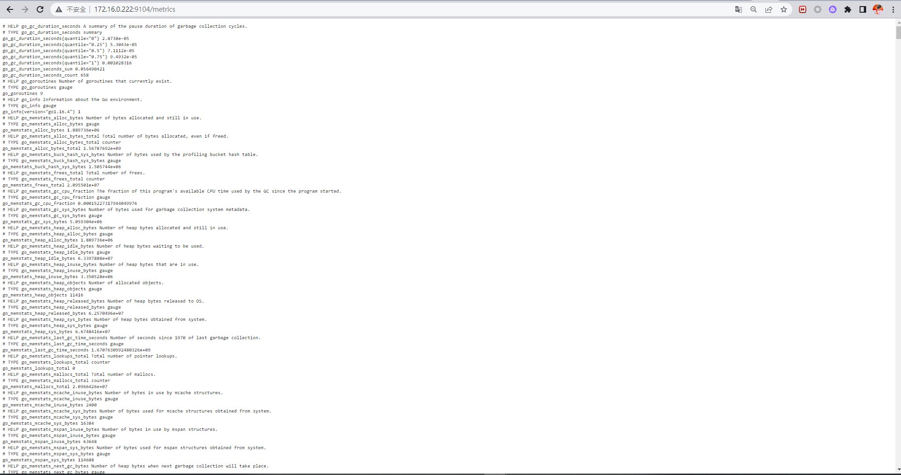

# Prometheus - MySQL 監控建立


***
***

**MySQL 建立 `exporter帳號`**
   
```sql
create user 'exporter'@'%' identified by 'exporter';

GRANT REPLICATION CLIENT, PROCESS ON *.* TO 'exporter'@'%';

GRANT SELECT ON performance_schema.* TO 'exporter'@'%';

flush privileges;
```

***
***
   
**下載 agent**
   
```sql
wget https://github.com/prometheus/mysqld_exporter/releases/download/v0.13.0/mysqld_exporter-0.13.0.linux-amd64.tar.gz

tar zxvf mysqld_exporter-0.13.0.linux-amd64.tar.gz
  
cd mysqld_exporter-0.13.0.linux-amd64/
```

***
***
   
**在 `mysqld_exporter` 這層放置設定檔 (這邊是多套,所以分開寫)**
    
```sql
vim mysqld_exporter-0.13.0.linux-amd64/.my.cnf
```
   
```sql
[client]

user=exporter
   
password=exporter

host=172.16.0.222
   
port=3306
   
[client]
   
user=exporter
   
password=exporter
   
host=172.16.0.222
   
port=3307
```

***
***
   
**將 exporter 寫入 systemctl**
    
```sql
vim /usr/lib/systemd/system/mysqld_export.service
```
   
```sql
[Unit]
   
Description=Mysqld_exporter
   
After=network-online.target
   
[Service]
   
Type=simple
   
ExecStart=/root/prometheus/mysqld_exporter-0.13.0.linux-amd64/mysqld_exporter \
   
--config.my-cnf=/root/prometheus/mysqld_exporter-0.13.0.linux-amd64/.my.cnf
   
Restart=on-failure
   
StartLimitInterval=1
   
RestartSec=3
   
[Install]
   
WantedBy=multi-user.target
```

***
***
   
**重啟 systemctl** 
    
```sql
systemctl daaemon-reload
```

***
***
    
**開啟 agent**
   
```sql
systemctl start mysqld_export
```

***
***
    
**驗證一下**
    
```sql
curl localhost:9104/metrics
```

***
***
    
   

***
***
    
***


<style>
.emojify {
	font-family: Apple Color Emoji, Segoe UI Emoji, NotoColorEmoji, Segoe UI Symbol, Android Emoji, EmojiSymbols;
	font-size: 2rem;
	vertical-align: middle;
}
@media screen and (max-width:650px) {
  .nowrap {
    display: block;
    margin: 25px 0;
  }
}
</style>



---

> Author: Laurance  
> URL: https://laurance.eu.org/posts/prometheus-mysql%E7%9B%A3%E6%8E%A7+grafana%E5%B1%95%E7%A4%BA/  

