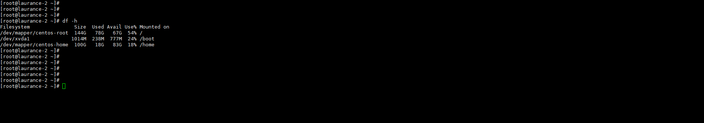
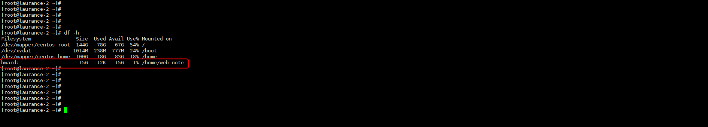

# Rclone - 掛載 google drive 作為本地硬碟使用 


***
***

**掛載 google drive 作為本地硬碟使用 (mount google drive)**
=====

***
***

[Rclone 官方教學](https://rclone.org/commands/rclone_mount/)

***
***

**設定並驗證好 rclone步驟 :**
-----

***
***

[設定步驟請參考](https://www.laurance.ml/p/centos7%E4%B8%8A%E4%BD%BF%E7%94%A8rclone%E9%81%A0%E7%AB%AF%E5%82%99%E4%BB%BD%E8%87%B3%E9%9B%B2%E7%AB%AF/)

***
***

**安裝依賴**

```sql
yum install fuse
```

***
***
    
**將 drive mount 到本地 linux**

```yaml
rclone mount  <gdrive剛剛輸入的代稱>:<根目錄以下的雲端路徑> <mount 本地的路徑>>rclone mount  <gdrive剛剛輸入的代稱>:<根目錄以下的雲端路徑> <mount 本地的路徑>
```
    
```sql
rclone mount hward: /home/web-note --allow-other --allow-non-empty --vfs-cache-mode full --daemon
```

***
***


    
**取消掛載指令**

```yaml
fusermount -qzu {本地路徑}
```



***
***
    
**Mount 之前**

***
***



***
***

**Mount 之後**

***
***



***
***

**常用語法**
-----

***
***

   
|  rclone命令範例	                                        | 功能								                                                                                            |
|  ----------------------------------------------------- 	| ---------------------------------------------------------------------------------------------------------------               |
|  --allow-other								        	| 允許非當前 rclone 用戶外其它用戶進行訪問						                                                            	|
|  --attr-timeout 5m        								| 文件屬性緩存，（大小，修改時間等）的時間。如果 VPS 配置比較低，建議適當提高這個值，避免過多內核交互，降低資源佔用			   	|
|  -vfs-cache-mode full 									| 開啟 VFS 文件緩存，可減少 rclone 與 API 交互，同時可提高文件讀寫效率		                                                    |
|  --vfs-cache-max-age 24h									| VFS 文件緩存時間，這裡設置 24 小時，如果文件很少更改，建議設置更長時間				                                    	|
|  --vfs-cache-max-size 10G								    | VFS文件緩存上限大小，建議不超過當前空餘磁盤的50%						                                                        |
|  vfs-read-chunk-size-limit 100M							| 分塊讀取大小，這裡設置的是100M，可提高文件讀的效率，比如1G的文件，大致分為10個塊進行讀取，但與此同時API請求次數也會增多		|
|  --buffer-size 100M   							    	| 內存緩存，如果您內存比較小，可降低此值，如果內存比較大，可適當提高							                            	|
|  --daemon				                                   	| 指後台方式運行	                                                                                                            |


***
***

***


<style>
.emojify {
	font-family: Apple Color Emoji, Segoe UI Emoji, NotoColorEmoji, Segoe UI Symbol, Android Emoji, EmojiSymbols;
	font-size: 2rem;
	vertical-align: middle;
}
@media screen and (max-width:650px) {
  .nowrap {
    display: block;
    margin: 25px 0;
  }
}
</style>



---

> Author: Laurance  
> URL: https://laurance.eu.org/posts/rclone%E6%8E%9B%E8%BC%89-google-drive-%E4%BD%9C%E7%82%BA%E6%9C%AC%E5%9C%B0%E7%A1%AC%E7%A2%9F%E4%BD%BF%E7%94%A8/  

