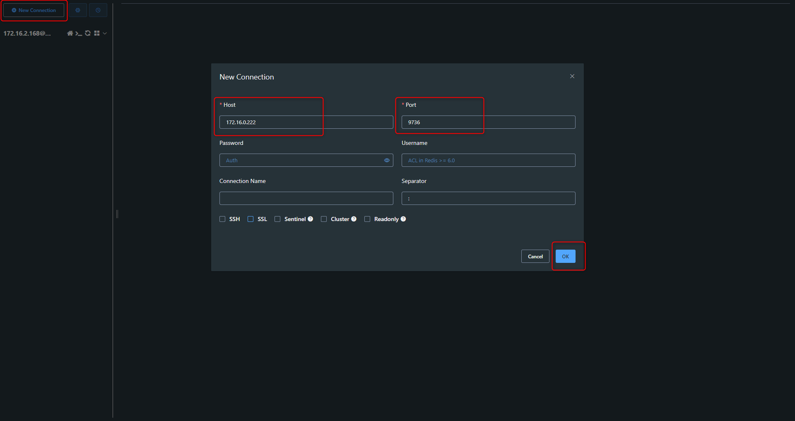
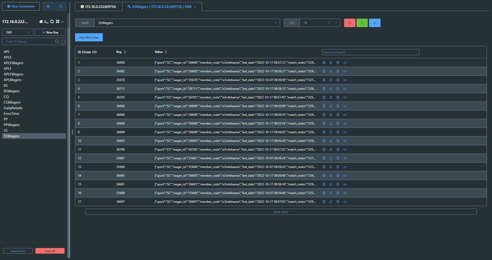

# Redis - Another Redis Desktop Manager 建立遠端連線

***
***

[Another Redis Desktop Manager for windows 載點](https://github.com/qishibo/AnotherRedisDesktopManager/releases)

***
***

**建立新連線**

***
***

***
***
   
**測試成功**

***
***

***
***
    

***





---

> Author: Laurance  
> URL: https://laurance.eu.org/posts/redis-another-redis-desktop-manager-%E5%BB%BA%E7%AB%8B%E9%81%A0%E7%AB%AF%E9%80%A3%E7%B7%9A/  

