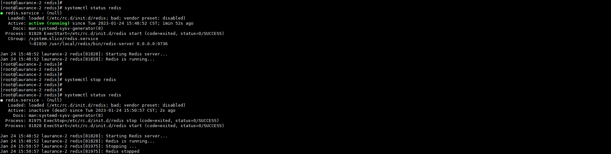
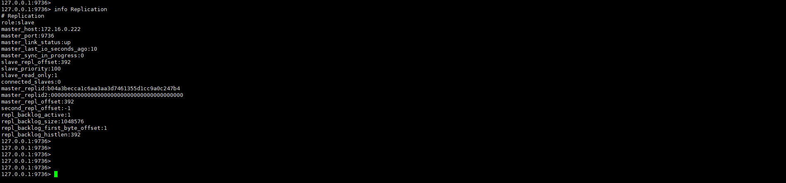

# Redis - 主從跟隨建立


***
***



**Redis 主從設定只需更動 Slave 設定即可**



***
***

**Slave Server:**
=====

***
***

**關閉 redis-slave-server**
-----

***
***



***
***

**修改 redis 設定檔**

```sql
vim /usr/local/redis/etc/redis.conf
```

***
***

**將 redis 編號**

```sql
:set nu
```

***
***

**在設定檔的第 `327 行` 增加設定 `REPLICATION 區塊`**

```sql
slave-read-only no
```

***
***
    
**註解第 `326 行` 設定**

```sql
#replica-read-only yes
```

***
***

**再開啟 redis 服務**

```sql
systemctl start redis
```

***
***
    
**登入並將 Slave 資料清空**

```yaml
redis-cli -h 127.0.0.1 -p 6739 -a 密碼
    
flushall
    
OK
```

***
***

**再將服務關閉**

```sql
systemctl stop redis
```

***
***
    
**在設定檔的第 `313 行` 增加設定**

```sql
slave-serve-stale-data yes
```

***
***
    
**註解第 `312 行`設定**

```sql
#replica-serve-stale-data yes
```

***
***
   
**在設定檔的第 290 & 291 行增加設定 (Master資訊)**

```sql
slaveof 172.16.0.222 6739
    
masterauth passwd
```

***
***
    
**在設定檔的第 `327 行` 修改設定**

```sql
slave-read-only yes
```

***
***
    
**開啟 redis 服務**

```sql
systemctl start redis
```

***
***
    
**進去查看是否已重跟**

```yaml
redis-cli -h 127.0.0.1 -p 9736 -a 密碼
    
127.0.0.1:9736> info Replication
```

***
***
    
**以下參數要是這樣 才算正常跟隨**

```sql
master_link_status:up
    
master_last_io_seconds_ago:0
    
master_sync_in_progress:0
```

***
***
    


***
***

`PS:重新跟隨狀態會比較慢更新 (大約要等 2分鐘 狀態才會變成 up)`

***
***


***


<style>
.emojify {
	font-family: Apple Color Emoji, Segoe UI Emoji, NotoColorEmoji, Segoe UI Symbol, Android Emoji, EmojiSymbols;
	font-size: 2rem;
	vertical-align: middle;
}
@media screen and (max-width:650px) {
  .nowrap {
    display: block;
    margin: 25px 0;
  }
}
</style>



---

> Author: Laurance  
> URL: https://laurance.eu.org/posts/redis-%E4%B8%BB%E5%BE%9E%E8%B7%9F%E9%9A%A8%E5%BB%BA%E7%AB%8B/  

