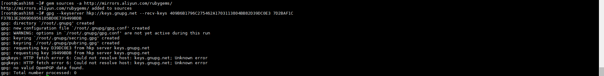
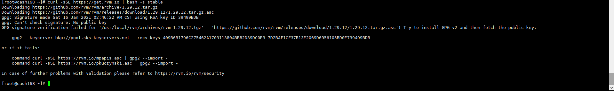
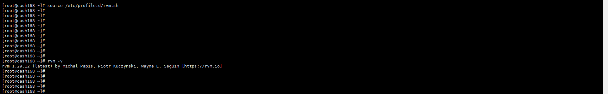
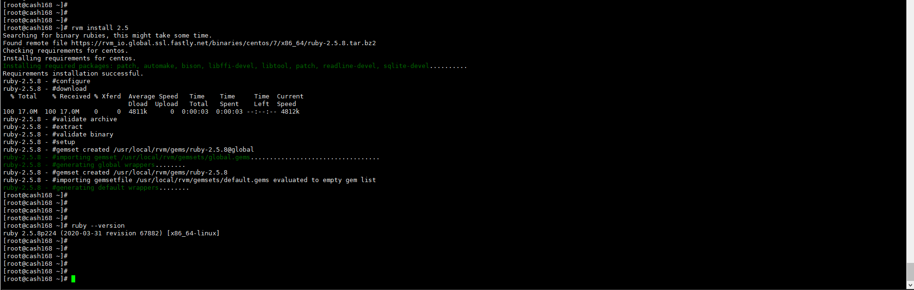
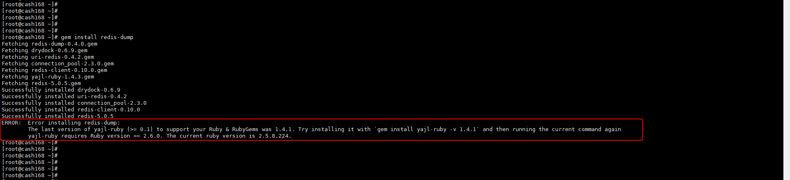
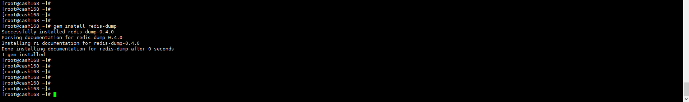

# Redis - 安裝 reids-dump 及備份


***
***

**需先安裝 redis-cli**
=====

***
***

**安裝 `ruby`跟 `gem`**

```sql
yum -y install ruby ruby-devel

yum -y install rubygems
```

***
***

**使用 gem 裝 `rvm`**

***
***

**載入 `來源`及`憑證`**

```sql
gem sources -a http://mirrors.aliyun.com/rubygems/

gpg --keyserver hkp://keys.gnupg.net --recv-keys 409B6B1796C275462A1703113804BB82D39DC0E3 7D2BAF1CF37B13E2069D6956105BD0E739499BDB
```

***
***



***
***

**使用腳本安裝**

```sql
curl -sSL https://get.rvm.io | bash -s stable
```

***
***



***
***



**若報錯 ERROR : 讀不到憑證 再重新載入一次即可**

***
  
```sql
curl -sSL https://rvm.io/mpapis.asc | gpg2 --import -

curl -sSL https://rvm.io/pkuczynski.asc | gpg2 --import -
```



**再重新安裝一次**

```sql
curl -sSL https://get.rvm.io | bash -s stable
```

***
***


***
***

**載入 rvm腳本**

```sql
source /etc/profile.d/rvm.sh
```

***
***

**rvm版本 確認**

```sql
rvm -v
```

***
***



***
***

**再用 rvm 升級 `ruby`**
=====

***
***

**安裝 `ruby 2.5 版`**

```sql
rvm install 2.5
```

***
***

**ruby 版本確認**

***
***

```sql
ruby --version
```

***
***



***
***

**再用 gem安裝 `redis-dump`**

```sql
gem install redis-dump
```

***
***



***
***



**若報錯 ERROR : 需要再安裝 yajl-ruby**



***
***


***
***

**重新再安裝一次即可**

```sql
gem install yajl-ruby -v 1.4.1

gem install redis-dump
```

***
***



***
***

**redis 備份 及 匯入語法 ( 可以使用別台的 IP 遠端備份 )**
=====

***
***


    
**備份語法**
    
```sql
redis-dump -u 127.0.0.1:9736 -a 'redisPasword' > /root/info-redis-bak.json
```

***
 
**匯入語法**
    
```sql
<info-redis-bak.json redis-load -u 127.0.0.1:9736
```
    


***
***

***


<style>
.emojify {
	font-family: Apple Color Emoji, Segoe UI Emoji, NotoColorEmoji, Segoe UI Symbol, Android Emoji, EmojiSymbols;
	font-size: 2rem;
	vertical-align: middle;
}
@media screen and (max-width:650px) {
  .nowrap {
    display: block;
    margin: 25px 0;
  }
}
</style>



---

> Author: Laurance  
> URL: https://laurance.eu.org/posts/redis-%E5%AE%89%E8%A3%9Dreids-dump%E5%82%99%E4%BB%BD/  

