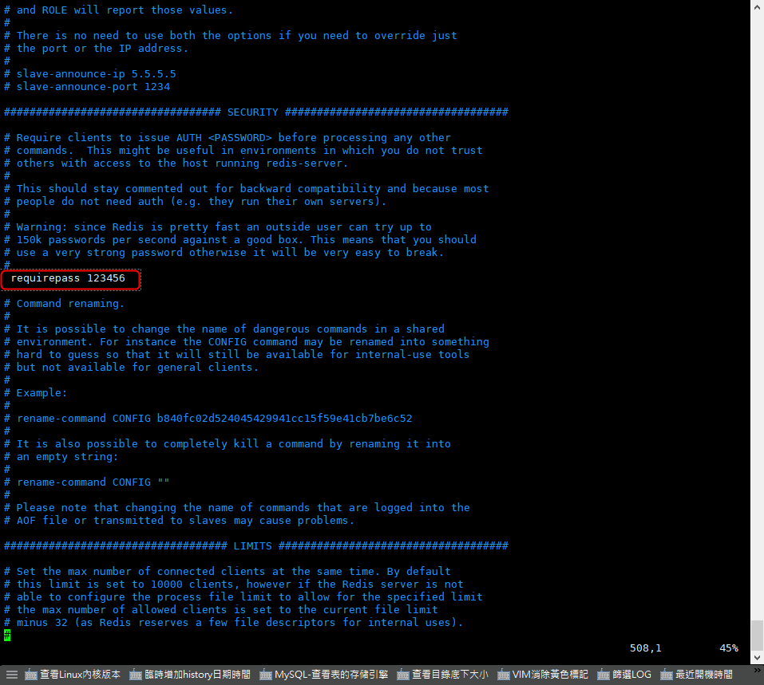

# Redis - 如何設置 Redis 密碼


***
***

**方法一**
=====

***
***

**修改 redis 設定檔 (requirepass 參數)**

    PWD: /usr/local/redis/etc/redis.conf

***
***
    
 

***
***
   
**修改完之後重啟服務**
    
```sql
service redis restart
```

***
***
   
**方法二**
=====

***
***

**進服務修改 Password (此方法 Redis 重啟後，密碼會失效)**

**進入 redis cmd 設定密碼**
    
```sql
config set requirepass 123456
```

***
***
    
**查詢密碼**
    
```sql
config get requirepass
```

***
***
    
**驗證密碼**
    
```sql
auth 123456
```
 
```sql
config get requirepass
    
    1) "requirepass"
    2) "123456"
```
       
***
***
    
**登入指令**

```sql
redis-cli -p 6379 -a test123
```
   
```sql
redis 127.0.0.1:6379> auth test123
```    

***
***


***


<style>
.emojify {
	font-family: Apple Color Emoji, Segoe UI Emoji, NotoColorEmoji, Segoe UI Symbol, Android Emoji, EmojiSymbols;
	font-size: 2rem;
	vertical-align: middle;
}
@media screen and (max-width:650px) {
  .nowrap {
    display: block;
    margin: 25px 0;
  }
}
</style>



---

> Author: Laurance  
> URL: https://laurance.eu.org/posts/redis-%E8%A8%AD%E7%BD%AEredis%E5%AF%86%E7%A2%BC/  

