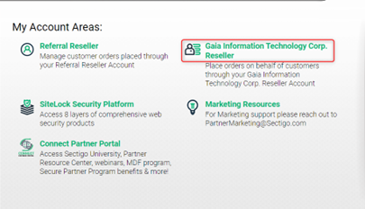
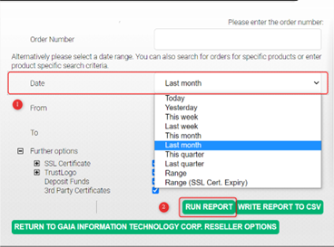
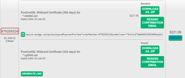
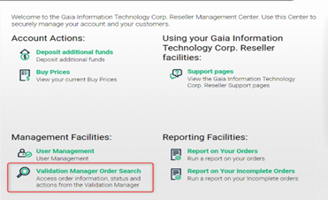
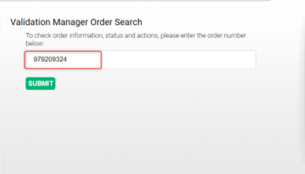
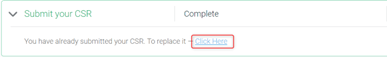
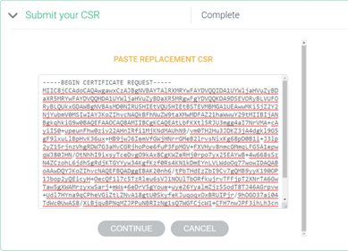
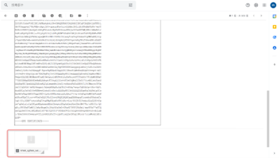

# Sectigo - 改簽 SSL 教學

<!--more-->
Sectigo 如何將 SSL 改簽給其他域名

***
***
  
**進入Sectigo 後台，並點選訂單管理 `Gaia Information Technology Corp. Reseller`**
-----

***
***

   

***
***
   
**點選訂單報告 `Report on Your Orders`**
-----

***
***
    
   

***
***
   
**以簽發日期查詢訂單編號**
-----

***
***
    
   

***
***
   
**用訂單編號搜索憑證更換CSR**
-----

***
***
    
   

***
***
   
**進入管理層並點選訂單管理操作 `Validation Manager Order Search`**
-----

***
***
    
   

***
***
   
**輸入剛查詢的訂單編號進入修改**
-----

***
***
    
   

***
***
   
**點選修改 `Submit your CSR`  並將 `CSR` 黏貼進入，後面一直按`CONTINUE`即可**
-----

***
***
    
   

***
***
   
   

***
***
   
**憑證簽發完後，Mail 會收到 Sectigo 寄來的 zip包**
-----

***
***
    
   

***
***
   
**下載後會有 4隻檔案**
-----

***
    
**將 `AAA CertificateServices.crt` 裡面的內容全部貼進 `STAR_XXX_net.crt` 的下面，並更名為`域名.crt`**
-----

***
    
**再將 `域名.crt` 複製到網頁主機裡**
-----

ps. 注意：STAR_XXX_net.crt內容一定要再上方，否則驗證不會過)

***
***
    
   

***
***
   
   

***
***

***





---

> Author: Laurance  
> URL: https://laurance.eu.org/posts/sectigo-%E6%94%B9%E7%B0%BDssl%E6%95%99%E5%AD%B8/  

