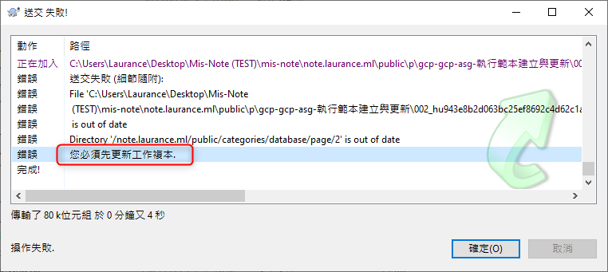
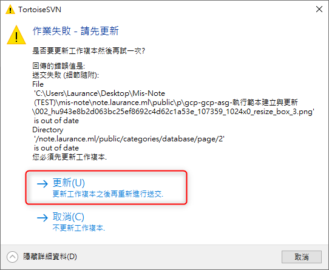

# SVN - error 你必須先更新你的工作副本

***
***

**SVN 送交時失敗跳 error : `"你必須先更新你的工作副本"`**

***
***

    

***
***
   
**按確定之後，會自動跳出 `作業失敗-請先更新的視窗` , 再點選`更新`即可**

***
***

   

***
***

***





---

> Author: Laurance  
> URL: https://laurance.eu.org/posts/svn-error-%E4%BD%A0%E5%BF%85%E9%A0%88%E5%85%88%E6%9B%B4%E6%96%B0%E4%BD%A0%E7%9A%84%E5%B7%A5%E4%BD%9C%E5%89%AF%E6%9C%AC/  

