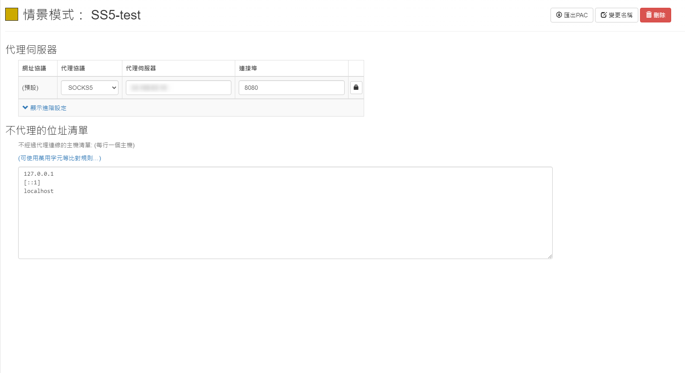

# VPN - 建置 SOCKS5 (SS5) 代理


***
***

**安裝編譯 SS5**
----

***
***

**從官網下載源碼**

```sql
wget https://nchc.dl.sourceforge.net/project/ss5/ss5/3.8.9-8/ss5-3.8.9-8.tar.gz
```

***
***
    
**安裝依賴**
   
```sql
yum -y install pam-devel openldap-devel cyrus-sasl-devel openssl-devel gcc automake make
```

***
***
    
**解壓、編譯、安裝**
   
```sql
tar xvf ss5-3.8.9-8.tar.gz
    
cd ss5-3.8.9
    
./configure && make && make install
```

***
***
    
**修改 SS5 設定檔**
-----

***
***

**修改認證方式**
   
```sql
vim /etc/opt/ss5/ss5.conf
```

***
***
    
**無帳號密碼的設定**
   
 ```sql
auth    0.0.0.0/0               -              -
permit -       0.0.0.0/0       -       0.0.0.0/0       -       -       -       -       -
```

***
***

**有帳號密碼的設定**
   
```sql
auth    0.0.0.0/0               -              u
permit u        0.0.0.0/0       -       0.0.0.0/0       -       -       -       -       -
```

***
***
    
**加入 `user` 及 `password`**
   
```sql
vim /etc/opt/ss5/ss5.passwd
```
    
```sql
laurance lau888
```

***
***

**修改 ss5 啟動 `port`**
   
```sql
vim /etc/sysconfig/ss5
```
    
```sql
SS5_OPTS=" -u root -b 0.0.0.0:8080"
```

***
***

**新增 ss5 執行檔`權限`**
   
```sql
chmod 755 /etc/rc.d/init.d/ss5
```

***
***
    
**啟動服務**
   
```sql
systemctl restart ss5
```

***
***
    
**查看啟動 LOG**
   
```sql
more /var/log/ss5/ss5.log
```

***
***

**使用 Chrome 套件 & SS5 翻牆**
----

***
***

**Chrome 新增套件: `Proxy SwitchyOmega`**

***
***
   
   

***
***
    
***


<style>
.emojify {
	font-family: Apple Color Emoji, Segoe UI Emoji, NotoColorEmoji, Segoe UI Symbol, Android Emoji, EmojiSymbols;
	font-size: 2rem;
	vertical-align: middle;
}
@media screen and (max-width:650px) {
  .nowrap {
    display: block;
    margin: 25px 0;
  }
}
</style>



---

> Author: Laurance  
> URL: https://laurance.eu.org/posts/vpn-%E5%BB%BA%E7%BD%AE-socks5ss5%E4%BB%A3%E7%90%86/  

