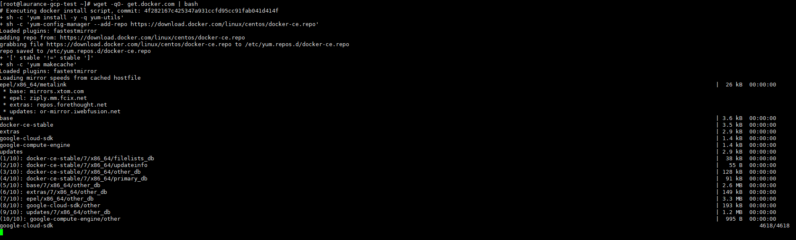
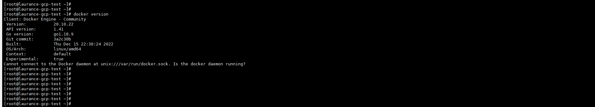
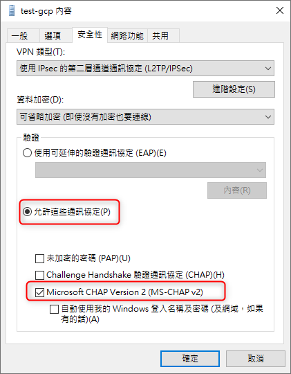
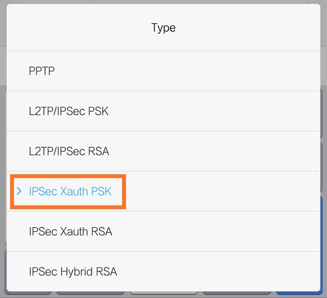

# VPN - 建置 XL2TPD + IPSec 服務 by DOCKER


***
***

**安裝 Docker**
-----

***
***
   
**安裝最新版 Docker**
   
```sql
wget -qO- get.docker.com | bash 
```

***
***
    
 

***
***
    
**查看版本**
   
```sql
docker version 
```

***
***
   
 

***
***
   
**啟動服務**
   
```sql
systemctl start docker 
```

***
***
  
**查看狀態**
   
```sql
systemctl status docker
```

***
***

**使用 Docker 安裝 L2TP**
-----

***
***
   
**拉取鏡像**
   
```sql
docker pull teddysun/l2tp
```

***
***
    
**建立環境參數設定檔**
   
```sql
vim /etc/l2tp.env
```
    
```sql
VPN_IPSEC_PSK=1234567890
VPN_USER=laurance
VPN_PASSWORD=lau888
VPN_PUBLIC_IP=XX.XX.XX.XX
VPN_L2TP_NET=192.168.18.0/24
VPN_L2TP_LOCAL=192.168.18.1
VPN_L2TP_REMOTE=192.168.18.10-192.168.18.250
VPN_XAUTH_NET=192.168.20.0/24
VPN_XAUTH_REMOTE=192.168.20.10-192.168.20.250
VPN_DNS1=8.8.8.8
VPN_DNS2=9.9.9.9
VPN_SHA2_TRUNCBUG=

```

***
***
  


**參數解析**

***

| 參數 | 參數代表意義 |
| --- | --- |
| VPN_IPSEC_PSK | 預共享密鑰 |
| VPN_USER | 默認的登錄用戶名 |
| VPN_PASSWORD | 默認的登錄用戶密碼 |
| VPN_PUBLIC_IP | 指定公網 IP 地址，當你的 VPS 有多個公網 IP 時，可能需要手動指定一下 |
| VPN_L2TP_NET | 內網 L2TP 網段範圍，默認為 192.168.18.0/24，一般此處留空即可 |
| VPN_L2TP_LOCAL | 內網 L2TP 網關 IP，默認為 192.168.18.1，一般此處留空即可 |
| VPN_L2TP_REMOTE | 內網 L2TP 網段分配給連接的 IP 段，默認為 192.168.18.10-192.168.18.250，一般此處留空即可 |
| VPN_XAUTH_NET | 內網 XAUTH 網段範圍，默認為 192.168.20.0/24，一般此處留空即可 |
| VPN_XAUTH_REMOTE | 內網 XAUTH 網段分配給連接的 IP 段，默認為 192.168.20.10-192.168.20.250，一般此處留空即可 |
| VPN_DNS1 | 默認 DNS 服務器，8.8.8.8，一般此處留空即可 |
| VPN_DNS2 | 默認 DNS 服務器，8.8.4.4，一般此處留空即可 |

***

**Android 6 和 7 如果遇到連接問題，嘗試在 /etc/ipsec.conf 中設置 sha2-truncbug=yes (默認為 no)**  

***
  
**可以在 /etc/l2tp.env 文件中添加 VPN_SHA2_TRUNCBUG=yes，然後重新創建 Docker 容器。**



***
***

**啟動容器**
   
```sql
docker run -d --privileged -p 500:500/udp -p 4500:4500/udp --name l2tp --restart=always --env-file /etc/l2tp.env -v /lib/modules:/lib/modules teddysun/l2tp
```

***
***
    
**查看啟動 LOG**
   
```sql
docker logs l2tp
```

***
***
    
**查看 ipsec status 輸出**
   
```sql
docker exec -it l2tp ipsec status
```

***
***
    
**管理 VPN 用户**
-----

***
***

**列出所有 user & password**
   
```sql
docker exec -it l2tp l2tpctl -l
```

***
***
    
**新增 user**
   
```sql
docker exec -it l2tp l2tpctl -a
```

***
***
    
**刪除 user**
   
```sql
docker exec -it l2tp l2tpctl -d
```

***
***
    
**修改 user 密碼**
   
```sql
docker exec -it l2tp l2tpctl -m
```

***
***
    
**查看 libreswan 和 xl2tpd 版本** 
   
```sql
docker exec -it l2tp l2tpctl -v 
```
    
```sql
Linux Libreswan 3.32 (netkey) on 3.10.0-1160.76.1.el7.x86_64

xl2tpd version:  xl2tpd-1.3.15
```

***
***

**Windows 10 下连接 L2TP VPN**
-----

***
***

**修改 VPN 協議**
   
  

***
***



***

**Configure a L2TP/IPsec server behind a NAT-T device**

***   

**`win + R` 輸入 `regedit`**

*** 

**路徑: `HKEY_LOCAL_MACHINE\SYSTEM\CurrentControlSet\Services\PolicyAgent`**

***    

**新增一組機碼 >> `DWORD`（32 位）值 >> `AssumeUDPEncapsulationContextOnSendRule` >> 值設定為 `2` (1 不會過)**

***



***
***

**PHONE 下连接 L2TP VPN**
-----

***
***

**Android 版本小於或等於 `7` 時，建議選擇 `IPSec Xauth PSK (Cisco IPsec) `模式連接**

***
***
   
   

***
***
    
   [參考文件](https://learn.microsoft.com/en-US/troubleshoot/windows-server/networking/configure-l2tp-ipsec-server-behind-nat-t-device)
   
   [參考文件](https://teddysun.com/536.html)
    
    
    
***


<style>
.emojify {
	font-family: Apple Color Emoji, Segoe UI Emoji, NotoColorEmoji, Segoe UI Symbol, Android Emoji, EmojiSymbols;
	font-size: 2rem;
	vertical-align: middle;
}
@media screen and (max-width:650px) {
  .nowrap {
    display: block;
    margin: 25px 0;
  }
}
</style>



---

> Author: Laurance  
> URL: https://laurance.eu.org/posts/vpn-%E5%BB%BA%E7%BD%AE-xl2tpd-+-ipsec-%E6%9C%8D%E5%8B%99/  

